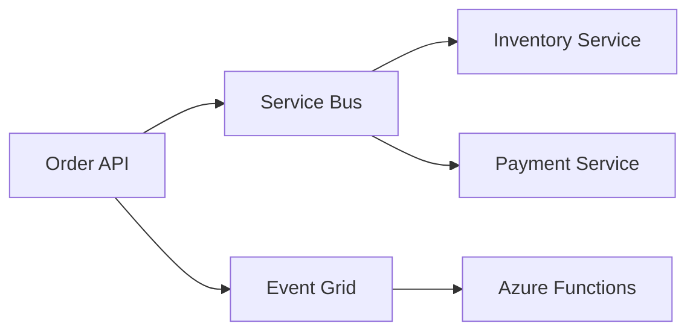

# Azure Integration — Advanced

> **Week 15** | **Level:** Advanced

## Event-Driven Architecture on Azure

## Saga Patterns

- **Choreography:** Events only — simpler, harder to debug
- **Orchestration:** Durable Functions / Logic Apps — visible state, more coupling

## Architect Scenario

Order placed → reserve inventory → charge payment → confirm order. Design failure compensation for payment timeout.

**Related:** [Week 35 messaging](../../week-35/theory/)

## Architect Deep Dive: Event-Driven at Scale

### Schema governance
Event schema in Git (AsyncAPI / CloudEvents envelope) — breaking changes require versioned topic or `eventType` v2 suffix.

### Ordering
Service Bus sessions on `orderId` when sequential processing required — accept throughput trade-off.

