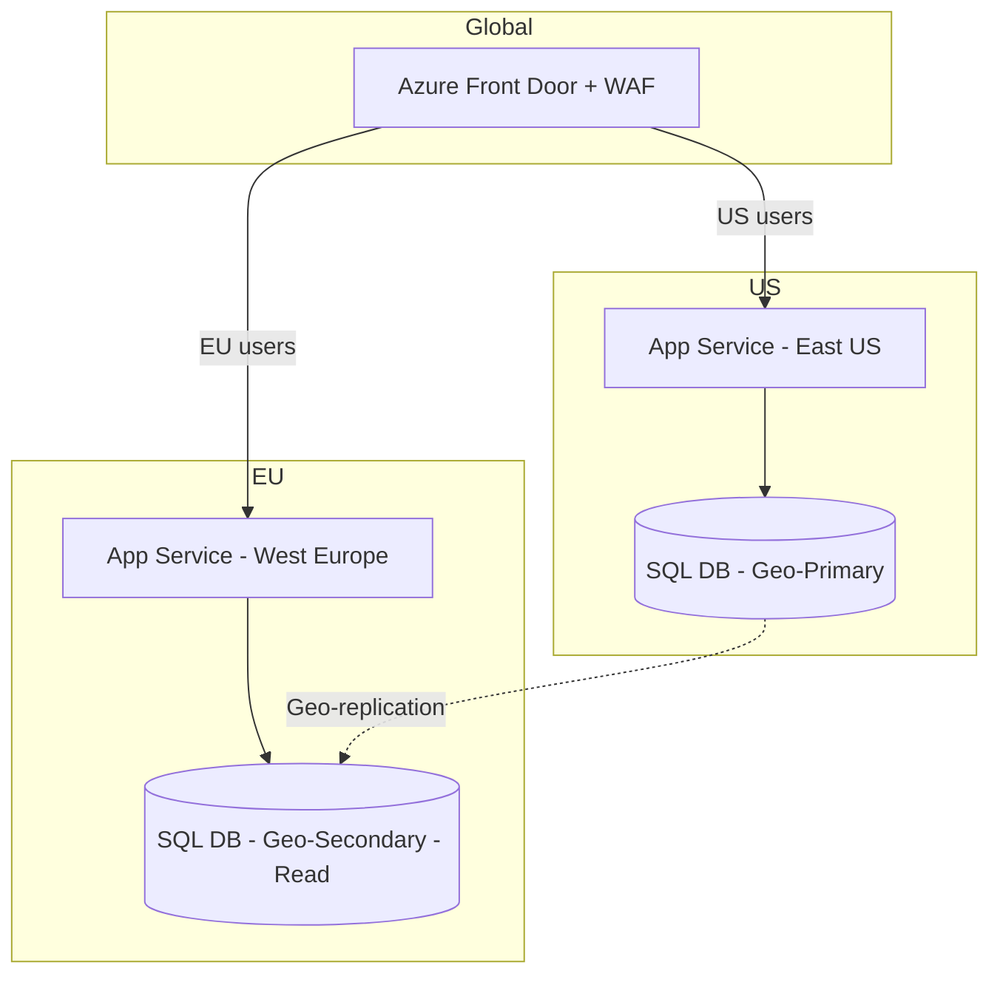

# Case Study: Multi-Region Azure SaaS Architecture

| **Week** | 16 | **Difficulty** | Expert | **Industry** | B2B SaaS

## Business Context
SaaS platform serving 50K users across US and EU. Current single-region deployment in East US. EU customers require data residency (GDPR). SLA: 99.95%. Revenue: $5M ARR.

## Current State
- Single App Service (P2v3) + Azure SQL (S3)
- No DR tested
- All traffic through single region
- Monthly cost: $8K

## Requirements
| NFR | Target |
|-----|--------|
| Availability | 99.95% |
| EU data residency | Required |
| RTO | 1 hour |
| RPO | 15 minutes |
| Budget | $15K/month max |

## Your Task
Design complete multi-region Azure architecture with cost estimate.

---

## Reference Solution

### Key Decisions
| Decision | Choice | Rationale |
|----------|--------|-----------|
| Traffic routing | Front Door | Global load balancing + WAF |
| EU data | West Europe region | GDPR data residency |
| Database | SQL geo-replication | RPO < 15min, automatic failover group |
| Secrets | Key Vault per region | Compliance isolation |
| Monitoring | App Insights + Sentinel | Cross-region visibility |
| Async | Service Bus geo-DR | Event replication |

### Cost Estimate (~$12K/month)
| Service | Monthly |
|---------|---------|
| Front Door Premium | $2,500 |
| App Service P2v3 × 2 | $3,600 |
| SQL Business Critical × 2 | $3,800 |
| Service Bus Premium | $700 |
| Key Vault + App Insights | $400 |
| Networking | $500 |

### DR Runbook
1. Front Door health probes detect US region failure
2. Automatic failover to EU (active-active for read)
3. SQL failover group promotes EU secondary
4. RTO: ~15 min (automatic), RPO: < 15 min

## Discussion
1. Active-active vs active-passive for EU?
2. When Cosmos DB instead of SQL for multi-region?
3. How to test DR without affecting production?
