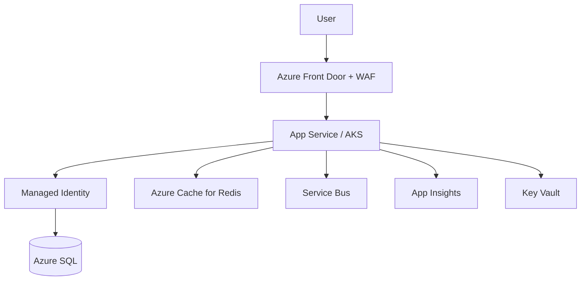
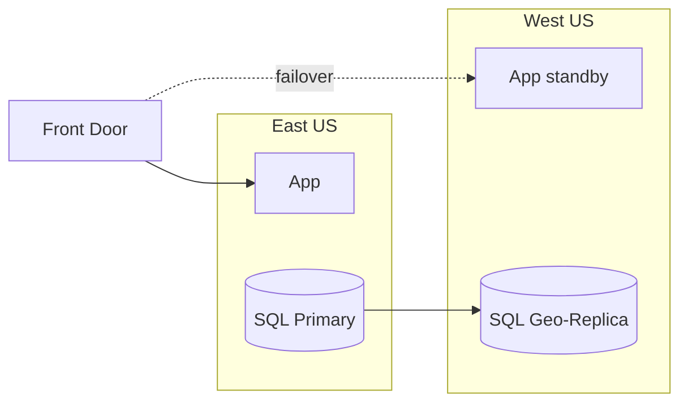
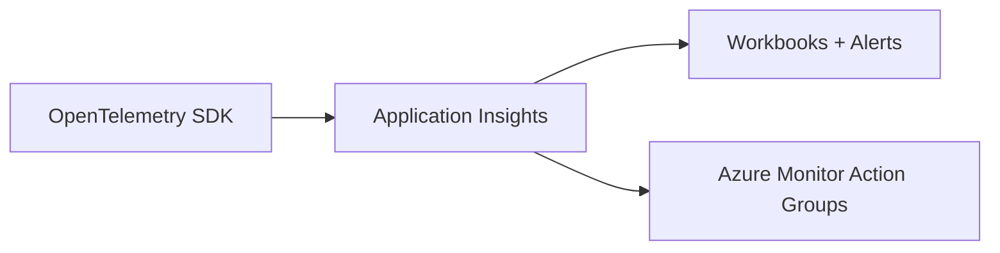
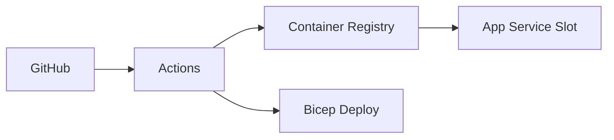
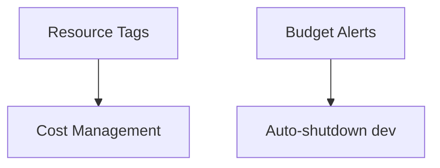

# Week 16 — Azure Capstone Architecture Diagrams

## 1. Reference 3-Tier .NET SaaS on Azure

## 2. Multi-Region Active-Passive

## 3. Observability — End to End

## 4. CI/CD to Azure

## 5. Cost Governance

## Practice Exercise

Produce a single-page architecture for Week 16 capstone: 3-tier SaaS with DR and observability.

---

[← Back to Week 16](../README.md)
