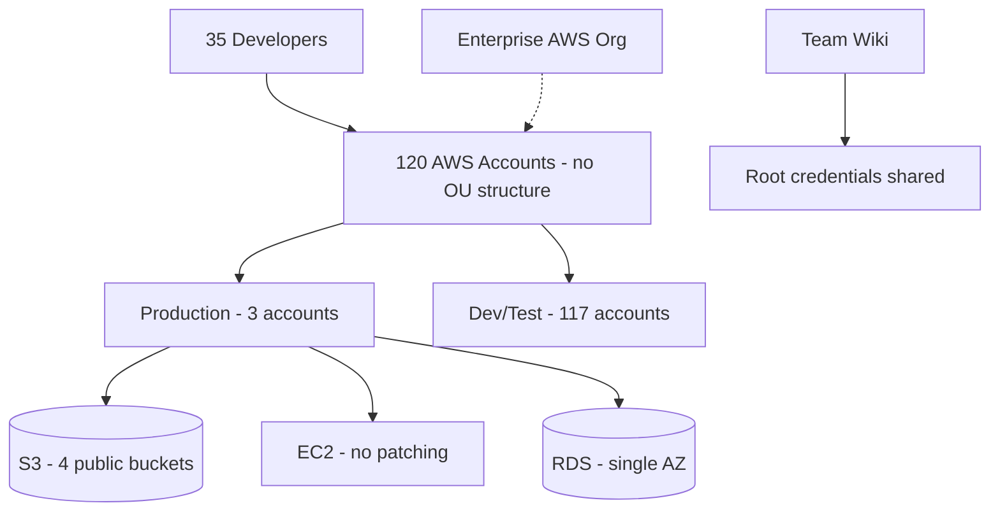
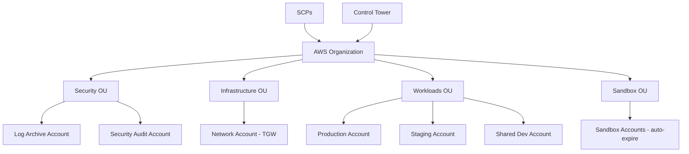

# Case Study: AWS Landing Zone for Acquired Startup

| Attribute | Value |
|-----------|-------|
| **Industry** | Enterprise Software (post-acquisition) |
| **Scale** | Acquired startup: 35 engineers, 120 AWS accounts, $85K/month spend |
| **Week** | 17 |
| **Difficulty** | Advanced |

## Business Context

A Fortune 500 enterprise acquired a SaaS startup running entirely on AWS with zero governance. The startup has 120 AWS accounts (one per developer experiment), root credentials shared in a team wiki, and production workloads in `us-east-1` with no backup region.

The acquiring company's cloud center of excellence mandates integration into the enterprise AWS Organization within 6 months. The startup team fears losing agility. The CISO has flagged 23 critical security findings including public S3 buckets with customer data and IAM users with `AdministratorAccess`.

You are the architect bridging enterprise governance with startup velocity.

## Current State

**Current implementation issues (from security assessment):**
- No AWS Organization — 120 standalone accounts with individual billing
- 4 S3 buckets publicly accessible containing customer PII
- 18 IAM users with long-term access keys (oldest: 3 years, never rotated)
- Root account MFA enabled on only 40 of 120 accounts
- No CloudTrail in 85 accounts — no audit trail
- Production RDS: single-AZ, no automated backups verified
- Network: default VPCs everywhere, no Transit Gateway or centralized egress
- Tagging: 0% compliance — cannot allocate $85K/month spend

## Requirements

### Functional
- Consolidate 120 accounts into enterprise AWS Organization
- Secure production workloads without breaking CI/CD pipelines
- Enable startup team self-service for dev/test environments
- Implement centralized logging, billing, and security monitoring
- Migrate production to multi-AZ with backup region capability

### Non-Functional
| NFR | Target |
|-----|--------|
| Security findings remediation | 23 critical → 0 within 90 days |
| Account consolidation | 120 → < 15 accounts in 6 months |
| Production availability | 99.95% (multi-AZ) |
| Dev environment provisioning | < 4 hours self-service |
| Audit log coverage | 100% accounts within 30 days |
| Cost visibility | Per-team tagging within 60 days |

## Constraints

- Startup team retains deployment autonomy for dev/test
- Enterprise SCPs (Service Control Policies) must not block startup's existing Terraform workflows
- 6-month integration timeline
- Budget: startup's $85K/month must not increase > 20% during transition
- Compliance: enterprise SOC 2 + acquired startup's existing GDPR obligations
- Cannot disrupt production SaaS (8,000 paying customers)

## Your Task

1. Design the AWS Organization structure (OUs, account strategy)
2. Define the account consolidation plan (120 → target state)
3. Remediate critical security findings without production outage
4. Design centralized logging and SCP guardrails
5. Propose an operating model that preserves startup agility

> **Attempt your solution before reading the reference below.**

---

## Reference Solution

### Top 3 Issues

1. **Account sprawl** — 120 accounts with no OU structure prevents centralized governance
2. **Critical security exposure** — public S3 buckets and shared root credentials are active breach risks
3. **No observability** — 85 accounts without CloudTrail means blind spots for both security and operations

### Revised Landing Zone Architecture

### Key Decisions

| Decision | Choice | Rationale |
|----------|--------|-----------|
| Account strategy | 120 → 8 accounts (prod, staging, dev, sandbox, network, log, audit, shared services) | Manageable; enterprise-aligned |
| Organization | AWS Control Tower with 4 OUs | Automated guardrails + account vending |
| S3 remediation | Block Public Access at org level via SCP + immediate bucket policy fix | Closes 4 public buckets in hours |
| Identity | SSO (IAM Identity Center) replaces IAM users + root sharing | Eliminate long-term keys |
| Logging | Org-wide CloudTrail → Log Archive account (immutable) | 100% coverage in 30 days |
| Networking | Shared VPC via Network account + TGW | Centralized egress, no default VPCs |
| Sandbox | Auto-expiring accounts via Control Tower Account Factory | Preserves startup experimentation |
| Production HA | Multi-AZ RDS + cross-region read replica | 99.95% availability target |

### Consolidation Phases

| Phase | Timeline | Action |
|-------|----------|--------|
| 1 — Contain | Week 1-2 | Invite accounts to Org; SCP deny public S3; enable CloudTrail |
| 2 — Secure | Week 3-8 | SSO migration; revoke IAM users; fix RDS backups |
| 3 — Consolidate | Month 2-4 | Migrate workloads to 8 target accounts; decommission 112 |
| 4 — Optimize | Month 5-6 | Reserved instances; tagging enforcement; backup region |

### Expected Outcome

- Critical findings: 23 → 0 within 90 days
- Accounts: 120 → 8 (manageable governance)
- Public S3 buckets: 4 → 0 (day 1 SCP block)
- Startup deploy velocity: maintained via sandbox auto-provisioning
- Cost increase: < 15% (offset by decommissioning idle accounts saving ~$12K/month)

## Discussion Questions

1. How do you convince a startup team that 120 accounts is not "agile"?
2. When should acquired workloads stay in separate accounts vs merge into enterprise shared accounts?
3. How do SCPs interact with the startup's existing Terraform pipelines without breaking them?

## Interview Story Angle

**STAR prompt:** "Tell me about integrating an acquired company's cloud infrastructure."

Use this case study: emphasize balancing enterprise governance with startup velocity, day-1 security containment (public S3 SCP), and pragmatic account consolidation (120 → 8).
