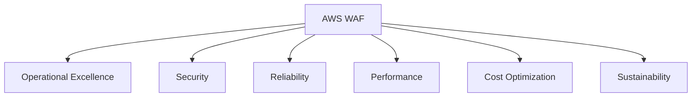
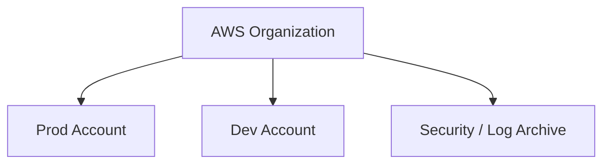
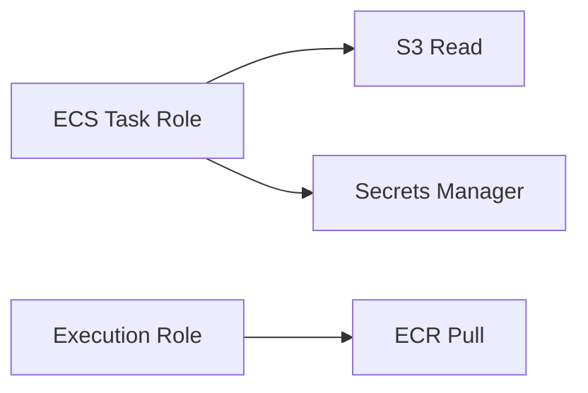
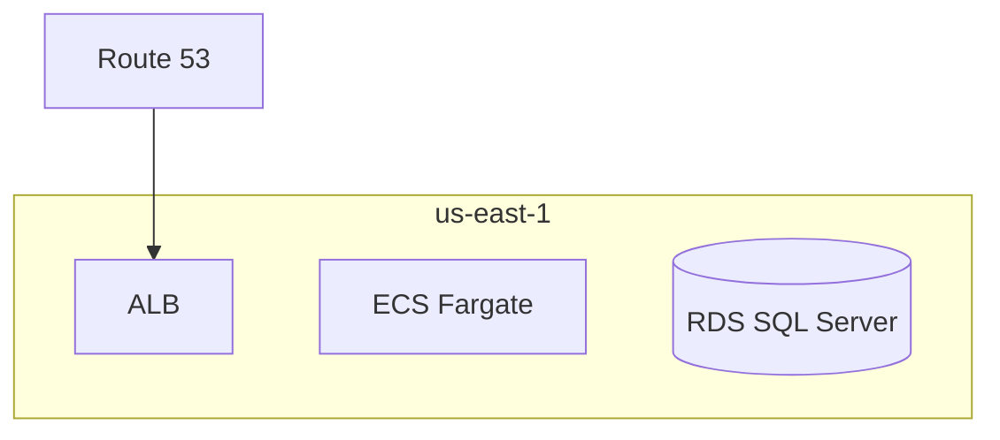
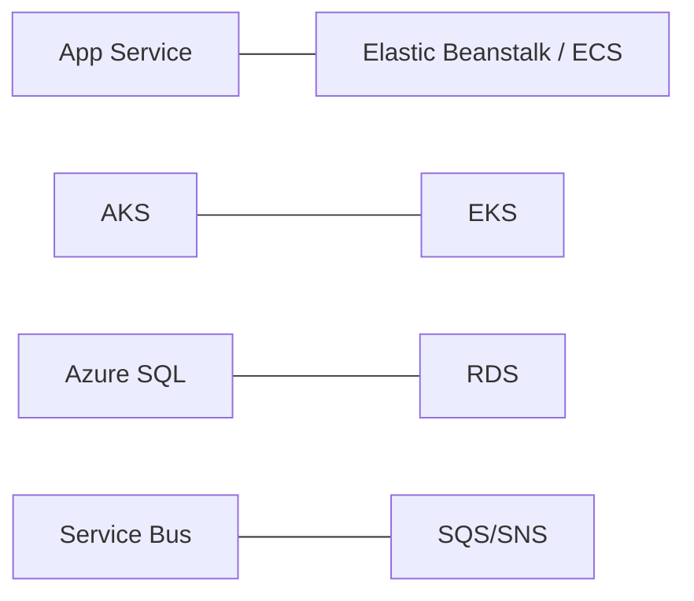

# Week 17 — AWS Fundamentals Diagrams

## 1. AWS Well-Architected Framework

## 2. Account Structure

## 3. IAM — Least Privilege for .NET on ECS

## 4. Regional Services Layout

## 5. Azure vs AWS Concept Map

## Practice Exercise

Map Week 9 Azure landing zone to equivalent AWS Organization OU structure.

---

[← Back to Week 17](../README.md)
