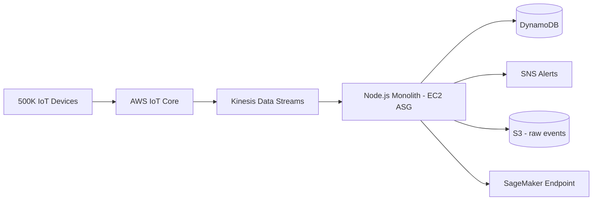
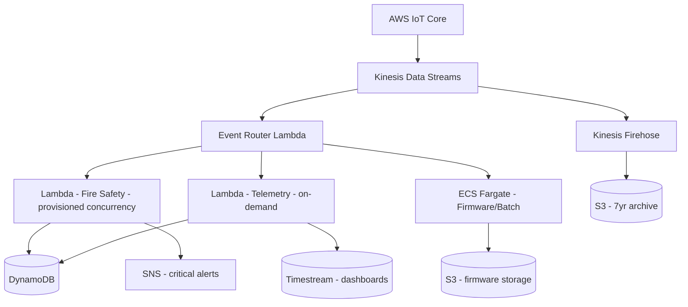

# Case Study: Lambda vs ECS — Serverless Decision for Event Processing

| Attribute | Value |
|-----------|-------|
| **Industry** | IoT / Smart Building |
| **Scale** | 500K devices, 2M events/minute peak, 50 event types |
| **Week** | 18 |
| **Difficulty** | Intermediate |

## Business Context

A smart building platform ingests telemetry from 500K IoT devices — temperature, occupancy, energy usage, HVAC commands — and processes events to trigger alerts, update dashboards, and feed ML anomaly detection. The current Node.js monolith on EC2 cannot keep up: message backlog grows to 4 hours during business hours, and scaling the monolith is slow (15-minute ASG cycle).

The engineering lead wants to go "fully serverless" with Lambda. The platform team prefers ECS Fargate for operational consistency with their other 12 services. The decision has been debated for 6 weeks with no resolution.

You are asked to make the architectural decision with a clear rationale and cost model.

## Current State

**Current implementation issues (from performance analysis):**
- Monolith processes 800 events/second per instance — need 42 instances at peak, ASG scales in 15 minutes
- Backlog during scale-up: 4 hours of delayed alerts (unacceptable for fire safety events)
- Memory leaks require weekly rolling restarts
- 50 event types with different processing logic — all in one codebase, 12-minute deploy
- Cold path events (firmware updates, 1/day per device) and hot path (temperature, every 30 seconds) share infrastructure
- Cost: $18K/month for EC2 (42 × m5.xlarge at peak, 8 at off-peak)

## Requirements

### Functional
- Ingest and process 2M events/minute peak (33K events/second)
- Route 50 event types to appropriate handlers
- Fire safety alerts: process within 5 seconds (hard SLA)
- Temperature/occupancy: process within 60 seconds
- Firmware events: process within 10 minutes (batch acceptable)
- Archive all raw events to S3 for compliance (7-year retention)

### Non-Functional
| NFR | Target |
|-----|--------|
| Availability | 99.99% |
| Hot path latency | < 5 seconds (fire safety) |
| Warm path latency | < 60 seconds (telemetry) |
| Scale-up time | < 30 seconds to handle 2x spike |
| Cost | ≤ $20K/month at peak |
| Deploy frequency | Multiple per day per event type |

## Constraints

- Team: 10 Node.js developers, 2 with Lambda experience, 8 comfortable with containers
- Must use AWS (existing IoT Core + Kinesis investment)
- Cannot change IoT device firmware — event format is fixed
- Budget: $20K/month processing infrastructure
- 8-week implementation timeline
- Fire safety SLA is regulatory — non-negotiable

## Your Task

1. Compare Lambda vs ECS Fargate for this event processing workload
2. Recommend an architecture (pure Lambda, pure ECS, or hybrid)
3. Define event routing strategy for 50 event types with different SLAs
4. Provide a cost model at 2M events/minute peak
5. Address cold start, concurrency limits, and deployment strategy

> **Attempt your solution before reading the reference below.**

---

## Reference Solution

### Top 3 Issues

1. **Monolithic scaling** — 15-minute ASG cycle cannot meet 5-second fire safety SLA during spikes
2. **Uniform infrastructure for heterogeneous SLAs** — fire safety and firmware updates should not share scaling characteristics
3. **Deploy coupling** — 50 event types in one codebase means any change risks all processing paths

### Recommended Hybrid Architecture

### Key Decisions

| Decision | Choice | Rationale |
|----------|--------|-----------|
| Fire safety (hot path) | Lambda with provisioned concurrency (50) | Sub-second scale; 5-second SLA guaranteed |
| Telemetry (warm path) | Lambda on-demand (auto-scale) | 33K/sec within Lambda account limits; cost-efficient |
| Firmware/batch (cold path) | ECS Fargate (scheduled + Kinesis consumer) | Long-running processing; container flexibility |
| Event routing | Router Lambda by event type prefix | Independent deploy per path |
| Archive | Kinesis Firehose → S3 (bypasses processing) | Compliance without processing overhead |
| Deployment | Lambda per event-type group (3 functions); ECS service per cold path | Independent deploy cycles |

### Cost Model (2M events/minute peak)

| Component | Calculation | Monthly Cost |
|-----------|-------------|--------------|
| Router Lambda | 2M/min × $0.20/1M invocations | ~$8,640 |
| Hot path Lambda | 5K fire events/min, 256MB, 200ms, provisioned | ~$2,200 |
| Warm path Lambda | 1.95M/min, 128MB, 50ms | ~$4,100 |
| ECS Fargate (cold) | 2 tasks × 1 vCPU always-on | ~$1,800 |
| Kinesis (8 shards) | 8 × $0.015/hr × 730 | ~$1,750 |
| Firehose + S3 | 2M records/min archive | ~$1,200 |
| **Total** | | **~$19,700/month** |

### Why Not Pure Lambda or Pure ECS?

| Factor | Pure Lambda | Pure ECS | Hybrid (recommended) |
|--------|------------|----------|---------------------|
| Fire safety SLA | ✓ with provisioned concurrency | ✗ 15-min scale | ✓ |
| Cost at 2M/min | ✗ $25K+ without optimization | ✗ $22K+ always-on | ✓ $19.7K |
| Cold path efficiency | ✗ overkill for 1/day events | ✓ | ✓ ECS for cold |
| Team skills | Partial | Strong | Both leveraged |
| Deploy independence | ✓ | Partial | ✓ |

### Expected Outcome

- Fire safety latency: 4-hour backlog → < 3 seconds
- Scale-up time: 15 minutes → < 10 seconds (Lambda auto-scale)
- Cost: $18K/month (EC2) → ~$19.7K/month (within $20K cap)
- Deploy: 12-minute monolith → independent per-path deploys

## Discussion Questions

1. At what event volume does Lambda become more expensive than ECS Fargate?
2. How do you handle Kinesis shard scaling in coordination with Lambda concurrency?
3. Would EventBridge Pipes simplify the routing layer compared to a Router Lambda?

## Interview Story Angle

**STAR prompt:** "Tell me about a technology choice you made between serverless and containers."

Use this case study: emphasize SLA-driven hybrid decision (not religious serverless), cost model transparency, and resolving a 6-week debate with data.
