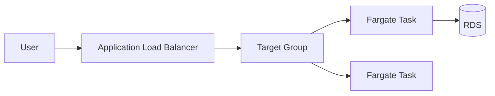
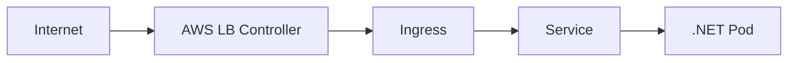
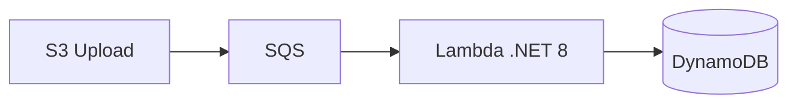
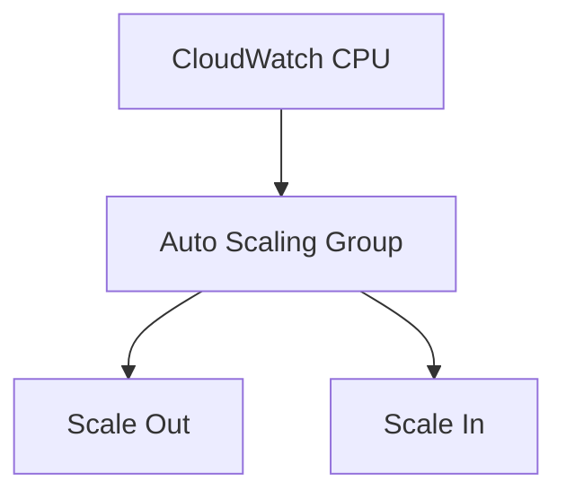
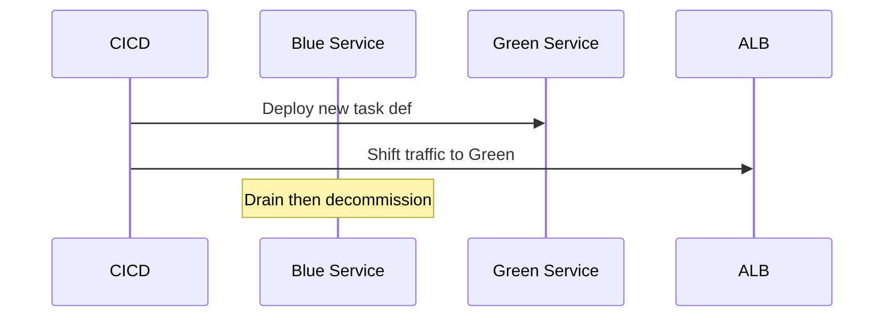

# Week 18 — AWS Compute Diagrams

## 1. ECS Fargate — .NET API

## 2. EKS Ingress

## 3. Lambda — Event-Driven

## 4. Auto Scaling

## 5. Blue/Green on ECS

## Practice Exercise

When is Lambda wrong for a .NET order API with 200ms p99 SLA and 2K RPS steady state?

---

[← Back to Week 18](../README.md)
