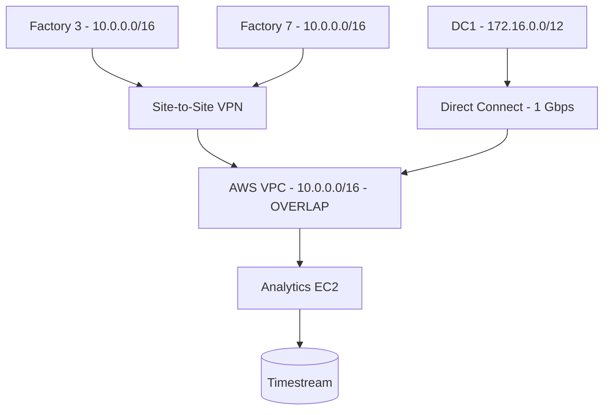
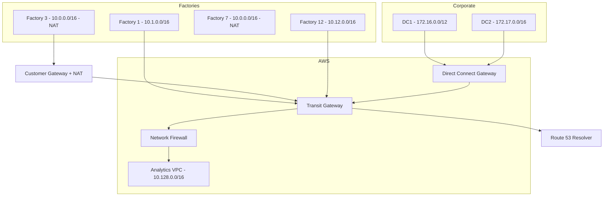

# Case Study: VPC Networking Design for Hybrid Cloud

| Attribute | Value |
|-----------|-------|
| **Industry** | Manufacturing / Industrial |
| **Scale** | 12 factories, 8,000 IoT sensors, 2 corporate data centers |
| **Week** | 19 |
| **Difficulty** | Expert |

## Business Context

A manufacturing company is connecting 12 factory sites to AWS for real-time production analytics. Each factory has on-premises PLCs, SCADA systems, and local edge servers. Corporate headquarters has two data centers running ERP and quality management systems.

A pilot connected Factory #3 via site-to-site VPN, but production analytics latency is unacceptable (180ms round-trip), and the network team discovered overlapping IP ranges (`10.0.0.0/16` used at 4 factories and in the AWS VPC). The CISO blocked further connections until a proper hybrid network architecture is designed.

The board approved $500K for hybrid connectivity. You must design VPC networking that supports factory-to-cloud, cloud-to-datacenter, and factory-to-factory communication without IP conflicts.

## Current State



**Current implementation issues (from network assessment):**
- IP overlap: 4 of 12 factories use `10.0.0.0/16`; AWS VPC also `10.0.0.0/16`
- Single VPN tunnel per factory — no redundancy; Factory #3 outage lasted 6 hours last month
- Direct Connect: single 1 Gbps connection, no backup DX or VPN failover
- No Transit Gateway — each factory VPN peers directly to VPC (full mesh planned = 12 tunnels)
- No network segmentation — factory IoT traffic shares route table with corporate ERP traffic
- DNS: factories use local DNS; AWS uses Route 53 — no hybrid resolution
- Latency: VPN over internet averages 180ms factory-to-AWS (production alerts need < 50ms)

## Requirements

### Functional
- Connect 12 factories + 2 data centers to AWS
- Factory sensors stream telemetry to AWS (8,000 sensors, 50K messages/minute per factory)
- Corporate ERP queries production summaries from AWS analytics
- Factory-to-factory communication for supply chain coordination (3 pairs)
- Centralized security inspection for internet-bound traffic

### Non-Functional
| NFR | Target |
|-----|--------|
| Factory-to-AWS latency | < 50ms |
| VPN/DX availability | 99.99% per site |
| Bandwidth per factory | 100 Mbps minimum |
| IP address space | Zero conflicts across all 14 sites |
| Network segmentation | OT (factory) isolated from IT (corporate) |
| RTO (connectivity) | < 15 minutes failover |
| RPO | N/A (network layer) |

## Constraints

- Budget: $500K one-time + $45K/month operational
- Factories cannot re-IP PLC networks (OT systems — re-IP requires 6-month change control each)
- AWS region: us-east-1 (closest to majority of factories in US Midwest)
- Team: 3 network engineers, 1 cloud architect
- CISO requires all factory-to-cloud traffic inspected by firewall
- 9-month rollout (2 factories per month after design approval)

## Your Task

1. Solve the IP overlap problem without re-IPing factory OT networks
2. Design the hub-spoke topology using Transit Gateway
3. Choose connectivity per site (VPN, Direct Connect, or SD-WAN)
4. Define network segmentation for OT vs IT traffic
5. Design hybrid DNS resolution across factories, data centers, and AWS

> **Attempt your solution before reading the reference below.**

---

## Reference Solution

### Top 3 Issues

1. **IP address overlap** — `10.0.0.0/16` used at 4 factories AND in AWS VPC; routing impossible without NAT/transit
2. **No centralized transit** — direct VPC peering for 12 factories creates 12 tunnels with no redundancy model
3. **OT/IT commingling** — factory sensor traffic and corporate ERP share routing paths without segmentation

### Revised Hybrid Network Architecture



### Key Decisions

| Decision | Choice | Rationale |
|----------|--------|-----------|
| IP overlap fix | AWS VPC re-IP to `10.128.0.0/16` + NAT at overlapping factories | Cannot re-IP OT; NAT translates `10.0.0.0/16` → unique `/24` per factory |
| Transit | AWS Transit Gateway (hub) | Centralized routing; 12 attachments vs full mesh |
| Factory connectivity | SD-WAN (AWS Partner) for 8 factories; DX + VPN backup for 4 largest | < 50ms latency; redundant paths |
| Corporate connectivity | Direct Connect (2 connections, 2 locations) + VPN backup | 99.99% availability |
| Segmentation | Separate TGW route tables: OT, IT, Shared | Factory sensors cannot reach ERP directly |
| Inspection | AWS Network Firewall on TGW | CISO requirement for traffic inspection |
| DNS | Route 53 Resolver endpoints + conditional forwarding | `factory3.internal` resolves on-prem and in AWS |

### Overlapping Factory NAT Strategy

```
Factory 3 (10.0.0.0/16) → Customer Gateway NAT → 10.200.3.0/24 (unique)
Factory 7 (10.0.0.0/16) → Customer Gateway NAT → 10.200.7.0/24 (unique)
AWS VPC: 10.128.0.0/16 (re-IPed from 10.0.0.0/16)
TGW route table: 10.200.3.0/24 → Factory 3 attachment
```

### Cost Estimate

| Component | Monthly Cost |
|-----------|-------------|
| Transit Gateway (14 attachments) | ~$8,400 |
| Direct Connect (2 × 1 Gbps) | ~$4,400 |
| SD-WAN (8 factories) | ~$16,000 |
| Network Firewall | ~$3,600 |
| VPN backup (12 factories) | ~$1,200 |
| **Total** | **~$33,600/month** (within $45K cap) |

### Expected Outcome

- Factory-to-AWS latency: 180ms → ~35ms (SD-WAN + TGW)
- IP conflicts: 4 overlapping factories → resolved via NAT
- Connectivity availability: 99.5% (single VPN) → 99.99% (SD-WAN + backup)
- Rollout: 2 factories/month over 9 months after TGW foundation

## Discussion Questions

1. When would you use AWS Cloud WAN instead of Transit Gateway for this topology?
2. How do you handle factory OT security requirements (Purdue model) in a cloud-connected architecture?
3. Should overlapping factories eventually be re-IPed, and what is the business case?

## Interview Story Angle

**STAR prompt:** "Tell me about a complex networking design you created for hybrid cloud."

Use this case study: emphasize pragmatic IP overlap resolution (NAT, not re-IP OT), Transit Gateway hub-spoke, and OT/IT segmentation for manufacturing.
