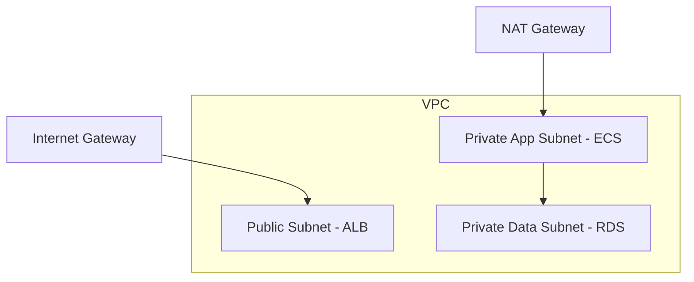
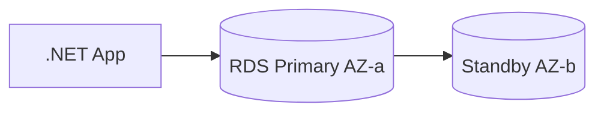
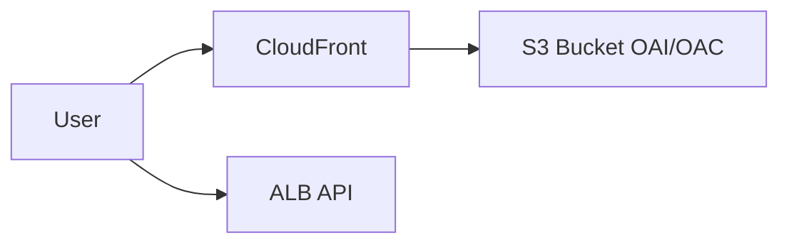
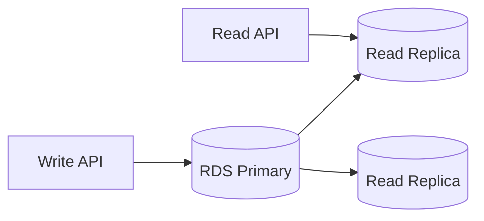
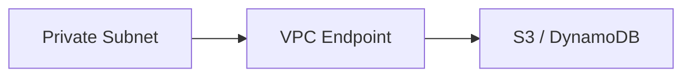

# Week 19 — AWS Data & VPC Diagrams

## 1. VPC — 3-Tier Subnets

## 2. RDS Multi-AZ

## 3. S3 + CloudFront Static Assets

## 4. Read Replica Scaling

## 5. VPC Endpoints — Private AWS API Access

> **Architect note:** NAT Gateway egress costs — use VPC endpoints for S3/Dynamo to reduce NAT traffic.

## Practice Exercise

Design VPC CIDR plan for 3 AZs with room for 4 environment expansions.

---

[← Back to Week 19](../README.md)
