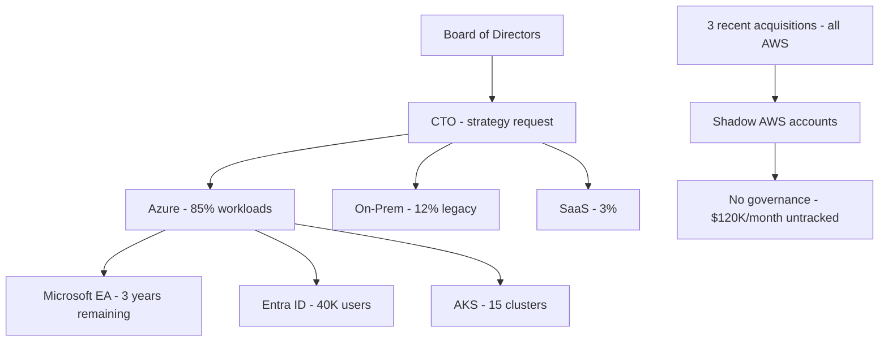
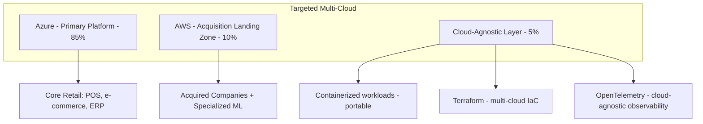

# Case Study: Multi-Cloud Strategy Board Presentation

| Attribute | Value |
|-----------|-------|
| **Industry** | Global Retail Enterprise |
| **Scale** | $12B revenue, 40K employees, 85% Azure today, AWS evaluation |
| **Week** | 20 |
| **Difficulty** | Expert |

## Business Context

A global retail enterprise runs 85% of production workloads on Azure (EA agreement, Entra ID, 200+ App Services, AKS clusters). The board of directors has asked the CTO to present a multi-cloud strategy at the Q3 meeting in 4 weeks. Three board members sit on portfolio companies running AWS. The CEO wants optionality for acquisitions. The CFO wants cost justification, not technology exploration.

The CTO has asked you — enterprise architect — to prepare the board presentation framework: strategic rationale, risk assessment, cost model, and a 3-year roadmap. This is not a technical deep-dive; it is a business decision document.

> **Note:** For a detailed Azure vs AWS technical comparison for .NET SaaS, see [cs20-multicloud-comparison.md](cs20-multicloud-comparison.md).

## Current State

**Current implementation issues (from enterprise architecture review):**
- No formal multi-cloud strategy — acquisitions bring AWS organically
- 3 acquired companies run AWS with zero integration ($120K/month untracked spend)
- Enterprise architects divided: 4 advocate "Azure-only," 3 advocate "true multi-cloud"
- No cloud exit strategy documented — board concerned about vendor lock-in
- Disaster recovery: single-cloud (Azure paired regions only) — no cross-cloud DR
- Skills: 200 Azure-certified engineers, 12 with AWS experience
- EA renewal in 18 months — board wants leverage for negotiation

## Requirements

### Functional (Board Deliverables)
- Multi-cloud strategy recommendation with clear decision framework
- 3-year roadmap with milestones and investment requirements
- Total cost of ownership comparison: Azure-only vs targeted multi-cloud
- Risk register: vendor lock-in, skills gap, operational complexity, security
- Acquisition integration playbook (cloud-agnostic)

### Non-Functional
| NFR | Target |
|-----|--------|
| Presentation length | 20 minutes + 10 minutes Q&A |
| Cost model accuracy | ±15% (directional, not line-item) |
| Board comprehension | Non-technical members must understand trade-offs |
| Decision clarity | Single recommended path with alternatives ranked |
| Regulatory alignment | GDPR, PCI-DSS, SOX compliance maintained |

## Constraints

- Microsoft EA: 3 years remaining, $18M/year committed spend
- Cannot migrate 85% Azure estate in 3 years (impractical and expensive)
- Board wants decision in Q3 meeting — 4 weeks to prepare
- CFO will challenge any strategy that increases total cloud spend > 10%
- CEO mandate: "optionality" does not mean "equal investment in both clouds"
- 3 recent AWS acquisitions must be integrated within 12 months regardless of strategy

## Your Task

1. Frame the board-level decision: what problem does multi-cloud solve for this retailer?
2. Define three strategic options with pros/cons (Azure-primary, targeted multi-cloud, cloud-agnostic)
3. Build a directional 3-year TCO model
4. Create the risk register with mitigation strategies
5. Draft the presentation outline with key slides and talking points

> **Attempt your solution before reading the reference below.**

---

## Reference Solution

### Strategic Options Analysis

| Option | Description | 3-Year TCO | Risk |
|--------|-------------|------------|------|
| A: Azure-primary | 90% Azure, absorb AWS acquisitions into Azure | $54M (EA baseline) | Vendor lock-in |
| B: Targeted multi-cloud (recommended) | Azure primary + AWS for acquisitions & ML | $58M (+7%) | Operational complexity |
| C: Cloud-agnostic | Kubernetes everywhere, avoid PaaS | $72M (+33%) | Skills, timeline, cost |

### Recommended Strategy: Targeted Multi-Cloud

### Key Decisions

| Decision | Choice | Rationale |
|----------|--------|-----------|
| Primary cloud | Azure (maintain 85%) | EA commitment, skills, Entra ID integration |
| Secondary cloud | AWS (targeted 10-15%) | Acquisition integration, board portfolio alignment |
| Abstraction layer | Terraform + Kubernetes for portable workloads only | Pragmatic portability without full cloud-agnostic rewrite |
| Acquisition playbook | AWS landing zone (Control Tower) for AWS acquisitions; Azure landing zone for Azure | Integrate, don't force-migrate on day 1 |
| DR strategy | Azure paired regions (primary) + AWS S3 cross-cloud backup for critical data | Board-requested exit optionality |
| Skills investment | AWS training for 30 architects (not 200 engineers) | Targeted capability, not broad retraining |
| EA negotiation | Use multi-cloud evaluation as leverage at renewal | Board-expected outcome |

### Board Presentation Outline

| Slide | Content | Talking Point |
|-------|---------|---------------|
| 1 | Executive summary | "Targeted multi-cloud: Azure primary, AWS for acquisitions" |
| 2 | Why now? | 3 AWS acquisitions, board optionality, EA renewal leverage |
| 3 | Three options compared | TCO table: $54M / $58M / $72M |
| 4 | Recommended architecture | Diagram: 85/10/5 split |
| 5 | 3-year roadmap | Year 1: AWS landing zone; Year 2: integrate acquisitions; Year 3: evaluate |
| 6 | Risk register | Lock-in, complexity, skills — with mitigations |
| 7 | Investment ask | $2M Year 1 (AWS landing zone + 30 architect training) |
| 8 | What we are NOT doing | No full migration, no cloud-agnostic rewrite, no 50/50 split |
| 9 | EA renewal strategy | Multi-cloud credible threat → better terms |
| 10 | Decision requested | Approve Option B + $2M Year 1 investment |

### 3-Year Roadmap

| Year | Milestone | Investment |
|------|-----------|------------|
| Year 1 | AWS Organization + landing zone; integrate 3 acquisitions | $2M |
| Year 2 | Cross-cloud DR for critical data; Terraform multi-cloud modules | $1.5M |
| Year 3 | EA renewal negotiation; evaluate 10% AWS growth vs baseline | $1M |
| **Total incremental** | | **$4.5M over 3 years** |

### Expected Board Outcome

- Clear decision framework: not "should we multi-cloud?" but "where and how much?"
- CFO comfort: +7% TCO (not +33% cloud-agnostic)
- CEO optionality: credible AWS capability for acquisitions
- EA leverage: documented AWS evaluation strengthens renewal negotiation

## Discussion Questions

1. How do you prevent "targeted multi-cloud" from becoming unmanaged shadow IT across both clouds?
2. What metrics would you use to evaluate whether the multi-cloud investment succeeded after 3 years?
3. When does vendor lock-in risk outweigh multi-cloud operational complexity?

## Interview Story Angle

**STAR prompt:** "Tell me about presenting a technology strategy to executive leadership."

Use this case study: emphasize business framing over technology, TCO-driven options analysis, and the discipline of saying what you are NOT doing (no 50/50 split, no cloud-agnostic rewrite).
