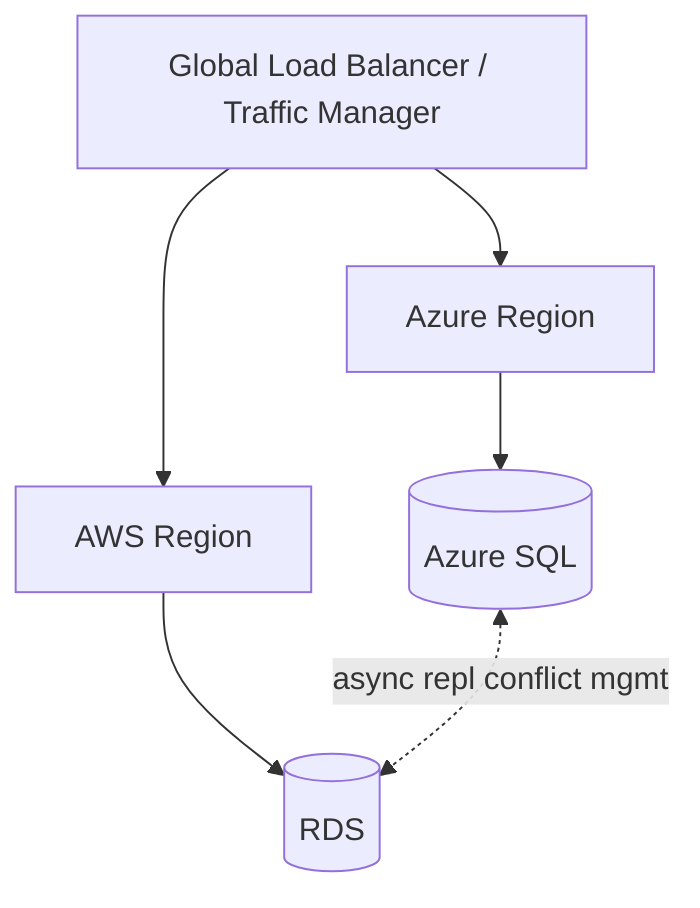
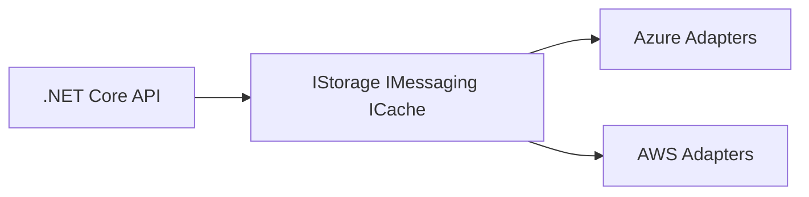
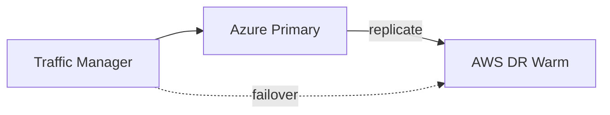
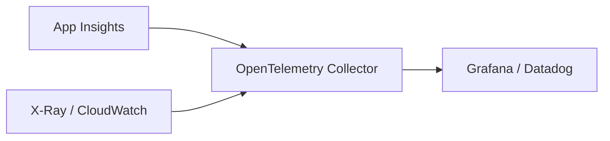
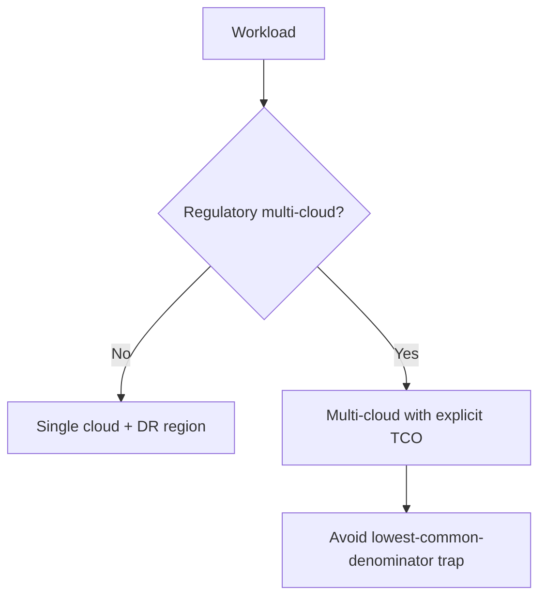

# Week 20 — Multi-Cloud Architecture Diagrams

## 1. Active-Active Multi-Cloud (Conceptual)

## 2. Cloud-Agnostic Abstraction

## 3. DR — Primary Azure, DR AWS

## 4. Observability Across Clouds

## 5. Decision — Single vs Multi-Cloud

## Practice Exercise

Build a comparison table (5 rows) for the same .NET API on Azure App Service vs AWS ECS Fargate.

---

[← Back to Week 20](../README.md)
