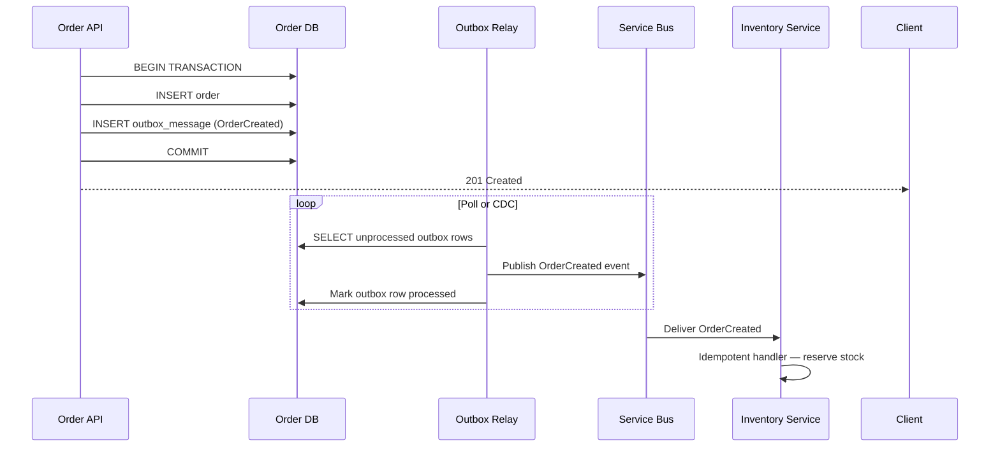

# Week 21 Assessment — Distributed Systems Fundamentals

| Attribute | Value |
|-----------|-------|
| **Time Limit** | 60 minutes |
| **Pass Score** | 70% |
| **Expert Score** | 90% |

---

## Section A: Conceptual (30 points)

### A1. CAP Theorem Application (10 pts)

Your team is choosing a data store for three subsystems:
1. **Bank ledger** — balance must never be wrong, even during AZ failure
2. **Product catalog** — 5-second stale prices acceptable, must stay online during partition
3. **Shopping cart** — merge conflicts acceptable, must never reject "add to cart"

**Question:** Classify each as CP or AP during partition. Justify.

**Model Answer:**
- **Bank ledger → CP:** Consistency over availability; reject writes/reads rather than return stale balance; use quorum writes (R+W>N), fencing tokens; PostgreSQL with synchronous replication or dedicated ledger service
- **Product catalog → AP:** Availability over strong consistency; CDN/cache with eventual propagation; stale price for 5 sec is acceptable business trade-off
- **Shopping cart → AP:** Availability critical; merge conflicts on concurrent edits (last-write-wins or CRDT merge); never block user from adding items
- **Key insight:** CAP applies during partition, not always — tune consistency levels (Cosmos DB session/strong) for normal operation
- **PACELC extension:** Normal operation — catalog optimizes latency (EL), ledger optimizes consistency (EC)

**Scoring:** 10 = correct CP/AP per system + business justification + partition context

---

### A2. Idempotency Keys (10 pts)

A mobile payment API receives duplicate `POST /payments` requests with the same body but no idempotency key. The handler calls Stripe, saves to DB, then crashes before returning 200. The client retries; Service Bus also redelivers the queued message.

**Question:** Design the idempotency solution end-to-end.

**Model Answer:**
- **Client:** Generate `Idempotency-Key` header (UUID) per payment attempt; reuse same key on retry
- **Server:** Check `ProcessedPayments` table by key before calling Stripe; return cached result if exists
- **Database:** Unique constraint on `(idempotency_key)` or `(order_id, operation)`
- **Stripe passthrough:** Forward idempotency key to Stripe API (native support)
- **Message handler:** Extract idempotency key from message envelope; same dedup logic
- **Atomicity:** Insert idempotency record + process in transaction, or use "processing" state to prevent concurrent duplicates
- **TTL:** Retain keys 24–72 hours; archive for audit
- **Monitoring:** Alert on duplicate key collision rate (indicates retry storms)

---

### A3. Saga vs 2PC (10 pts)

A architect proposes using two-phase commit (2PC) across Order, Payment, and Inventory microservices to guarantee atomic checkout.

**Question:** Why is this a bad idea? What should replace it?

**Model Answer:**
- **2PC problems:** Coordinator blocks all participants on prepare; locks held across network; coordinator failure after prepare stalls all services; unsuitable for WAN/long-running business logic
- **Microservices violate 2PC assumptions:** Independent databases, different teams, variable latency
- **Replace with Saga:** Orchestrated or choreographed multi-step workflow with compensating transactions
- **Flow:** Reserve inventory → Charge payment → Confirm order; on payment failure → Release inventory (compensate)
- **Consistency model:** Eventual consistency with explicit business states (Pending, Confirmed, Compensated)
- **2PC acceptable only:** Same-DC, same-team, same database cluster, short transactions (legacy XA)
- **Pair with:** Outbox for reliable event publishing; idempotency on every saga step

---

## Section B: Architecture Diagram (20 points)

**Prompt:** Draw a sequence diagram for the transactional outbox pattern: order saved to DB and outbox message written atomically, then relay publishes to Service Bus.

**Rubric:**
| Criteria | Points |
|----------|--------|
| Single transaction for order + outbox insert | 8 |
| Separate relay/worker publishes asynchronously | 6 |
| At-least-once delivery acknowledged | 4 |
| Clear labeling | 2 |

**Reference:** See [diagrams/README.md](../diagrams/README.md)

---

## Section C: Trade-off Analysis (25 points)

**Scenario:** A social feed shows posts from followed users. Product team wants "instant" feed updates. Engineering proposes strong consistency reads from a globally replicated database (2x latency, 3x cost).

**Options:**
- A: Strong consistency globally (CP everywhere)
- B: Eventual consistency with 2-second propagation + read-your-writes for own posts
- C: AP with client-side merge and conflict resolution

**Prompt:** Analyze and recommend for 2M users, 50K concurrent peak.

**Model Answer:**
- **Business mapping:** Feed staleness of 2 seconds is acceptable for social content; user's own post must appear immediately (read-your-writes)
- **Option A:** Over-engineered; global strong consistency unnecessary for feed; cost and latency penalty hurts peak performance
- **Option B (recommended):** Eventual consistency for feed reads; session consistency for own writes; fan-out on write or pull model depending on follower count
- **Option C:** Excessive complexity for users; merge conflicts confusing in feed context
- **Eventual consistency mechanics:** Write to primary → async replicate → cache invalidation → feed refresh
- **Monitoring:** Track replication lag p99; alert if > 5 seconds
- **Architect framing:** "We chose availability and latency during partition; consistency is tunable per use case, not global"

---

## Section D: Production Realism (15 points)

**Scenario:** Order service saves order to PostgreSQL, then calls `serviceBus.PublishAsync(OrderCreated)` in a separate step. During a network blip, 3% of orders are saved but events never published — inventory never reserves stock, but customer sees "order confirmed."

**Question:** Root cause and architectural fix?

**Model Answer:**
1. **Root cause:** Dual-write problem — DB commit and message publish are not atomic
2. **Symptoms:** Orphan orders in DB without downstream processing; reconciliation nightmare
3. **Immediate:** Reconciliation job compares orders without matching inventory reservation; replay missing events
4. **Architectural fix:** Transactional outbox — write order + outbox row in same DB transaction; relay worker publishes asynchronously
5. **Consumer side:** Idempotent inventory handler with inbox dedup table
6. **Alternative at scale:** Debezium CDC on outbox table → Kafka/Service Bus (no polling load)
7. **Prevention:** Never publish after `SaveChanges` without outbox; code review checklist item
8. **Monitoring:** Outbox relay lag metric; alert if unprocessed rows > threshold for 5 minutes

---

## Section E: Interview Communication (10 points)

**Prompt:** Explain eventual consistency to a CFO who asks: "Why can't our system just be consistent all the time? We paid for enterprise software."

**Model Answer (2 minutes):**
"When your bank transfers money, you expect the balance to be exact — that's strong consistency, and we use it where money is involved. But not every part of the business needs that same guarantee.

Think of it like a newspaper versus a stock ticker. The newspaper is correct when printed, but it's hours old — that's eventual consistency, and it's fine for product descriptions or recommendation feeds. The stock ticker needs real-time accuracy — that's strong consistency, and it costs more infrastructure to deliver.

During peak traffic — like Black Friday — we choose to keep the website available and accept that a product count might be one or two units behind for a few seconds, rather than showing an error page while we sync every database globally. We compensate with idempotency keys on payments so money is never charged twice, and sagas that undo partial work if something fails.

The enterprise software didn't remove physics — data still travels at network speed. We architect which guarantees matter per business function, instead of paying 3x cost for strong consistency everywhere."

---

## Self-Score Summary

| Section | Score | Max |
|---------|-------|-----|
| A | | 30 |
| B | | 20 |
| C | | 25 |
| D | | 15 |
| E | | 10 |
| **Total** | | **100** |

## Review Plan

| If scored low in... | Revisit |
|---------------------|---------|
| Section A | [theory/01-fundamentals.md](../theory/01-fundamentals.md) |
| Section B | [diagrams/README.md](../diagrams/README.md) + [theory/02-intermediate.md](../theory/02-intermediate.md) |
| Section C | [theory/03-advanced-expert.md](../theory/03-advanced-expert.md) |
| Section D | [case-studies/cs21-double-charge.md](../case-studies/cs21-double-charge.md) + [labs/lab-21-polly-resilience.md](../labs/lab-21-polly-resilience.md) |
| Section E | Practice aloud — [interview-questions/](../interview-questions/) |
