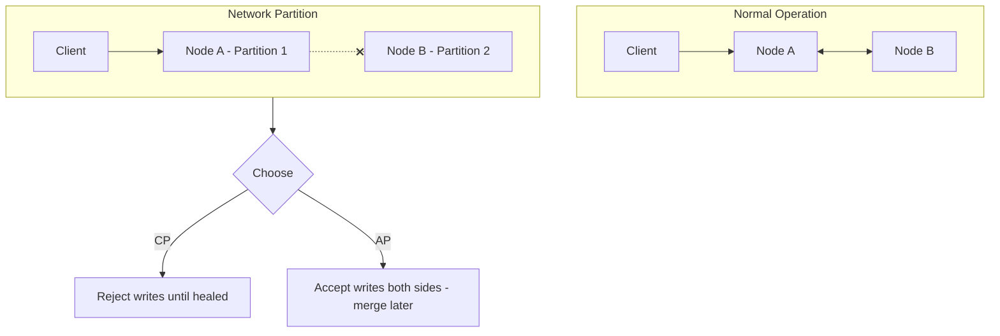
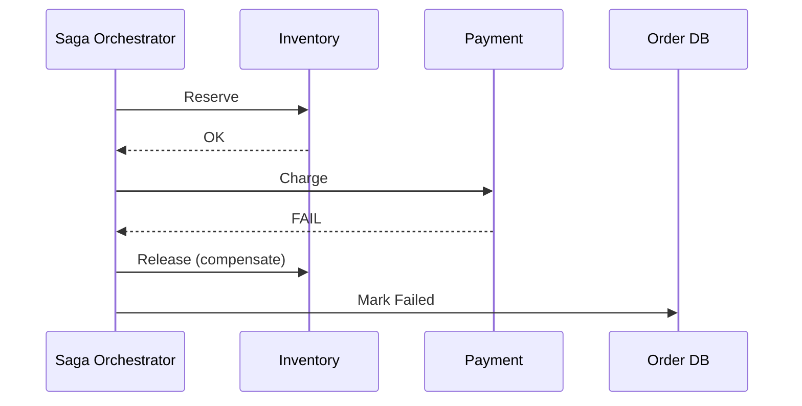
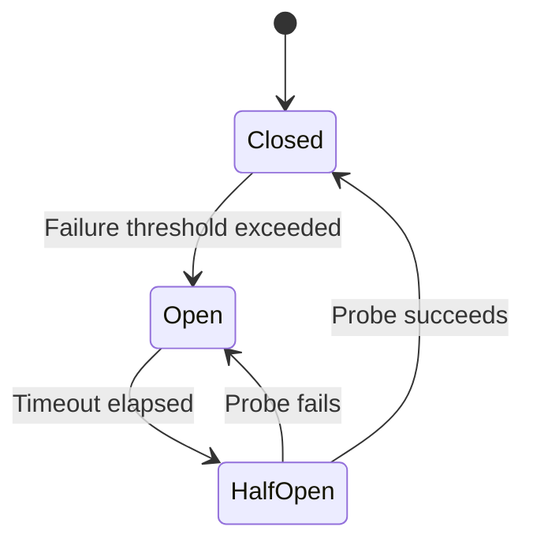
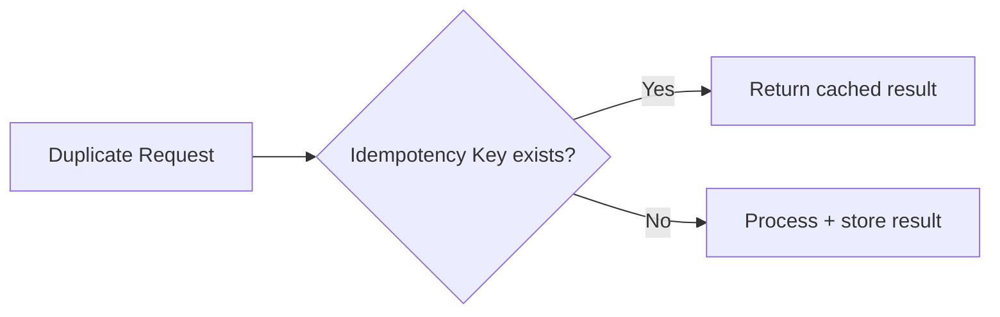

# Week 21 — Diagrams

## CAP During Partition

```mermaid
flowchart TD
    subgraph Normal["Normal Operation"]
        C1[Client] --> N1[Node A]
        N1 <--> N2[Node B]
    end

    subgraph Partition["Network Partition"]
        C2[Client] --> P1[Node A - Partition 1]
        P2[Node B - Partition 2]
        P1 -.-x P2
    end

    Partition --> Choice{Choose}
    Choice -->|CP| Consistent[Reject writes until healed]
    Choice -->|AP| Available[Accept writes both sides - merge later]
```

## Saga Orchestration

```mermaid
sequenceDiagram
    participant S as Saga Orchestrator
    participant I as Inventory
    participant P as Payment
    participant O as Order DB

    S->>I: Reserve
    I-->>S: OK
    S->>P: Charge
    P-->>S: FAIL
    S->>I: Release (compensate)
    S->>O: Mark Failed
```

## Circuit Breaker States

```mermaid
stateDiagram-v2
    [*] --> Closed
    Closed --> Open: Failure threshold exceeded
    Open --> HalfOpen: Timeout elapsed
    HalfOpen --> Closed: Probe succeeds
    HalfOpen --> Open: Probe fails
```

## Idempotency Flow

```mermaid
flowchart LR
    Request[Duplicate Request] --> Check{Idempotency Key exists?}
    Check -->|Yes| Return[Return cached result]
    Check -->|No| Process[Process + store result]
```

---

[← Back to Week 21](../README.md)
