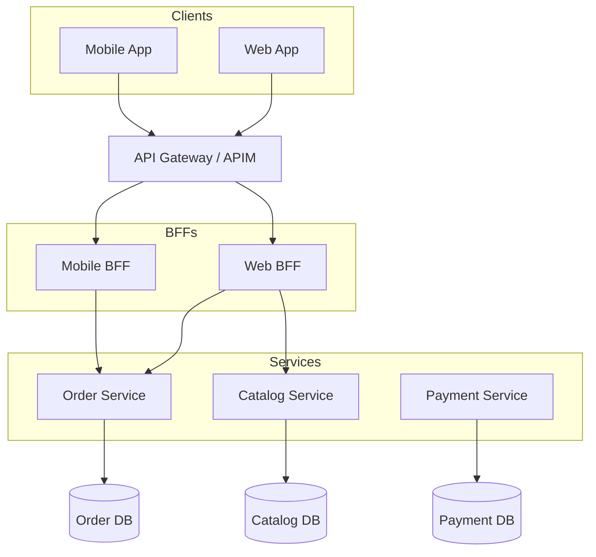

# Week 22 Assessment — Microservices Architecture

| Attribute | Value |
|-----------|-------|
| **Time Limit** | 60 minutes |
| **Pass Score** | 70% |
| **Expert Score** | 90% |

---

## Section A: Conceptual (30 points)

### A1. Service Boundary Design (10 pts)

A team proposes decomposing an e-commerce monolith into: `DatabaseService`, `BusinessLogicService`, `UIService`, and `AuthService`.

**Question:** Why is this wrong? How should boundaries be drawn instead?

**Model Answer:**
- **Anti-pattern:** Decomposition by technical layer — recreates distributed monolith with network latency between every layer
- **Problems:** `BusinessLogicService` becomes god service; shared database likely; no independent deployability; cascading failures across layers
- **Correct approach:** Decompose by **business capability** or **bounded context** (DDD): Order, Payment, Inventory, Catalog, Notification
- **Conway's Law:** Team structure should align with service boundaries — one squad owns Order end-to-end
- **Transaction boundary test:** Services align with business transactions that can be eventually consistent
- **Each service owns:** Its API, its data, its deployment pipeline

**Scoring:** 10 = identifies layer anti-pattern + bounded context alternative + ownership model

---

### A2. Sync vs Async Communication Chains (10 pts)

Place-order flow currently chains five synchronous HTTP calls: API → Order → Inventory → Payment → Shipping → Notification. p99 latency is 2.8 seconds (SLA: 800ms).

**Question:** Which calls should be sync vs async? Redesign the chain.

**Model Answer:**
- **Sync (user waits):** Order creation, inventory reservation, payment charge — core transaction path; return 201 when payment confirmed
- **Async (fire-and-forget via events):** Shipping label creation, email/SMS notification, analytics, search index update
- **Redesigned flow:** Sync saga (Order → Inventory → Payment) returns in ~400ms; publish `OrderConfirmed` event; Shipping and Notification subscribe asynchronously
- **Why not all sync:** Each hop adds latency + failure point; notification failure shouldn't block order
- **Why not all async:** User needs immediate confirmation that payment succeeded
- **Correlation ID:** Propagate through sync chain and into async events for tracing
- **UX:** Return order ID immediately; push notification or poll for shipping status

---

### A3. Circuit Breaker Tuning (10 pts)

Inventory service circuit breaker is configured: `FailureRatio = 0.1`, `MinimumThroughput = 5`, `BreakDuration = 60s`. During a flash sale, inventory returns 503 for 8 seconds (planned scaling event). The circuit opens and blocks all orders for 60 seconds — worse than the original outage.

**Question:** What went wrong? How do you tune circuit breakers for this scenario?

**Model Answer:**
- **Problem:** Threshold too aggressive — 10% failure on low throughput (5 requests) opens circuit on single failure; 60s break duration amplifies brief outage into minute-long blackout
- **Tuning adjustments:**
  - Raise `MinimumThroughput` to 20–50 (need meaningful sample before opening)
  - Raise `FailureRatio` to 0.5–0.6 for brief transient failures
  - Reduce `BreakDuration` to 10–15s with half-open probe requests
  - Add **timeout** (3s) separate from circuit breaker — distinguish slow vs failed
- **Bulkhead:** Isolate inventory call thread pool from payment calls
- **Fallback:** Return "limited stock check" degraded mode vs hard fail all orders
- **Monitoring:** Circuit state transitions as metric; alert on open state, not just 503s
- **Architect rule:** Circuit breaker protects the caller, not the callee — tune from caller's SLA perspective

---

## Section B: Architecture Diagram (20 points)

**Prompt:** Draw an architecture diagram showing API Gateway routing to microservices, with BFF aggregation for mobile vs web clients.

**Rubric:**
| Criteria | Points |
|----------|--------|
| API Gateway with auth/rate-limit responsibilities | 6 |
| Separate BFFs for mobile and web | 6 |
| Services own independent databases | 4 |
| Clear client → gateway → BFF → service flow | 4 |

**Reference:** See [diagrams/README.md](../diagrams/README.md)

---

## Section C: Trade-off Analysis (25 points)

**Scenario:** E-commerce monolith shares one SQL Server database. Team of 8 wants to extract Order service. Shared database is allowed temporarily. Timeline: 6 months. Zero downtime required.

**Options:**
- A: Big-bang — extract Order service + dedicated DB in one release
- B: Strangler fig — parallel run with API Gateway routing, phased DB split
- C: Keep monolith, add read replicas for scale

**Prompt:** Analyze and recommend with migration phases.

**Model Answer:**
- **Option A:** Too risky — big-bang DB migration with zero downtime is extremely difficult; rollback complex
- **Option C:** Doesn't solve deployment frequency pain (order changes 3x/week)
- **Option B (recommended) — Strangler fig phases:**
  - **Phase 1 (Month 1–2):** Deploy Order microservice alongside monolith; API Gateway routes `/api/v2/orders/*` to new service; shared DB with schema separation (`orders` schema)
  - **Phase 2 (Month 3–4):** Feature flags shift traffic 10% → 50% → 100%; CDC syncs data between monolith writes and new service
  - **Phase 3 (Month 5–6):** Extract `orders` schema to dedicated SQL instance; reconciliation job during transition; decommission monolith order code
- **Risks:** Data inconsistency (mitigate with CDC + reconciliation), dual maintenance (time-box to 6 months)
- **Database per service:** End state — each service owns its DB; no cross-service JOINs
- **Success metric:** Order service deploys independently without monolith release

---

## Section D: Production Realism (15 points)

**Scenario:** After extracting Payment service with its own database, the Order service still queries `SELECT * FROM payments WHERE order_id = @id` via a shared database view. A new developer adds a JOIN across `orders` and `payments` tables in the Order service.

**Question:** What architectural violation occurred? Fix plan?

**Model Answer:**
1. **Violation:** Shared database anti-pattern — breaks service autonomy, creates hidden coupling, prevents independent schema evolution
2. **Immediate risk:** Payment schema change breaks Order service; deployment coupling returns
3. **Fix:** Remove shared view; Order service calls Payment API (`GET /payments/{orderId}`) or subscribes to `PaymentCompleted` events and maintains local read projection
4. **Data duplication accepted:** Order service stores `paymentStatus` and `transactionId` as projection — eventual consistency
5. **Enforcement:** CI lint rule — no cross-schema SQL in microservices; architecture fitness function
6. **Migration:** Backfill projection from Payment events; deprecate view with deadline
7. **ADR:** Document "database per service" policy with API composition and CQRS read models as alternatives

---

## Section E: Interview Communication (10 points)

**Prompt:** Explain to a engineering director why you need an API Gateway when each microservice already has its own REST API.

**Model Answer (2 minutes):**
"Each service having its own API is correct — that's how teams deploy independently. But our clients — web app, mobile app, partner integrations — shouldn't need to know about twelve internal service URLs, authentication mechanisms, and rate limits.

The API Gateway is the front door. It handles cross-cutting concerns once: JWT validation, rate limiting, TLS termination, and request routing. When Mobile v3 needs a different payload shape, the Mobile BFF sits behind the gateway and aggregates calls to Order and Catalog services — so we don't pollute either service with client-specific logic.

Without a gateway, every client couples directly to every service. A security policy change means updating four clients. A new service means four client releases. The gateway lets us add, remove, or reroute services without touching client apps.

It's the difference between customers walking through the main entrance versus climbing through twelve different windows."

---

## Self-Score Summary

| Section | Score | Max |
|---------|-------|-----|
| A | | 30 |
| B | | 20 |
| C | | 25 |
| D | | 15 |
| E | | 10 |
| **Total** | | **100** |

## Review Plan

| If scored low in... | Revisit |
|---------------------|---------|
| Section A | [theory/01-fundamentals.md](../theory/01-fundamentals.md) |
| Section B | [diagrams/README.md](../diagrams/README.md) |
| Section C | [case-studies/cs22-monolith-extraction.md](../case-studies/cs22-monolith-extraction.md) |
| Section D | [labs/lab-22-ocelot-gateway.md](../labs/lab-22-ocelot-gateway.md) + [common-mistakes.md](../common-mistakes.md) |
| Section E | Practice aloud — [interview-questions/](../interview-questions/) |
