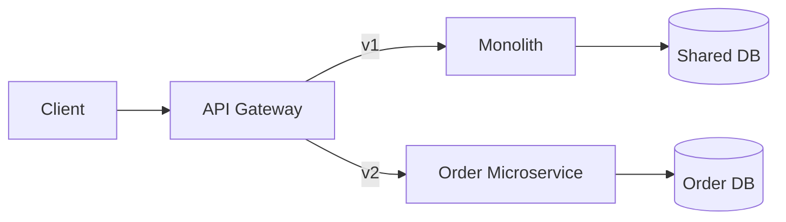

# Case Study: Strangler Fig — Order Module Extraction

| **Week** | 22 | **Difficulty** | Advanced |

## Context
E-commerce monolith (.NET Framework 4.8, 400K LOC). Order module changes 3x/week. Rest of monolith changes monthly. Team wants faster order deployments without full monolith release.

## Constraints
- Zero downtime migration
- Shared SQL database initially allowed (temporary)
- 6-month timeline
- Team of 8 developers

## Your Task
Design strangler fig extraction for Order module.

## Reference Solution

### Phase 1 (Month 1-2): Parallel Run
- Deploy Order microservice (.NET 8) alongside monolith
- API Gateway routes `/api/v2/orders/*` to new service
- Monolith still owns `/api/v1/orders/*`
- Shared database with schema separation (`orders` schema)

### Phase 2 (Month 3-4): Traffic Shift
- Feature flags: 10% → 50% → 100% traffic to v2
- Sync data: monolith writes still visible to new service (shared DB or CDC)

### Phase 3 (Month 5-6): Database Split
- Extract `orders` schema to dedicated SQL instance
- CDC / event sync during transition
- Decommission monolith order code

### Architecture

### Risks
| Risk | Mitigation |
|------|------------|
| Data inconsistency | CDC + reconciliation job |
| Dual maintenance | Time-box to 6 months |
| Performance | Load test v2 before shift |

## Interview Angle
STAR: strangler fig migration, measurable deployment frequency improvement.
