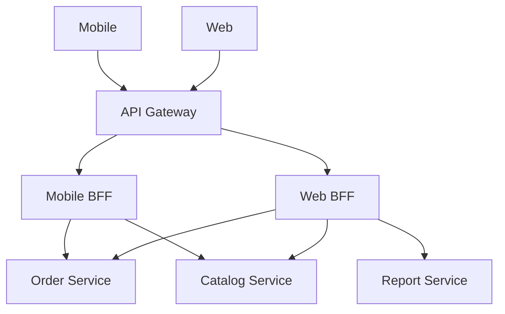
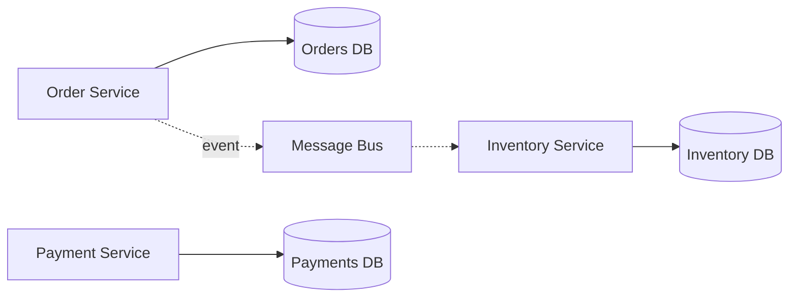
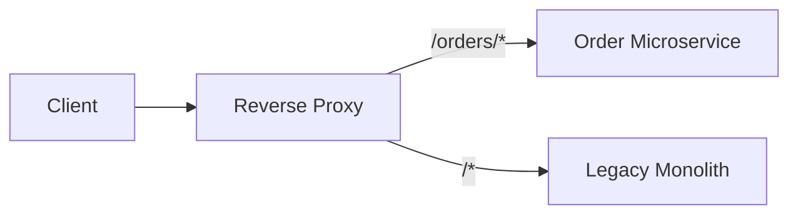
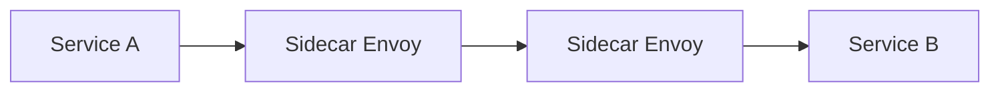

# Week 22 — Microservices Diagrams

## API Gateway + BFF Pattern

```mermaid
flowchart TB
    Mobile --> APIM[API Gateway]
    Web --> APIM
    APIM --> MobileBFF[Mobile BFF]
    APIM --> WebBFF[Web BFF]
    MobileBFF --> OrderSvc[Order Service]
    MobileBFF --> CatalogSvc[Catalog Service]
    WebBFF --> OrderSvc
    WebBFF --> CatalogSvc
    WebBFF --> ReportSvc[Report Service]
```

## Database Per Service

```mermaid
flowchart LR
  O[Order Service] --> ODB[(Orders DB)]
  P[Payment Service] --> PDB[(Payments DB)]
  I[Inventory Service] --> IDB[(Inventory DB)]
  O -.->|event| Bus[Message Bus]
  Bus -.-> I
```

## Strangler Fig Migration

```mermaid
flowchart LR
    Client --> Proxy[Reverse Proxy]
    Proxy -->|/orders/*| NewMS[Order Microservice]
    Proxy -->|/*| Monolith[Legacy Monolith]
```

## Service Mesh

```mermaid
flowchart LR
    A[Service A] --> SA[Sidecar Envoy]
    SA --> SB[Sidecar Envoy]
    SB --> B[Service B]
```

---

[← Back to Week 22](../README.md)
