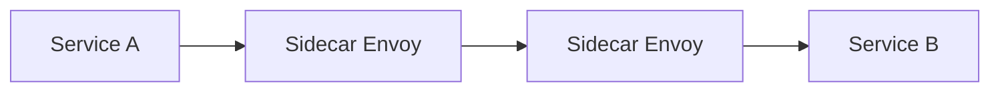

# Microservices Architecture — Decomposition & Patterns

> **Week 22** | **Module:** [microservices-distributed-systems](../../../modules/microservices-distributed-systems/README.md)

## Learning Objectives
- Decompose monoliths using bounded contexts
- Apply microservices patterns: API Gateway, BFF, service mesh
- Know when NOT to use microservices

---

## 1. When Microservices vs Monolith

| Signal | Monolith | Microservices |
|--------|----------|---------------|
| Team size | < 10 | > 15-20 (Conway's Law) |
| Domain complexity | Simple CRUD | Multiple bounded contexts |
| Deployment | Weekly OK | Need daily per service |
| Scale | Uniform | Independent per service |
| Ops maturity | Low | CI/CD, K8s, observability in place |

**Architect default:** Start modular monolith. Extract services when **concrete pain** — not hypothetical scale.

---

## 2. Decomposition Strategies

| Strategy | Description |
|----------|-------------|
| **By business capability** | Order, Payment, Inventory services |
| **By subdomain (DDD)** | Core, supporting, generic |
| **Strangler fig** | Incrementally replace monolith routes |
| **By transaction boundary** | Services align with ACID boundaries |

**Anti-pattern:** Decompose by technical layer (UI service, DB service) — recreates distributed monolith.

---

## 3. API Gateway Pattern

```
Clients → API Gateway → [Order | Payment | Inventory] Services
```

**Responsibilities:**
- Authentication / authorization
- Rate limiting, throttling
- Request routing, load balancing
- Protocol translation (REST → gRPC)
- Response aggregation (limited — prefer BFF)

**Azure:** API Management | **AWS:** API Gateway | **OSS:** Kong, Ocelot (.NET)

---

## 4. Backend for Frontend (BFF)

| BFF | Optimized For |
|-----|---------------|
| Mobile BFF | Payload size, aggregation, mobile auth |
| Web BFF | Richer payloads, GraphQL optional |
| Partner BFF | Strict SLA, API versioning, rate limits |

**Why not one API for all clients?** Different clients need different data shapes — ISP at API level.

---

## 5. Service Mesh (Istio, Linkerd, App Mesh)

Sidecar proxy handles:
- mTLS between services
- Retries, timeouts, circuit breaking
- Traffic splitting (canary: 90/10)
- Observability (distributed tracing)

**When:** 20+ services, mTLS mandate, advanced traffic management.
**Skip:** 5 services on App Service — overhead not justified.



---

## 6. Communication Patterns

| Pattern | Coupling | Consistency |
|---------|----------|-------------|
| Sync REST/gRPC | Tight (temporal) | Immediate |
| Async messaging | Loose | Eventual |
| Event-driven | Loosest | Eventual |

**Architect rule:** Sync for queries and user-waiting paths. Async for side effects, notifications, analytics.

---

## 7. Data Per Service

Each microservice owns its database. **No shared database** — anti-pattern (distributed monolith).

| Challenge | Solution |
|-----------|----------|
| Cross-service query | API composition, CQRS read model, materialized view |
| Cross-service transaction | Saga |
| Data duplication | Event-driven projection (accept eventual consistency) |

---

## 8. Observability in Microservices

**Three pillars:** Logs, Metrics, Traces

- **Correlation ID** propagated across all calls
- **OpenTelemetry** — vendor-neutral standard
- **Service map** in App Insights / Datadog / Jaeger

**Architect mandate:** No microservice deploys without distributed tracing and structured logging.

---

## Common Mistakes
1. Microservices on day one
2. Shared database across services
3. Sync chains (A→B→C→D) for user requests
4. No correlation IDs
5. Distributed monolith — must deploy all services together

**Next:** Week 23 DDD
