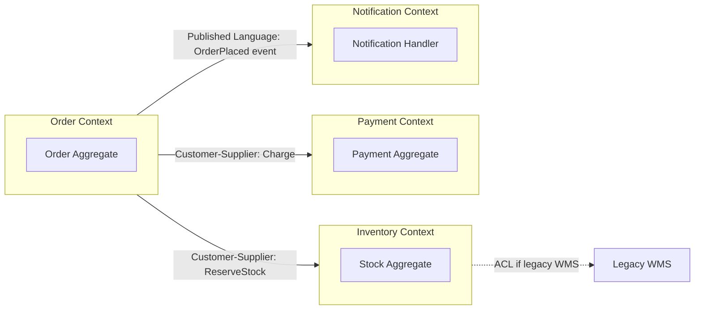

# Week 23 Assessment — Domain-Driven Design (DDD)

| Attribute | Value |
|-----------|-------|
| **Time Limit** | 60 minutes |
| **Pass Score** | 70% |
| **Expert Score** | 90% |

---

## Section A: Conceptual (30 points)

### A1. Bounded Context Boundaries (10 pts)

An e-commerce monolith has modules: Catalog, Cart, Checkout, Shipping, Returns, Loyalty Points, and Customer Support. The team plans 6 microservices.

**Question:** How would you draw bounded contexts? Which modules belong together and which must split? Justify using DDD strategic design.

**Model Answer:**
- **Order Fulfillment context:** Checkout + Shipping + Returns (shared lifecycle: place → ship → return)
- **Merchandising context:** Catalog (product truth, pricing rules owned here)
- **Customer context:** Profile, addresses, preferences — not loyalty accrual rules
- **Loyalty context:** Points accrual/redemption — separate because different change rate and compliance
- **Support context:** Tickets reference orders via IDs, not shared database
- Split when: different ubiquitous language, different team ownership, different scaling/SLA
- Anti-pattern: "Customer microservice" that owns cart + loyalty + support — god service

**Scoring:** 10 = context map reasoning + language boundaries + anti-pattern callout

---

### A2. Aggregate Design (10 pts)

`Order` aggregate contains `OrderLine`, `ShippingAddress`, and `Payment`. Developers add `Customer` entity inside `Order` with full customer profile (name, email, 50 preference fields).

**Question:** Is this correct aggregate design? What would you change?

**Model Answer:**
- Violates aggregate boundary — `Customer` is its own aggregate root
- Order should reference `CustomerId` only; load customer via application service when needed
- Large aggregate = contention on save, optimistic concurrency failures
- `ShippingAddress` as value object snapshot on order is correct (historical truth at order time)
- `Payment` may be separate aggregate if payment gateway callbacks update independently
- Rule: one transaction modifies one aggregate; use domain events for cross-aggregate updates

---

### A3. Ubiquitous Language in Microservices (10 pts)

The Catalog service calls a product a "SKU." Checkout calls it an "Item." Warehouse calls it a "Stock Unit." APIs use different field names (`skuId`, `productCode`, `unitId`).

**Question:** As architect, what is your remediation plan?

**Model Answer:**
- Facilitate event storming / domain workshop with all teams
- Publish **Context Map** with explicit relationships (Customer-Supplier, ACL)
- Anti-Corruption Layer at Checkout boundary translating Catalog's SKU to Checkout's Item
- Shared kernel only for truly stable identifiers (e.g., `ProductId` UUID) — not full models
- API style guide: external contracts use canonical `productId`; internal names can differ
- ADR documenting bounded context ownership and integration patterns

---

## Section B: Architecture Diagram (20 points)

**Prompt:** Draw a context map showing 4 bounded contexts (Order, Inventory, Payment, Notification) with relationship types (Partnership, Customer-Supplier, ACL, Published Language).

**Rubric:**
| Criteria | Points |
|----------|--------|
| Correct context boundaries | 6 |
| Relationship types labeled | 8 |
| Integration mechanism shown (events/API) | 4 |
| Clear labeling | 2 |

**Reference:**

---

## Section C: Trade-off Analysis (25 points)

**Scenario:** Team debates Event Sourcing for the `Order` aggregate. 2M orders/month, strong audit requirement, complex state transitions (pending → paid → shipped → delivered → returned).

**Options:**
- A: Event Sourcing + CQRS with read models
- B: Traditional CRUD with audit log table
- C: Hybrid — CRUD for Order, event log for audit only

**Prompt:** Analyze and recommend.

**Model Answer:**
- Event Sourcing strengths: complete audit trail, temporal queries, replay for new projections
- Costs: learning curve, snapshot strategy, eventual consistency on read side, tooling complexity
- 2M orders/month is manageable but team must own projection rebuilds and versioning
- Option B sufficient if audit = append-only `OrderAudit` table with who/when/what
- Option C pragmatic for teams new to ES — audit without full ES operational burden
- Recommend C or B unless regulatory requires point-in-time reconstruction of any field
- If A chosen: mandate snapshots every N events, idempotent projections, ADR with rollback plan

---

## Section D: Production Realism (15 points)

**Scenario:** After splitting monolith, `OrderService` and `InventoryService` both update stock. Race condition causes overselling — 3 orders confirmed for last unit in stock.

**Question:** Investigation and fix using DDD/tactical patterns.

**Model Answer:**
1. Root cause: shared database or dual writes without aggregate boundary
2. Inventory owns stock — Order only **reserves** via domain command `ReserveStock(orderId, sku, qty)`
3. Use optimistic concurrency on `Stock` aggregate (`RowVersion` / etag)
4. Saga: reserve → pay → confirm; compensate release on payment failure
5. Idempotency keys on reserve API
6. Short-term: pessimistic lock on stock row if volume low
7. Long-term: event-driven reservation with single writer per SKU partition
8. Add integration test for concurrent reserve scenarios

---

## Section E: Interview Communication (10 points)

**Prompt:** Explain "bounded context" to a product manager planning a microservices roadmap (2 minutes).

**Model Answer:**
"Think of bounded contexts as separate departments in a company that use the same words differently. In Sales, a 'customer' is someone who might buy. In Support, a 'customer' is someone with open tickets. They're related but not the same concept.

In software, each context gets its own model and its own service boundary. We don't force one giant 'Customer' table that tries to mean everything. Instead, we define clear handoffs — like Sales passes an order ID to Shipping, not the entire customer profile.

This prevents the 'god service' problem and lets teams ship independently. The hard part is drawing the boundaries right — that's what we do with domain workshops before writing code."

---

## Self-Score Summary

| Section | Score | Max |
|---------|-------|-----|
| A | | 30 |
| B | | 20 |
| C | | 25 |
| D | | 15 |
| E | | 10 |
| **Total** | | **100** |

## Review Plan

| If scored low in... | Revisit |
|---------------------|---------|
| Section A | [theory/01-fundamentals.md](../theory/01-fundamentals.md) |
| Section B | [diagrams/README.md](../diagrams/README.md) |
| Section C | [theory/02-intermediate.md](../theory/02-intermediate.md) |
| Section D | [case-studies/](../case-studies/) |
| Section E | [interview-questions/](../interview-questions/) |
