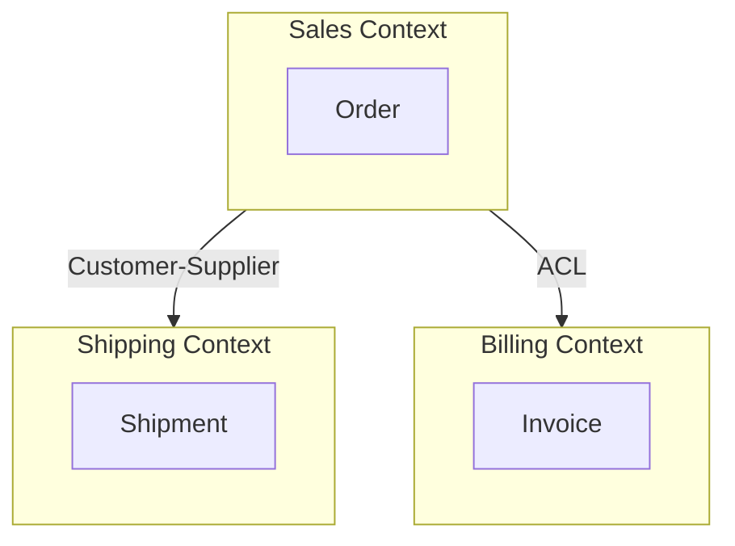
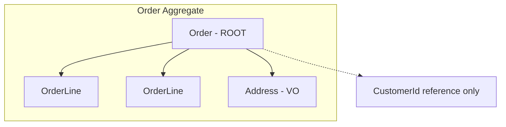

# Week 23 — DDD Diagrams

## Bounded Context Map

## Aggregate Boundary

## Event Storming Legend

| Color | Element |
|-------|---------|
| Orange | Domain Event |
| Blue | Command |
| Yellow | Aggregate |
| Pink | Policy |
| Green | Read Model |

---

[← Back to Week 23](../README.md)
