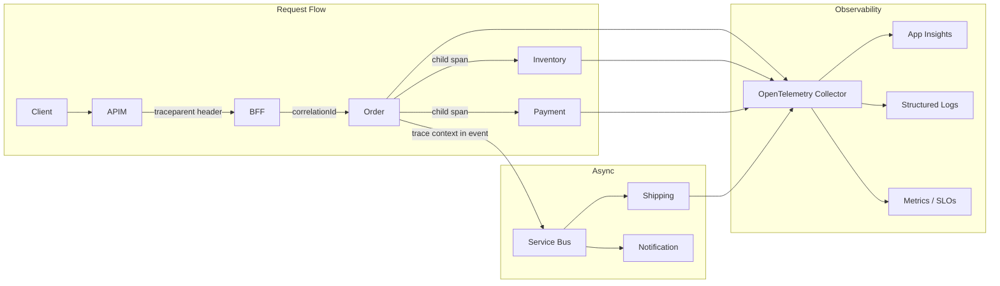

# Week 24 Assessment — Microservices Capstone

| Attribute | Value |
|-----------|-------|
| **Time Limit** | 60 minutes |
| **Pass Score** | 70% |
| **Expert Score** | 90% |

---

## Section A: Conceptual (30 points)

### A1. End-to-End Order Flow (10 pts)

Design the complete place-order flow for a 12-service e-commerce platform (2M users, 500 orders/min peak). List each service involved, sync vs async boundaries, and where the user gets a response.

**Model Answer:**
- **Sync path (user waits):** Client → APIM → BFF → Order Saga orchestrator → Inventory (reserve) → Payment (charge) → Order (confirm) → return 201 with order ID (~400–600ms target)
- **Async path (after confirmation):** `OrderConfirmed` event via Service Bus → Shipping (create label), Notification (email/SMS), Analytics (event stream), Search (index update), Recommendation (retrain signal)
- **Services in sync path:** Order, Inventory, Payment (3 services, not all 12)
- **Services in async path:** Shipping, Notification, Analytics, Search, Recommendation
- **Not in critical path:** Catalog (read before order), Cart (cleared async), Pricing (evaluated during cart), Identity (auth at gateway)
- **State machine:** Pending → Reserved → Paid → Confirmed → Shipped; user sees Confirmed
- **Failure at each step:** Inventory fail → 409; Payment fail → compensate inventory release → 402

**Scoring:** 10 = correct sync/async split + service list + response boundary + failure handling

---

### A2. Payment Saga Design (10 pts)

Payment service is in PCI scope, isolated with its own database. Design the payment step of the order saga including failure modes and compensation.

**Model Answer:**
- **Orchestration:** Order Saga calls Payment service via gRPC with `Idempotency-Key` header
- **Payment flow:** Validate idempotency → call Stripe with passthrough key → save transaction record → return result
- **On success:** Saga proceeds to confirm order; publish `PaymentCompleted` event via outbox
- **On failure (card declined):** Return failure to saga; saga compensates by releasing inventory; order status → Cancelled
- **On timeout:** Saga waits for payment callback or polls status; after timeout → compensating refund if charge succeeded but response lost (idempotency prevents double charge)
- **PCI isolation:** Payment service is only service touching card data; Order stores `transactionId` and `paymentStatus` projection only
- **Duplicate protection:** Idempotency key at client, saga, payment handler, and Stripe levels
- **Monitoring:** Payment success rate, saga compensation rate, stuck saga count

---

### A3. Deployment Independence (10 pts)

Six squads (40 developers) own 12 services. Order squad wants to deploy 3x/week; Payment squad deploys monthly (compliance review). How does the architecture support independent deployment?

**Model Answer:**
- **Database per service:** Order schema change doesn't require Payment deployment
- **Contract versioning:** gRPC/REST with backward-compatible API contracts; consumer-driven contract tests in CI
- **Async decoupling:** Order publishes events; Payment doesn't need redeployment when Order adds fields to `OrderConfirmed` event (schema registry with compatibility mode)
- **Feature flags:** Gradual rollout per service without cross-team coordination
- **CI/CD per repo:** Each squad has own pipeline, own K8s namespace or Container App
- **Shared nothing runtime:** No shared libraries that force coordinated releases (use NuGet with semver)
- **Payment monthly cadence:** Protected by stable API contract + compliance gate; Order team never blocks on Payment releases
- **Integration testing:** Contract test suite in CI — not monolithic integration environment

---

## Section B: Architecture Diagram (20 points)

**Prompt:** Draw an observability architecture showing how correlation IDs and distributed tracing flow across the 12-service platform during a place-order request.

**Rubric:**
| Criteria | Points |
|----------|--------|
| Correlation/trace ID propagated across sync calls | 6 |
| Trace context injected into async events | 6 |
| Three pillars identified (logs, metrics, traces) | 4 |
| Central backend (App Insights / OTel collector) shown | 4 |

**Reference:** See [diagrams/README.md](../diagrams/README.md)

---

## Section C: Trade-off Analysis (25 points)

**Scenario:** Capstone platform needs order saga orchestration. Two teams advocate different approaches:
- Team A: Central saga orchestrator (Azure Durable Functions)
- Team B: Event choreography (pure Service Bus pub/sub)

**Constraints:** PCI compliance requires auditable payment flow; 6 squads need visibility into stuck orders; 500 orders/min peak.

**Prompt:** Analyze and recommend.

**Model Answer:**
- **Team A (Orchestration — recommended):**
  - Central saga state visible in Durable Functions dashboard
  - Clear compensation flow — auditable for PCI
  - Easier to add/modify steps (change orchestrator, not all subscribers)
  - Single point of failure mitigated by Durable Functions durability guarantees
- **Team B (Choreography):**
  - Looser coupling but hard to debug stuck sagas without distributed tracing
  - Adding a step requires all subscribers to handle new events
  - PCI audit trail scattered across services
  - Better for simple event chains (3 steps), not complex conditional flows
- **Hybrid:** Orchestration for place-order/cancel-order (Tier-0); choreography for analytics, recommendations (Tier-2)
- **Decision criteria:** Complexity, compliance, visibility → orchestration; simplicity, loose coupling → choreography
- **ADR required:** Document saga style per flow with rationale

---

## Section D: Production Realism (15 points)

**Scenario:** Capstone platform launches to production. First week metrics:
- Order API p99: 1.2s (SLA: 800ms)
- 12 stuck sagas in "PaymentPending" state for > 30 minutes
- Notification service DLQ depth growing (2,400 messages)
- No service map in App Insights — traces broken at Service Bus boundary

**Question:** Prioritized production readiness remediation plan?

**Model Answer:**
1. **Stuck sagas (P0):** Saga timeout scanner — auto-compensate or escalate after 15 min; manual replay tool for ops; alert on `stuck_sagas > 5`
2. **Broken traces (P0):** Inject W3C `traceparent` into Service Bus message properties; OpenTelemetry baggage for `sagaId`, `orderId`; verify all 12 services export to same App Insights instance
3. **DLQ growth (P1):** Investigate Notification failures — likely missing idempotency or template rendering error; fix handler, replay DLQ with dedup
4. **Latency (P1):** Trace waterfall — identify slowest sync hop; parallelize independent calls; verify circuit breaker not opening prematurely
5. **Production readiness checklist:**
   - Saga completion rate SLO (99.5%)
   - Outbox relay lag < 5 seconds
   - DLQ depth alert threshold
   - Runbook for stuck saga manual intervention
   - Chaos test: kill Payment service mid-saga, verify compensation
6. **Deployment gate:** No service deploys without distributed tracing verified in staging

---

## Section E: Interview Communication (10 points)

**Prompt:** Present the capstone architecture to stakeholders in 2 minutes: why 12 services, how you manage complexity, and what gives you confidence it will work in production.

**Model Answer (2 minutes):**
"We decomposed by business capability — Order, Payment, Inventory, and nine others — so six squads can deploy independently. A payment compliance change doesn't block the order team from shipping three times a week.

Complexity is managed through clear boundaries: each service owns its database, communicates via versioned APIs for queries and events for side effects, and all cross-cutting concerns — auth, rate limiting, tracing — are handled at the API Gateway and OpenTelemetry layer, not reinvented per service.

The place-order flow uses an orchestrated saga — reserve stock, charge payment, confirm — with automatic compensation if payment fails. Every step is idempotent, every event goes through a transactional outbox, and every request carries a correlation ID across all twelve services.

What gives me confidence: we have SLOs on saga completion rate, not just API latency. We have runbooks for stuck orders, DLQ monitoring, and we've chaos-tested payment failure mid-saga. PCI scope is isolated to one service. And we started with a modular monolith — we extracted services only where we had concrete deployment pain, not hypothetical scale."

---

## Self-Score Summary

| Section | Score | Max |
|---------|-------|-----|
| A | | 30 |
| B | | 20 |
| C | | 25 |
| D | | 15 |
| E | | 10 |
| **Total** | | **100** |

## Review Plan

| If scored low in... | Revisit |
|---------------------|---------|
| Section A | [theory/01-capstone-guide.md](../theory/01-capstone-guide.md) |
| Section B | [diagrams/README.md](../diagrams/README.md) |
| Section C | [theory/01-capstone-guide.md](../theory/01-capstone-guide.md) (Orchestration vs Choreography) |
| Section D | [labs/lab-24-capstone-design.md](../labs/lab-24-capstone-design.md) + [common-mistakes.md](../common-mistakes.md) |
| Section E | Practice aloud — [interview-questions/](../interview-questions/) |
