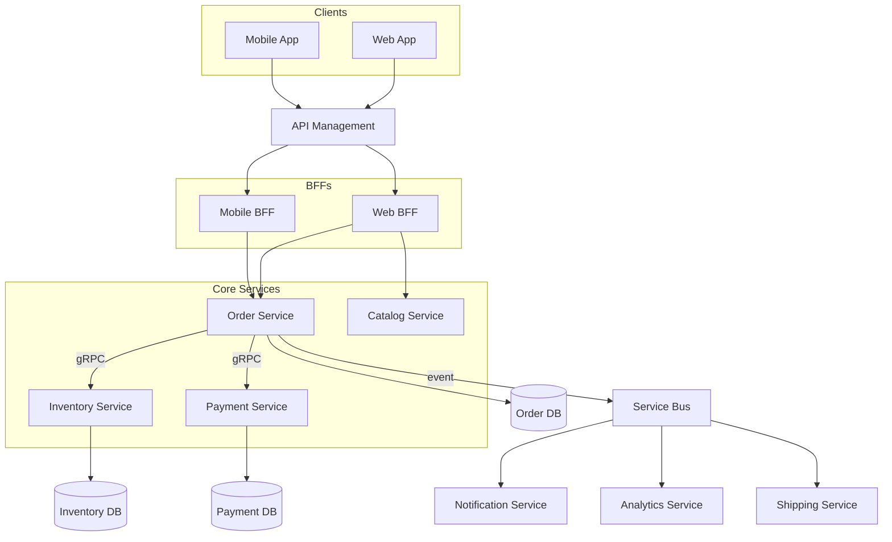
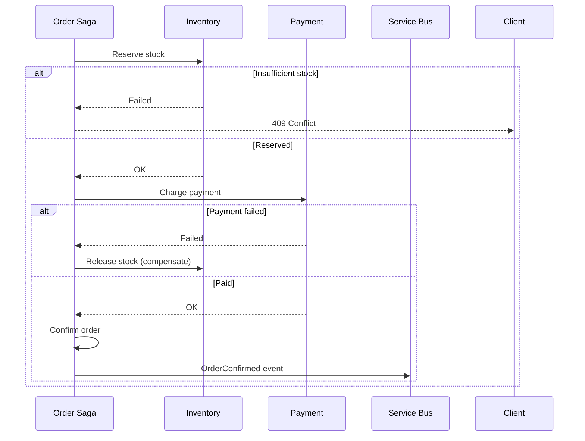

# Microservices Capstone — 12-Service E-Commerce Platform

> **Week 24** | **Level:** Expert Capstone

## Capstone Scenario

Design a cloud-native e-commerce platform:

| Attribute | Value |
|-----------|-------|
| **Users** | 2M registered, 50K concurrent peak |
| **Orders** | 500 orders/minute peak |
| **Team** | 40 developers, 6 squads |
| **Cloud** | Azure (primary) |
| **Compliance** | PCI for payments |

---

## Reference Service Decomposition

| # | Service | Bounded Context | Data Store |
|---|---------|-----------------|------------|
| 1 | Identity | Users, auth | Entra ID + SQL |
| 2 | Catalog | Products, categories | Cosmos DB / SQL |
| 3 | Inventory | Stock levels | SQL + Redis cache |
| 4 | Cart | Shopping cart | Redis |
| 5 | Pricing | Discounts, promotions | SQL |
| 6 | Order | Order lifecycle | SQL |
| 7 | Payment | PCI scope | SQL (isolated) |
| 8 | Shipping | Fulfillment | SQL |
| 9 | Notification | Email, SMS, push | Service Bus |
| 10 | Search | Product search | Azure AI Search |
| 11 | Recommendation | ML suggestions | Blob + Batch |
| 12 | Analytics | Events, reporting | Event Hubs → Synapse |

---

## Architecture Diagram

---

## Key Flows

### Place Order (Saga — Orchestration)

### Choreography Alternative
Order publishes `OrderPlaced` → Inventory subscribes → publishes `StockReserved` → Payment subscribes...

**Orchestration vs Choreography:**
| Factor | Orchestration | Choreography |
|--------|---------------|--------------|
| Visibility | Central saga log | Distributed tracing needed |
| Coupling | Saga knows all steps | Services react to events |
| Change | Modify orchestrator | Add/remove event subscribers |
| **Choose** | Complex flows, compliance | Simple event chains |

---

## Cross-Cutting Concerns

| Concern | Solution |
|---------|----------|
| Auth | Entra ID + APIM JWT validation |
| Service-to-service | gRPC + mTLS or Managed Identity |
| Config | Azure App Configuration |
| Secrets | Key Vault |
| Observability | OpenTelemetry → App Insights |
| Resilience | Polly (retry, CB, timeout) |
| Idempotency | Idempotency-Key header on all commands |

---

## Capstone Deliverables

- [ ] C4 Context + Container diagrams
- [ ] Bounded context map with context relationships
- [ ] Saga design for place order + cancel order
- [ ] 5 ADRs (decomposition, sync vs async, DB per service, API gateway, event bus choice)
- [ ] Failure mode analysis (5 scenarios)
- [ ] 45-minute whiteboard presentation

## Assessment Rubric

| Criteria | Weight |
|----------|--------|
| Correct service boundaries | 25% |
| Data ownership clarity | 20% |
| Saga / consistency handling | 20% |
| Observability & resilience | 15% |
| Security (PCI isolation) | 10% |
| Communication clarity | 10% |
