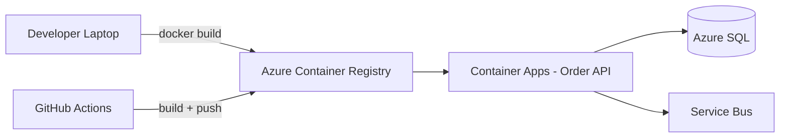

# Case Study: Black Friday Container Deploy Failure — Docker Security & Image Hygiene

| Attribute | Value |
|-----------|-------|
| **Industry** | E-commerce |
| **Scale** | 12,000 orders/minute peak (Black Friday) |
| **Week** | 25 |
| **Difficulty** | Intermediate |

## Business Context

A mid-size e-commerce company containerized its .NET 8 Order API six months ago to move from Azure App Service to Azure Container Apps. The team celebrated a successful staging deploy and planned a Black Friday cutover.

At 6:00 AM on launch day, the new container deployment failed health checks. Rollback to App Service took 47 minutes. During that window, checkout error rates hit 18% and the company estimates $400K in lost revenue. A post-incident review found three Dockerfile anti-patterns that had been ignored in code review.

The platform lead has asked you to redesign the container build and deploy pipeline before the next peak event (8 weeks away).

## Current State



**Current implementation issues (from incident review):**

- Dockerfile runs as `root` — no `USER` directive; container escape risk flagged by security scan
- Single-stage build: SDK + runtime + source in final image (~1.8 GB); pull times exceed ACA startup budget
- `ARG SQL_CONNECTION_STRING` and `ARG STRIPE_API_KEY` baked into image layers — secrets visible in ACR history
- `COPY . .` includes `bin/`, `obj/`, and test projects — bloated context and non-reproducible builds
- No image scanning in CI; `latest` tag used in production manifests
- Health check defined only in Container Apps portal, not in Dockerfile or K8s-style probes

## Requirements

### Functional
- Build and deploy Order API container on every merge to `main`
- Support blue/green or revision-based rollout with automatic rollback on failed health checks
- Inject secrets at runtime, never at build time

### Non-Functional
| NFR | Target |
|-----|--------|
| Availability | 99.95% during peak |
| Image pull + cold start | < 30 seconds |
| Image size | < 200 MB (runtime layer) |
| Security | Non-root, no critical CVEs in base image |
| RTO (failed deploy) | < 5 minutes to previous revision |
| RPO | N/A (stateless API) |

## Constraints

- Team: 8 .NET developers, 1 part-time DevOps engineer
- Must stay on Azure Container Apps (no AKS migration this quarter)
- Azure Key Vault and Managed Identity already provisioned
- PCI scope: payment keys must never appear in logs, images, or Git
- 8-week timeline before next Black Friday rehearsal

## Your Task

1. Identify the top 3 container/Docker issues that caused or worsened the outage
2. Propose a revised Dockerfile and CI/CD pipeline architecture
3. Explain how secrets should be injected in Azure Container Apps
4. Define image security gates for the pipeline
5. Specify health check strategy for zero-downtime deploys

> **Attempt your solution before reading the reference below.**

---

## Reference Solution

### Top 3 Issues

1. **Secrets in image layers** — Stripe and SQL credentials persisted in ACR; forced key rotation and emergency rebuild during outage
2. **Bloated single-stage image** — 1.8 GB image caused slow pulls and ACA revision timeouts under concurrent scale-out
3. **Root user + no supply-chain scanning** — Trivy found 14 high CVEs; security team blocked production promotion at the worst possible time

### Revised Architecture

```mermaid
flowchart TD
    subgraph CI[GitHub Actions]
        Lint[dotnet build + test]
        Build[Multi-stage docker build]
        Scan[Trivy + SBOM]
        Sign[Cosign sign image]
        Lint --> Build --> Scan --> Sign
    end
    Sign --> ACR[ACR - semver tags only]
    ACR --> Deploy[ACA Revision Deploy]
    Deploy --> MI[Managed Identity]
    MI --> KV[Key Vault - secrets]
    Deploy --> Health[/health + /ready probes]
    Health -->|fail| Rollback[Auto rollback to N-1]
```

### Key Decisions

| Decision | Choice | Rationale |
|----------|--------|-----------|
| Base image | `mcr.microsoft.com/dotnet/aspnet:8.0-alpine` | Smaller attack surface, faster pulls |
| Build pattern | Multi-stage: SDK → publish → runtime | Final image ~120 MB |
| Secrets | Key Vault references via Managed Identity | Never in Dockerfile or env files in Git |
| Non-root user | `USER $APP_UID` (built into .NET 8 images) | Satisfies PCI and pod security policies |
| Tags | `order-api:1.4.2` + digest pin in manifest | Reproducible deploys; no `latest` |
| CI gates | Trivy fail on CRITICAL/HIGH; unit tests pass | Block vulnerable images before ACR |
| Health checks | Liveness `/health`, readiness `/ready` (DB + SB) | ACA routes traffic only when dependencies up |

### Hardened Dockerfile Sketch

```dockerfile
FROM mcr.microsoft.com/dotnet/sdk:8.0-alpine AS build
WORKDIR /src
COPY ["OrderApi/OrderApi.csproj", "OrderApi/"]
RUN dotnet restore "OrderApi/OrderApi.csproj"
COPY OrderApi/ OrderApi/
RUN dotnet publish -c Release -o /app/publish --no-restore

FROM mcr.microsoft.com/dotnet/aspnet:8.0-alpine AS final
USER $APP_UID
WORKDIR /app
COPY --from=build /app/publish .
HEALTHCHECK --interval=30s CMD wget -qO- http://localhost:8080/health || exit 1
ENTRYPOINT ["dotnet", "OrderApi.dll"]
```

### Expected Outcome

- Image size: 1.8 GB → ~115 MB; cold start: 90s → ~18s
- Deploy rollback: 47 min manual → < 3 min automatic via ACA revision traffic shift
- Security: zero secrets in image layers; Trivy clean on promoted tags
- Cost: negligible change; faster scale-out reduces over-provisioned min replicas

## Discussion Questions

1. Would you use Azure Container Apps or AKS for this workload at 12K orders/minute?
2. How do you handle secret rotation without rebuilding the image?
3. When is distroless worth the operational trade-off over Alpine?

## Interview Story Angle

**STAR prompt:** "Tell me about a production deployment failure you led recovery for."

Use this case study: emphasize secrets-not-in-images principle, multi-stage builds for startup time, and automated rollback — frame the $400K risk as measurable impact from container hygiene, not "Docker is hard."
