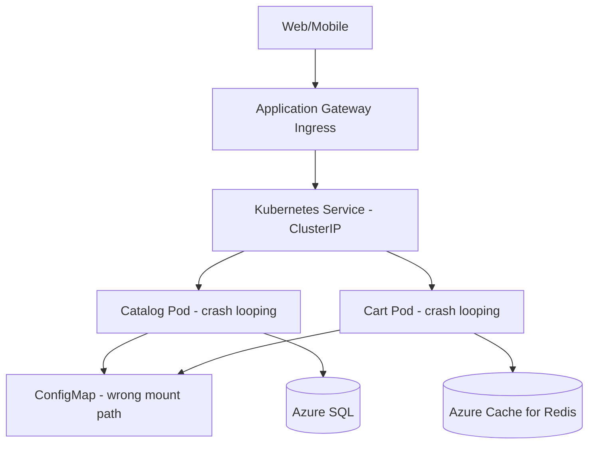
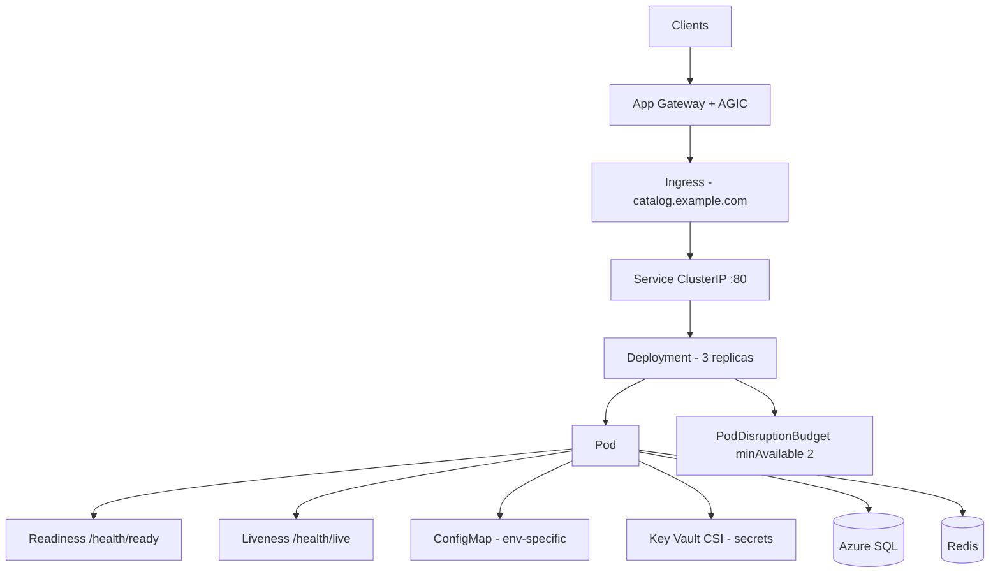

# Case Study: First AKS Migration — Crash-Looping Pods & Misconfigured ConfigMaps

| Attribute | Value |
|-----------|-------|
| **Industry** | E-commerce |
| **Scale** | 3,000 RPS peak, 6 microservices |
| **Week** | 26 |
| **Difficulty** | Intermediate |

## Business Context

After containerizing their .NET microservices, an e-commerce platform team migrated the Catalog and Cart APIs from Azure Container Apps to AKS for greater control over networking and cost at scale. The migration was scheduled for a Tuesday maintenance window.

Within 20 minutes of cutover, both APIs entered `CrashLoopBackOff`. Ingress returned 502 errors. The on-call engineer rolled back to Container Apps after 90 minutes. Root cause analysis revealed Kubernetes fundamentals gaps: no readiness probes, wrong ConfigMap key paths, and resource limits set without understanding .NET GC behavior.

You are the solution architect asked to produce a production-ready AKS deployment pattern before the retry in 4 weeks.

## Current State



**Current implementation issues (from `kubectl` investigation):**

- Deployment YAML copied from a blog; `readinessProbe` and `livenessProbe` omitted entirely
- ConfigMap mounted at `/app/appsettings.json` but app expects `/app/config/appsettings.Production.json`
- `ASPNETCORE_ENVIRONMENT` set to `Development` in the Deployment manifest
- Memory limit `128Mi` — .NET 8 API OOMKilled during startup before logs flush
- `imagePullPolicy: Always` with no resource requests — scheduler packs 40 pods onto 3 nodes
- Azure SQL firewall allows ACA subnet but not AKS node pool outbound IPs
- No Pod Disruption Budget; rolling update killed all replicas simultaneously

## Requirements

### Functional
- Run Catalog and Cart APIs on AKS with zero-downtime rolling deploys
- External traffic via Application Gateway Ingress Controller (AGIC)
- Configuration from ConfigMaps; secrets from Azure Key Vault via CSI driver

### Non-Functional
| NFR | Target |
|-----|--------|
| Availability | 99.9% |
| Rollout success | Max 1 unavailable pod during deploy |
| Pod startup | Ready within 60 seconds |
| Latency (p99) | < 150ms |
| RTO (bad deploy) | < 10 minutes |
| RPO | N/A (stateless) |

## Constraints

- AKS cluster: 3-node `Standard_D4s_v5` node pool, Kubernetes 1.29
- Must use existing Azure SQL and Redis; no data migration
- Team new to Kubernetes — needs repeatable Helm chart or Kustomize base
- Budget: cannot add a service mesh this phase
- PCI: secrets only via Key Vault CSI, not plain ConfigMaps

## Your Task

1. Identify the top 3 Kubernetes configuration issues behind the outage
2. Propose corrected Deployment, Service, and Ingress manifests (or Helm structure)
3. Define readiness vs liveness probe strategy for .NET APIs
4. Specify resource requests/limits appropriate for .NET 8 on AKS
5. Document a pre-cutover checklist for networking and config validation

> **Attempt your solution before reading the reference below.**

---

## Reference Solution

### Top 3 Issues

1. **Missing readiness probes** — kubelet marked pods Ready immediately; AGIC sent traffic to containers still starting or crash-looping
2. **ConfigMap mount mismatch** — app read default `appsettings.json` with localhost SQL; immediate unhandled exception on `DbContext` init
3. **OOMKill from 128Mi limit** — .NET runtime could not complete JIT + DI container build; logs showed silent restart loops

### Revised Architecture



### Key Decisions

| Decision | Choice | Rationale |
|----------|--------|-----------|
| Config loading | `appsettings.json` + `appsettings.Production.json` via mount subPath | Match ASP.NET Core conventions |
| Readiness probe | HTTP GET `/health/ready` — checks SQL + Redis | Traffic only when dependencies healthy |
| Liveness probe | HTTP GET `/health/live` — lightweight | Restart hung processes only |
| Memory | Request `256Mi`, limit `512Mi` | Room for .NET GC; limit prevents noisy neighbor |
| CPU | Request `250m`, limit `1000m` | Scheduler fairness; burst allowed |
| Secrets | Key Vault CSI `SecretProviderClass` | PCI-compliant; no secrets in etcd |
| Rollout | `maxUnavailable: 0`, `maxSurge: 1` + PDB | Never drain all replicas |
| Networking | NAT Gateway outbound IP allowlisted in SQL | Fix AKS → Azure SQL connectivity |

### Probe Configuration Sketch

```yaml
readinessProbe:
  httpGet:
    path: /health/ready
    port: 8080
  initialDelaySeconds: 10
  periodSeconds: 5
  failureThreshold: 3
livenessProbe:
  httpGet:
    path: /health/live
    port: 8080
  initialDelaySeconds: 30
  periodSeconds: 10
```

### Expected Outcome

- Crash loops eliminated; pods reach Ready in ~25 seconds
- Rolling deploy: zero 502s during cutover rehearsal
- Rollback time: 90 min manual → < 8 min via `kubectl rollout undo`
- Observability: pod restart count stable; App Insights shows healthy dependency calls

## Discussion Questions

1. When should readiness probe failure remove a pod from the Service endpoints?
2. How would you validate ConfigMap changes before applying to production?
3. At what scale does AGIC become a bottleneck vs nginx Ingress?

## Interview Story Angle

**STAR prompt:** "Describe a time you debugged a production Kubernetes issue."

Use this case study: walk through `kubectl describe pod`, distinguish readiness vs liveness, and show how ConfigMap path mismatches look like "app bugs" but are platform config errors — emphasize systematic pre-cutover checklist.
