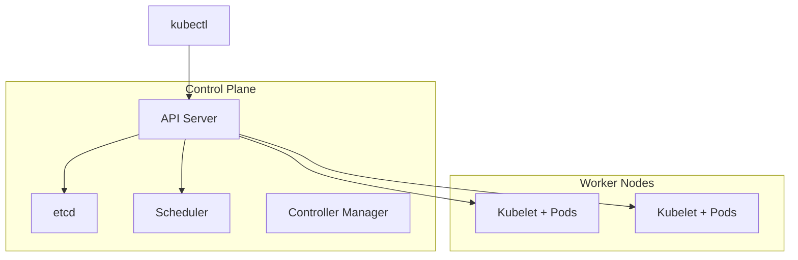

# Kubernetes Fundamentals for Architects

> **Week 26** | **Module:** [docker-kubernetes](../../../modules/docker-kubernetes/README.md)

## Learning Objectives
- Explain K8s architecture and core resources
- Design deployments for .NET microservices
- Know when K8s vs managed PaaS

---

## 1. Kubernetes Architecture



| Component | Role |
|-----------|------|
| **API Server** | Front door for all operations |
| **etcd** | Cluster state store |
| **Scheduler** | Assigns pods to nodes |
| **Kubelet** | Runs pods on node |
| **Controller Manager** | Reconciliation loops |

---

## 2. Core Resources

| Resource | Purpose |
|----------|---------|
| **Pod** | Smallest deployable unit (1+ containers) |
| **Deployment** | Declarative pod management, rolling updates |
| **Service** | Stable network endpoint for pods |
| **Ingress** | HTTP routing into cluster |
| **ConfigMap** | Non-sensitive config |
| **Secret** | Sensitive config (base64, not encrypted by default) |
| **Namespace** | Logical isolation |

```yaml
apiVersion: apps/v1
kind: Deployment
metadata:
  name: order-api
spec:
  replicas: 3
  selector:
    matchLabels:
      app: order-api
  template:
    metadata:
      labels:
        app: order-api
    spec:
      containers:
      - name: order-api
        image: myacr.azurecr.io/order-api:1.2.3
        ports:
        - containerPort: 8080
        resources:
          requests:
            memory: "256Mi"
            cpu: "250m"
          limits:
            memory: "512Mi"
            cpu: "500m"
        livenessProbe:
          httpGet:
            path: /health/live
            port: 8080
        readinessProbe:
          httpGet:
            path: /health/ready
            port: 8080
```

---

## 3. Service Types

| Type | Use |
|------|-----|
| **ClusterIP** | Internal only (default) |
| **NodePort** | Expose on node IP:port |
| **LoadBalancer** | Cloud LB (AKS creates Azure LB) |
| **ExternalName** | DNS CNAME |

---

## 4. Ingress & TLS

```yaml
apiVersion: networking.k8s.io/v1
kind: Ingress
metadata:
  name: order-ingress
  annotations:
    cert-manager.io/cluster-issuer: letsencrypt
spec:
  tls:
  - hosts: [api.example.com]
    secretName: api-tls
  rules:
  - host: api.example.com
    http:
      paths:
      - path: /orders
        pathType: Prefix
        backend:
          service:
            name: order-api
            port:
              number: 80
```

---

## 5. K8s vs AKS vs Container Apps vs App Service

| Factor | App Service | Container Apps | AKS |
|--------|-------------|----------------|-----|
| K8s API | No | Subset | Full |
| Ops burden | Lowest | Low | High |
| Scale to zero | No | Yes | HPA (not zero) |
| Service mesh | No | Limited | Full |
| .NET fit | Excellent | Good | Good |

**Choose AKS when:** 15+ services, GitOps, service mesh, custom operators, multi-team cluster sharing.

---

## 6. Resource Requests and Limits

**Requests:** Scheduler uses for placement. **Limits:** Max allowed — OOMKill if exceeded.

**Architect:** Always set both. Load test to find values. Don't run without limits in production.

**Next:** Week 27 Advanced K8s
