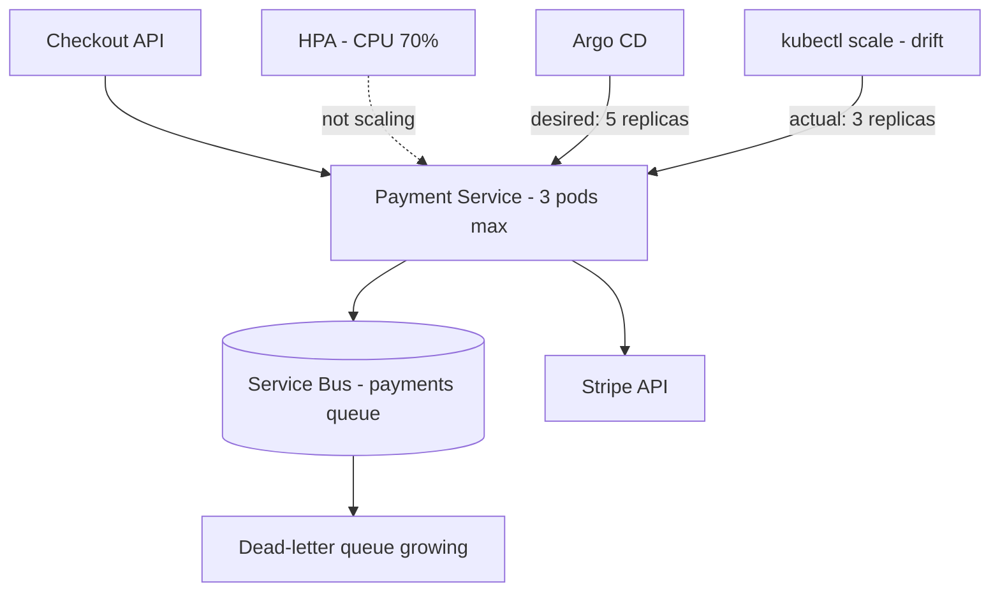
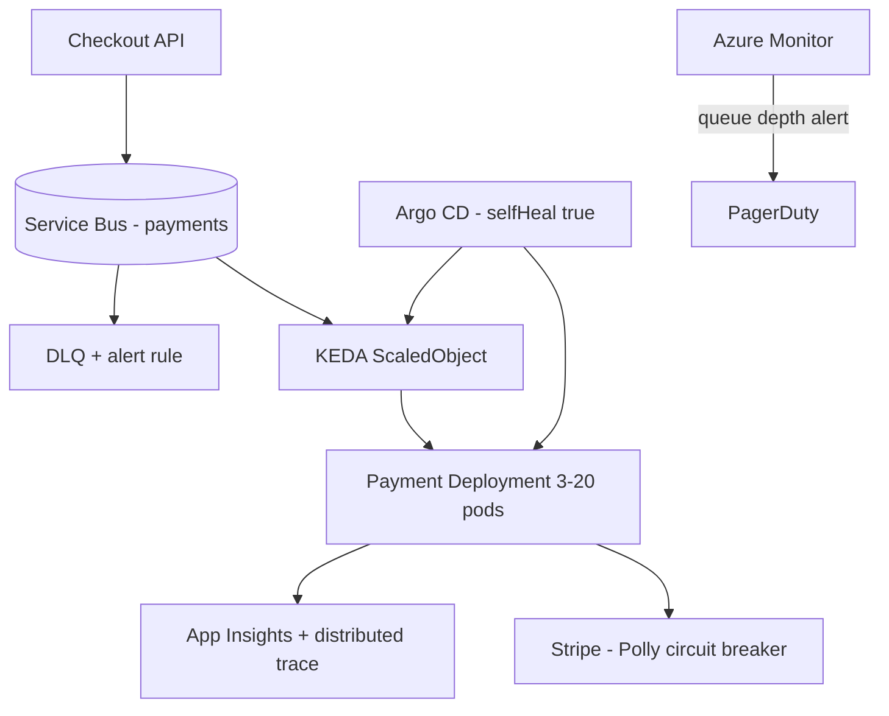

# Case Study: Peak Traffic Outage — HPA Stalls, GitOps Drift & Payment Service Down

| Attribute | Value |
|-----------|-------|
| **Industry** | E-commerce / FinTech |
| **Scale** | 25,000 checkout requests/minute peak |
| **Week** | 27 |
| **Difficulty** | Advanced |

## Business Context

An e-commerce company's payment microservice runs on AKS with Argo CD for GitOps delivery. During a spring sale, checkout failure rates spiked to 22% for 40 minutes. Payment pods were CPU-throttled at 3 replicas while queue depth on Azure Service Bus grew unbounded. Meanwhile, an engineer had `kubectl scale`d the deployment manually during a prior incident — Argo CD showed `OutOfSync` but nobody noticed.

Post-incident, leadership wants a production-grade autoscaling and GitOps governance model before the next peak. You own the architecture recommendation.

## Current State



**Current implementation issues (from war room):**

- HPA `targetCPUUtilizationPercentage: 70` but CPU **requests** set to `100m` while pods burst to 2 cores — HPA never fires
- `maxReplicas: 3` — hard cap below documented peak need of 12+
- Payment workers are queue-driven; CPU-based HPA wrong metric for I/O-bound .NET consumers
- Argo CD `selfHeal: false` on payment namespace — manual scale persisted for 3 weeks
- No KEDA ScaledObject; Service Bus queue length ignored
- Payment pods lack Pod Anti-Affinity — all 3 scheduled on same node; node failure = total outage
- Istio not deployed; no circuit breaker on Stripe outbound calls
- Missing `HorizontalPodAutoscaler` behavior `scaleUp stabilizationWindowSeconds` — flapping during partial recovery

## Requirements

### Functional
- Payment processing scales with Service Bus queue depth and checkout traffic
- GitOps is single source of truth; manual cluster changes auto-corrected or blocked
- Dead-letter messages alert within 2 minutes

### Non-Functional
| NFR | Target |
|-----|--------|
| Availability | 99.95% during sales events |
| Payment latency (p99) | < 500ms (excluding Stripe) |
| Scale-out time | < 2 minutes from queue spike |
| Max queue age | < 30 seconds at p99 |
| RTO | 15 minutes |
| RPO | 0 (payments — no message loss) |

## Constraints

- Must keep Argo CD; no migration to Flux
- KEDA add-on available on AKS cluster
- Stripe rate limits: 100 req/s per API key — architecture must respect this
- Team of 2 platform engineers, 6 application developers
- Cannot rewrite payment service before next sale (6 weeks)

## Your Task

1. Identify why HPA failed to scale during the incident
2. Propose KEDA-based autoscaling tied to Service Bus metrics
3. Design GitOps policies to prevent configuration drift
4. Recommend resilience patterns for Stripe outbound calls
5. Define alerting and runbooks for queue backlog scenarios

> **Attempt your solution before reading the reference below.**

---

## Reference Solution

### Top 3 Issues

1. **Wrong autoscaling signal** — CPU HPA on I/O-bound workers with misconfigured requests; queue grew while pods stayed idle
2. **GitOps drift** — manual `kubectl scale` overrode Git; Argo CD OutOfSync ignored; `maxReplicas: 3` never corrected
3. **No queue-aware scaling** — Service Bus depth is the leading indicator; CPU lagged by 10+ minutes during the spike

### Revised Architecture



### Key Decisions

| Decision | Choice | Rationale |
|----------|--------|-----------|
| Autoscaling | KEDA `azure-servicebus` trigger on queue length | Scales on backlog, not CPU |
| Scale bounds | `minReplicaCount: 3`, `maxReplicaCount: 20` | Match peak + Stripe rate budget |
| HPA fallback | CPU HPA removed for payment workers | Single scaler avoids conflict |
| GitOps | `selfHeal: true`, sync policy automated | Drift corrected within 3 min |
| RBAC | Remove namespace `scale` from app team | Prevent manual replica override |
| Resilience | Polly circuit breaker + bulkhead on Stripe | Fail fast when gateway degrades |
| Placement | Pod Anti-Affinity across nodes/zones | Survive single node loss |
| Alerts | Queue > 500 msgs for 2 min → Sev2 | Leading indicator before user impact |

### KEDA ScaledObject Sketch

```yaml
triggers:
  - type: azure-servicebus
    metadata:
      queueName: payments
      messageCount: "30"        # scale up per 30 messages
      connectionFromEnv: SERVICEBUS_CONNECTION
  - type: cpu
    metadata:
      type: Utilization
      value: "80"               # ceiling guard only
```

### Expected Outcome

- Scale-out: 3 → 14 pods within 90 seconds of queue spike in load test
- Checkout failure rate during rehearsal: 22% → < 0.5%
- GitOps drift: detected and auto-healed; audit log for any override attempts
- DLQ growth: alerted at 10 messages; zero silent message loss over 30-day window

## Discussion Questions

1. When would you add a service mesh vs Polly in-application resilience?
2. How do you scale down safely without killing in-flight payment messages?
3. Should Argo CD sync be automated in production or manual approval gate?

## Interview Story Angle

**STAR prompt:** "Tell me about a time autoscaling didn't work as expected in production."

Use this case study: contrast CPU HPA vs queue-driven KEDA, explain GitOps drift as an organizational failure mode, and quantify impact (22% checkout failures) — shows you think in metrics, not just YAML.
