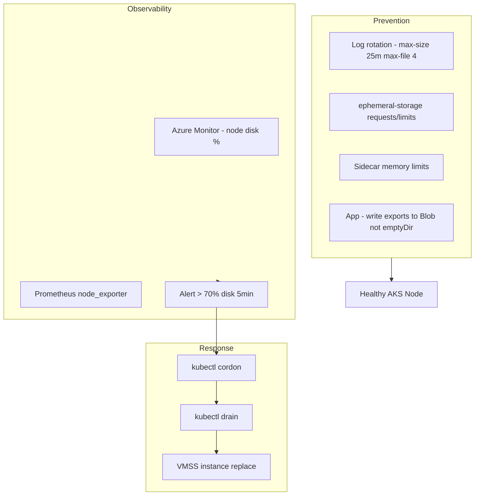

# Case Study: AKS Node Meltdown — Disk Full, OOM Killer & API Timeouts

| Attribute | Value |
|-----------|-------|
| **Industry** | E-commerce |
| **Scale** | 4-node AKS pool, 80 pods, 2,500 RPS |
| **Week** | 28 |
| **Difficulty** | Intermediate |

## Business Context

At 2:14 AM, PagerDuty fired for elevated p99 latency on the Order API. On-call observed timeouts across multiple services. Initial suspicion was a bad deploy, but the latest Argo CD sync was 18 hours old. SSH via `kubectl debug node` revealed one AKS worker node in distress: disk 100% full, `dmesg` showing OOM killer terminating containerd-shim processes, and kubelet posting `NodeNotReady`.

The node hosted 28 pods including Order API replicas. Kubernetes evicted pods slowly; cascading failures lasted 55 minutes. You are asked to define Linux-level observability and remediation practices so platform and app teams can triage node incidents without a senior SRE on every page.

## Current State

```mermaid
flowchart TD
    subgraph Node4[AKS Node - vmss000004]
        Kubelet[kubelet]
        Containerd[containerd]
        Logs[/var/log/pods - 42GB]
        EmptyDir[emptyDir volumes - unbounded]
        CoreDump[core dumps in /tmp]
        Kubelet --> Containerd
        Containerd --> Logs
        Containerd --> EmptyDir
    end
    OrderAPI[Order API pods] --> Node4
    Prom[Prometheus] -.->|no node disk alert| Node4
    Node4 -->|NotReady| APIgw[502/504 to clients]
```

**Current implementation issues (from node triage):**

- Container log rotation not tuned — default 10 MB × 5 files per container; 28 pods × verbose Serilog = disk exhaustion in ~6 days
- .NET app writing temp export files to `emptyDir` without cleanup job — 18 GB orphaned CSVs
- No `ephemeral-storage` requests/limits on pods — scheduler unaware of disk pressure
- Memory limit absent on sidecar (Log Analytics agent) — OOM killer targeted random processes
- `kubectl top nodes` never monitored; Azure Monitor agent installed but no disk alert rule
- Order API `HttpClient` retry storm during partial outage amplified memory on surviving pods
- Node pool autoscaling disabled — remaining 3 nodes oversubscribed after evictions

## Requirements

### Functional
- Detect node disk/memory pressure before pod evictions
- Triage runbook: identify top disk consumers on a node in < 5 minutes
- Remediate without full cluster outage (cordon, drain, replace)

### Non-Functional
| NFR | Target |
|-----|--------|
| Node disk utilization | < 75% sustained |
| MTTD (node pressure) | < 3 minutes |
| MTTR (node recovery) | < 20 minutes |
| API availability during node failure | 99.9% (survive single node loss) |
| Log retention on node | 72 hours max |

## Constraints

- AKS managed — no direct SSH to nodes in production; use `kubectl debug` and Azure Monitor
- Cannot increase node disk from 128 GB without new node pool (change window in 2 weeks)
- Team comfortable with bash and `kubectl`, not full-time Linux admins
- Must not disable logging — compliance requires 90-day retention in Log Analytics

## Your Task

1. Walk through the Linux triage steps you would run on the affected node
2. Identify root causes of disk full and OOM on AKS
3. Propose preventive controls (Kubernetes + application level)
4. Define Azure Monitor alerts and dashboards for node health
5. Document cordon/drain/replace runbook for operators

> **Attempt your solution before reading the reference below.**

---

## Reference Solution

### Top 3 Issues

1. **Unbounded container logs on disk** — default rotation insufficient for verbose .NET logging; `/var/log/pods` consumed 42 GB
2. **emptyDir abuse without limits** — application temp files never cleaned; triggered disk pressure before memory alerts
3. **No ephemeral-storage governance** — kubelet evicted pods reactively; no early warning; retry storms accelerated OOM

### Revised Architecture



### Key Decisions

| Decision | Choice | Rationale |
|----------|--------|-----------|
| Log volume | Tune kubelet `containerLogMaxSize/Files` via AKS config | Cap per-container disk on node |
| App logging | Serilog → stdout only; exports to Blob Storage | Central retention; no local files |
| Pod spec | `ephemeral-storage` request `1Gi`, limit `2Gi` | Scheduler + eviction fairness |
| Sidecars | Memory limit on AMA agent `200Mi` | Prevent OOM killing random processes |
| Alerts | Disk > 70% for 5 min Sev2; > 85% Sev1 | Time to act before evictions |
| Pod spread | Topology spread + PDB | Single node loss doesn't take all Order API pods |
| Triage | `kubectl debug node` + `du -sh /var/log/pods/*` | Standard runbook step 2 |
| Recovery | Cordon → drain → delete VMSS instance | Faster than debugging in place |

### Triage Command Sequence

```bash
kubectl cordon aks-nodepool-12345678-vmss000004
kubectl describe node aks-nodepool-12345678-vmss000004 | grep -A5 Conditions
kubectl debug node/aks-nodepool-12345678-vmss000004 -it --image=ubuntu
# inside: df -h; du -sh /var/log/pods/* | sort -rh | head
kubectl drain aks-nodepool-12345678-vmss000004 --ignore-daemonsets --delete-emptydir-data
```

### Expected Outcome

- Disk incidents: 1 major/month → zero over 90 days post-fix
- MTTD: 55 min (human noticed timeouts) → < 3 min via alert
- MTTR: 55 min → ~15 min cordon/drain/replace
- Order API: survives single-node loss with PDB + spread constraints

## Discussion Questions

1. How does kubelet eviction order prioritize pods when disk pressure hits?
2. When should apps write to Blob vs persistent volumes vs emptyDir?
3. What is the trade-off between verbose container logs and node disk safety?

## Interview Story Angle

**STAR prompt:** "Describe a production incident where the underlying OS was the root cause."

Use this case study: show structured triage (`df`, `du`, `dmesg`, kubelet events), connect Linux symptoms to Kubernetes outcomes (evictions, NotReady), and present preventive guardrails — demonstrates architect-level ops literacy, not just app debugging.
