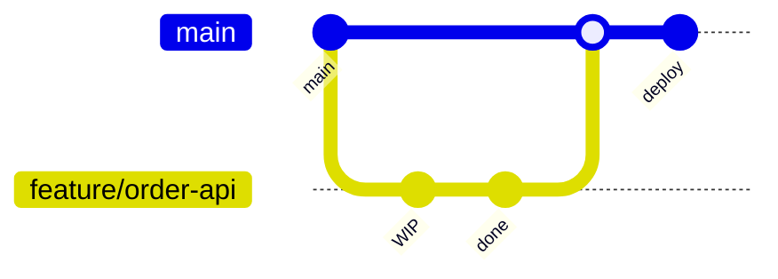

# DevOps Culture & DORA Metrics

> **Week 29** | **Module:** [devops-cicd](../../../modules/devops-cicd/README.md)

## Learning Objectives
- Apply DORA metrics to measure and improve delivery performance
- Understand trunk-based development vs GitFlow
- Design feature flag strategies for safe releases

---

## 1. What DevOps Means for Architects

DevOps is not a team — it's a **culture + practices** bridging development and operations.

| Pillar | Architect Role |
|--------|----------------|
| Culture | Blameless postmortems, shared ownership |
| Automation | CI/CD, IaC, automated testing |
| Measurement | DORA metrics, SLIs/SLOs |
| Sharing | Internal platforms, golden paths |

**Architect mandate:** Design systems that are **deployable**, **observable**, and **recoverable** — not just functional.

---

## 2. DORA Four Key Metrics

| Metric | Elite | What It Measures |
|--------|-------|------------------|
| **Deployment Frequency** | Multiple/day | How often code reaches production |
| **Lead Time for Changes** | < 1 hour | Commit to production |
| **Change Failure Rate** | < 5% | % deployments causing failure |
| **Mean Time to Recovery (MTTR)** | < 1 hour | Time to restore service |

**Architect use:** Baseline current state. Set improvement targets. Don't optimize one metric in isolation (deploy daily but 50% failure rate = bad).

---

## 3. Trunk-Based Development vs GitFlow

| Aspect | Trunk-Based | GitFlow |
|--------|-------------|---------|
| Branches | Short-lived feature branches (< 2 days) | Long-lived develop, release branches |
| Integration | Continuous to main | Periodic merges |
| CI/CD fit | Excellent | Complex |
| DORA correlation | Elite performers | Lower performers |

**Architect recommendation:** Trunk-based + feature flags for enterprise .NET teams. GitFlow only if regulatory release gates require it.



---

## 4. Feature Flags

Deploy code dark; enable per user/tenant/environment.

```csharp
if (await _featureManager.IsEnabledAsync("NewCheckoutFlow", userId))
    return await _newCheckout.ProcessAsync(order);
return await _legacyCheckout.ProcessAsync(order);
```

| Platform | Service |
|----------|---------|
| Azure | Azure App Configuration + Feature Management |
| AWS | AppConfig |
| OSS | LaunchDarkly, Unleash |

**Architect patterns:**
- **Release flags** — short-lived, remove after stable
- **Ops flags** — kill switch for incidents
- **Experiment flags** — A/B testing

---

## 5. Blameless Postmortems

After incidents:
1. Timeline of events
2. Root cause (not who)
3. Contributing factors
4. Action items with owners
5. No blame — learn

**Architect:** Lead postmortems for architecture-related incidents. Feed learnings into ADRs.

---

## 6. Platform Engineering / Internal Developer Platform

Golden paths for teams:
- Standard .NET 8 API template
- Pre-wired CI/CD pipeline
- Observability, security scanning built-in
- Self-service environments

**Architect role:** Design the platform, not every team's pipeline individually.

**Next:** [02-intermediate.md](02-intermediate.md) | Week 30 CI/CD
