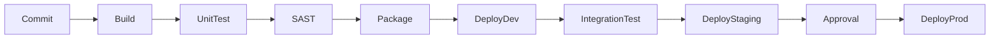

# CI/CD Pipelines for .NET Microservices

> **Week 30** | **Module:** [devops-cicd](../../../modules/devops-cicd/README.md)

## Learning Objectives
- Design CI/CD pipelines for .NET 8 microservices
- Implement build, test, security scan, deploy stages
- Apply deployment strategies (blue-green, canary, rolling)

---

## 1. Pipeline Stages



| Stage | Purpose | Fail Fast |
|-------|---------|-----------|
| Build | Compile, restore | Broken code |
| Unit test | Logic correctness | Regressions |
| SAST/dependency scan | CVE, secrets | Security |
| Integration test | API contracts | Integration breaks |
| Deploy | Ship artifact | Config errors |

---

## 2. GitHub Actions for .NET

```yaml
name: CI/CD
on:
  push:
    branches: [main]
  pull_request:
    branches: [main]

jobs:
  build:
    runs-on: ubuntu-latest
    steps:
      - uses: actions/checkout@v4
      - uses: actions/setup-dotnet@v4
        with:
          dotnet-version: '8.0.x'
      - run: dotnet restore
      - run: dotnet build --no-restore -c Release
      - run: dotnet test --no-build -c Release --logger trx
      - run: dotnet publish -c Release -o ./publish
      - uses: actions/upload-artifact@v4
        with:
          name: app
          path: ./publish

  deploy:
    needs: build
    if: github.ref == 'refs/heads/main'
    runs-on: ubuntu-latest
    environment: production
    steps:
      - uses: actions/download-artifact@v4
      - uses: azure/webapps-deploy@v2
        with:
          app-name: order-api
          publish-profile: ${{ secrets.AZURE_WEBAPP_PUBLISH_PROFILE }}
```

---

## 3. Azure DevOps Pipeline (YAML)

```yaml
trigger:
  branches:
    include: [main]

stages:
- stage: Build
  jobs:
  - job: BuildJob
    pool:
      vmImage: 'ubuntu-latest'
    steps:
    - task: DotNetCoreCLI@2
      inputs:
        command: 'publish'
        publishWebProjects: true
        arguments: '-c Release -o $(Build.ArtifactStagingDirectory)'

- stage: DeployStaging
  dependsOn: Build
  jobs:
  - deployment: Deploy
    environment: staging
    strategy:
      runOnce:
        deploy:
          steps:
          - task: AzureWebApp@1
            inputs:
              azureSubscription: 'service-connection'
              appName: 'order-api-staging'
```

---

## 4. Deployment Strategies

| Strategy | Downtime | Risk | Rollback |
|----------|----------|------|----------|
| **Rolling** | Zero | Medium — mixed versions | Redeploy previous |
| **Blue-green** | Zero | Low — instant switch | Switch back |
| **Canary** | Zero | Lowest — gradual | Stop canary |
| **Recreate** | Yes | High | Redeploy |

**AKS:** Rolling update default. Argo Rollouts for canary. App Service deployment slots for blue-green.

---

## 5. Artifact Management

| Practice | Why |
|----------|-----|
| Immutable artifacts | Same binary dev → prod |
| Semantic versioning | `1.2.3` not `latest` |
| Container registry (ACR/ECR) | Scan, sign, promote |
| SBOM generation | Supply chain compliance |

**Architect:** Build once, deploy many environments. Never rebuild for production.

---

## 6. Pipeline Security

- [ ] Secrets in vault (GitHub Secrets, Azure Key Vault) — never in YAML
- [ ] OIDC federation (no long-lived cloud credentials in CI)
- [ ] Dependency scanning (Dependabot, Snyk)
- [ ] SAST (CodeQL, SonarQube)
- [ ] Container image scanning (Trivy, Defender)
- [ ] Signed commits / branch protection on main

**Next:** Week 31 IaC
