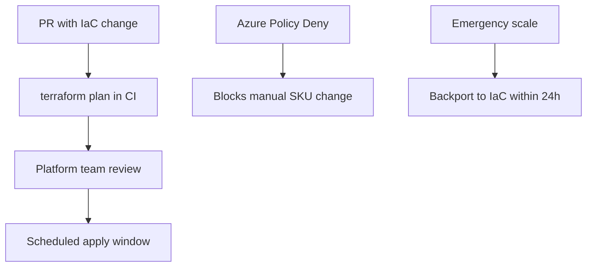

# Case Study 31 — IaC Drift Caused Production Outage

## Scenario

DBA manually scaled SQL Database to Premium during Black Friday. IaC `terraform apply` on Monday reverted to Standard — connection pool exhaustion during peak.

## Facts
- Terraform state said `S4`; Azure had `P2` (manual portal change)
- No drift detection in CI
- On-call didn't correlate apply with incident for 2 hours

## Your Role

Design IaC governance to prevent recurrence.

## Analysis Questions

1. Why didn't `terraform plan` run before Monday apply?
2. Should production manual changes ever be allowed?
3. How to handle legitimate emergency scaling?
4. Azure Policy vs pipeline gates — which layer?

## Recommended Architecture

## Deliverables
- [ ] Drift detection job (daily plan, alert on diff)
- [ ] Policy: deny SKU downgrade without exemption
- [ ] Postmortem template filled out
