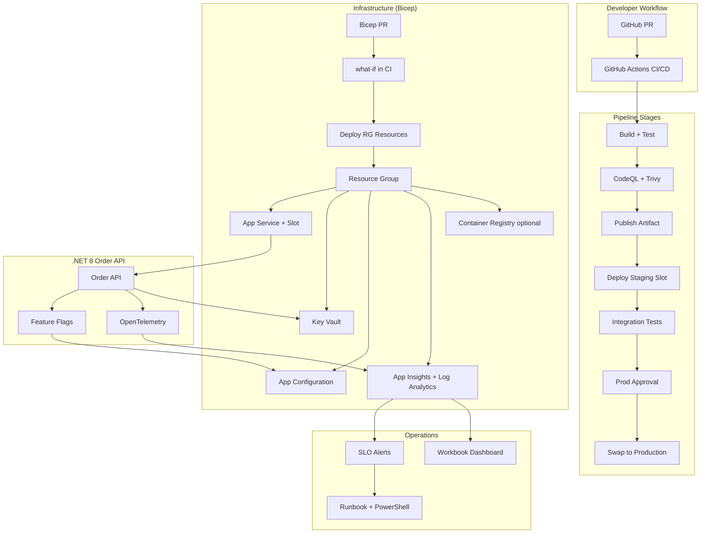

# Month 8 Capstone — End-to-End DevOps Platform

> **Weeks 29–32 integration** | Duration: 12–16 hours over Week 32 weekend  
> Ties together: feature flags, CI/CD, IaC, and observability

## Capstone Brief

Build and deploy a production-ready **Order API** (.NET 8) demonstrating the complete DevOps toolchain from Month 8. This is the proof you can design platforms, not just individual tools.

**Success criteria:** A reviewer can trace a commit from PR → CI → staging → production swap, see infrastructure defined in Bicep, toggle a feature flag without redeploy, and follow a distributed trace in Application Insights.

---

## Architecture Overview



---

## Prerequisites

- Azure subscription with Contributor access
- GitHub account and repository
- .NET 8 SDK, Azure CLI, Bicep CLI
- `az login` completed

---

## Phase 1 — Infrastructure as Code (Week 31)

**Goal:** All Azure resources provisioned via Bicep. No portal clicks.

### 1.1 Repository Structure

```
order-api-platform/
├── infra/
│   ├── modules/
│   │   ├── app-service.bicep
│   │   ├── app-insights.bicep
│   │   ├── key-vault.bicep
│   │   └── app-configuration.bicep
│   ├── main.bicep
│   └── main.bicepparam
├── .github/workflows/
│   ├── infra.yml
│   └── app.yml
└── src/OrderApi/
```

### 1.2 Deploy Core Infrastructure

```bash
cd infra
az group create -n rg-order-capstone -l eastus
az deployment group create \
  -g rg-order-capstone \
  -f main.bicep \
  -p main.bicepparam \
  -p environment=dev \
  -p appName=order-api-capstone
```

**`main.bicep` must provision:**
- [ ] App Service Plan (Linux, P1v3)
- [ ] App Service with **staging slot**
- [ ] System-assigned Managed Identity
- [ ] Key Vault (RBAC, soft delete)
- [ ] App Configuration (Standard — for feature flags)
- [ ] Application Insights + Log Analytics workspace
- [ ] Mandatory tags: `Environment`, `CostCenter`, `Owner`, `ManagedBy=Bicep`

### 1.3 IaC Pipeline (`infra.yml`)

On PR to `infra/**`:
```yaml
- run: az bicep build --file infra/main.bicep
- run: az deployment group what-if -g rg-order-capstone -f infra/main.bicep -p infra/main.bicepparam
```

On merge to `main`: apply infrastructure (with environment approval for prod params).

### 1.4 Deliverable Checklist — IaC
- [ ] `what-if` runs on every infra PR
- [ ] Managed Identity has Key Vault Secrets User role
- [ ] Managed Identity has App Configuration Data Reader role
- [ ] ADR: `docs/adr-001-bicep-module-structure.md`

---

## Phase 2 — Application with Feature Flags (Week 29)

**Goal:** Order API with feature-flagged checkout flow.

### 2.1 API Endpoints

| Endpoint | Description |
|----------|-------------|
| `GET /health` | SQL + App Config connectivity check |
| `GET /orders/{id}` | Retrieve order |
| `POST /orders` | Create order |
| `POST /checkout` | Legacy checkout |
| `POST /checkout/v2` | `[FeatureGate("CheckoutV2")]` new flow |

### 2.2 Feature Flag Integration

```csharp
builder.Configuration.AddAzureAppConfiguration(options =>
    options.Connect(appConfigEndpoint, new DefaultAzureCredential())
           .UseFeatureFlags());

builder.Services.AddFeatureManagement();
```

### 2.3 Flag Rollout Plan (document in README)

| Stage | CheckoutV2 State | Audience |
|-------|------------------|----------|
| 1 | Off | — |
| 2 | On | Internal testers (TargetingFilter) |
| 3 | 10% | Percentage rollout |
| 4 | 100% | All users — remove flag next sprint |

### 2.4 Deliverable Checklist — Feature Flags
- [ ] Toggle CheckoutV2 in App Configuration without redeploy
- [ ] Kill-switch documented: disable flag → instant rollback
- [ ] Flag removal ticket created in backlog

---

## Phase 3 — CI/CD Pipeline (Week 30)

**Goal:** GitHub Actions with OIDC — no stored Azure credentials.

### 3.1 Configure OIDC Federation

```bash
# Create App Registration + federated credential for GitHub
az ad app create --display-name "github-order-api"
# Federated credential: repo:YOUR_ORG/order-api-platform:environment:production
```

Grant App Registration **Website Contributor** on resource group (or narrower scope).

### 3.2 Application Pipeline (`app.yml`)

```yaml
name: Order API CI/CD

permissions:
  id-token: write
  contents: read

on:
  push:
    branches: [main]
    paths: ['src/**', '.github/workflows/app.yml']
  pull_request:
    branches: [main]

jobs:
  build-test:
    runs-on: ubuntu-latest
    steps:
      - uses: actions/checkout@v4
      - uses: actions/setup-dotnet@v4
        with:
          dotnet-version: '8.0.x'
          cache: true
      - run: dotnet test src/OrderApi.Tests -c Release --logger trx
      - run: dotnet publish src/OrderApi -c Release -o ./publish
      - uses: actions/upload-artifact@v4
        with:
          name: order-api
          path: ./publish

  security:
    needs: build-test
    runs-on: ubuntu-latest
    steps:
      - uses: actions/checkout@v4
      - uses: github/codeql-action/init@v3
        with:
          languages: csharp
      - uses: github/codeql-action/analyze@v3

  deploy-staging:
    needs: [build-test, security]
    if: github.ref == 'refs/heads/main'
    runs-on: ubuntu-latest
    environment: staging
    steps:
      - uses: actions/download-artifact@v4
      - uses: azure/login@v2
        with:
          client-id: ${{ secrets.AZURE_CLIENT_ID }}
          tenant-id: ${{ secrets.AZURE_TENANT_ID }}
          subscription-id: ${{ secrets.AZURE_SUBSCRIPTION_ID }}
      - uses: azure/webapps-deploy@v3
        with:
          app-name: order-api-capstone
          slot-name: staging
          package: ./publish

  integration-tests:
    needs: deploy-staging
    runs-on: ubuntu-latest
    steps:
      - uses: actions/checkout@v4
      - run: dotnet test tests/OrderApi.IntegrationTests -- --endpoint https://order-api-capstone-staging.azurewebsites.net

  deploy-production:
    needs: integration-tests
    runs-on: ubuntu-latest
    environment: production  # requires 1 reviewer
    steps:
      - uses: actions/download-artifact@v4
      - uses: azure/login@v2
        with:
          client-id: ${{ secrets.AZURE_CLIENT_ID }}
          tenant-id: ${{ secrets.AZURE_TENANT_ID }}
          subscription-id: ${{ secrets.AZURE_SUBSCRIPTION_ID }}
      - uses: azure/webapps-deploy@v3
        with:
          app-name: order-api-capstone
          slot-name: staging
          package: ./publish
      - run: |
          az webapp deployment slot swap \
            -g rg-order-capstone \
            -n order-api-capstone \
            --slot staging \
            --target-slot production
```

### 3.3 Pipeline Rules
- [ ] PR: build + test + CodeQL only (no deploy)
- [ ] Main: deploy staging → integration tests → prod approval → swap
- [ ] Same artifact digest from build job used in staging and prod
- [ ] Branch protection: require CI pass before merge

### 3.4 Deliverable Checklist — CI/CD
- [ ] OIDC working — no `AZURE_CREDENTIALS` secret
- [ ] Rollback documented: redeploy previous artifact OR swap back
- [ ] Deployment summary in GitHub Actions with commit SHA

---

## Phase 4 — Observability (Week 32)

**Goal:** Full OpenTelemetry instrumentation with SLO-based alerting.

### 4.1 Instrument Order API

```csharp
builder.Services.AddOpenTelemetry()
    .ConfigureResource(r => r.AddService("order-api-capstone"))
    .WithTracing(t => t
        .AddAspNetCoreInstrumentation()
        .AddHttpClientInstrumentation()
        .AddAzureMonitorTraceExporter())
    .WithMetrics(m => m
        .AddAspNetCoreInstrumentation()
        .AddAzureMonitorMetricExporter());
```

### 4.2 Custom Metrics & Logs

```csharp
// Business metric
ordersPlaced.Add(1, new KeyValuePair<string, object?>("checkout.version", "v2"));

// Structured log
_logger.LogInformation("Order {OrderId} created for {CustomerId}", order.Id, order.CustomerId);
```

### 4.3 Dashboard (App Insights Workbook)

Create workbook with:
- [ ] RED metrics: request rate, 5xx rate, p50/p95/p99 latency
- [ ] Feature flag dimension: requests by CheckoutV2 on/off
- [ ] Dependency map: Order API → downstream calls

### 4.4 Alerts

| Alert | Condition | Action |
|-------|-----------|--------|
| High error rate | 5xx > 1% for 5 min | Email + runbook link |
| Latency SLO | p99 > 500ms for 10 min | Ticket |
| Failed deploy | Slot health check fail | Block swap (pipeline gate) |

### 4.5 PowerShell Runbook (`scripts/incident-rollback.ps1`)

```powershell
param([string]$ResourceGroup = "rg-order-capstone", [string]$AppName = "order-api-capstone")

Write-Host "Rolling back $AppName via slot swap..."
az webapp deployment slot swap -g $ResourceGroup -n $AppName --slot staging --target-slot production
Write-Host "Verifying health..."
Invoke-RestMethod -Uri "https://$AppName.azurewebsites.net/health"
```

### 4.6 Deliverable Checklist — Observability
- [ ] End-to-end trace visible for `POST /checkout/v2`
- [ ] Alert fires when you inject 500 errors (test in staging)
- [ ] Runbook linked from alert notification

---

## Phase 5 — Integration Demo (Graduation Review)

Perform this demo live or record a 10-minute video:

| Step | Action | Proves |
|------|--------|--------|
| 1 | Open PR changing checkout logic | CI runs tests + CodeQL |
| 2 | Merge PR | Auto-deploy to staging |
| 3 | Show integration tests passing | Quality gate |
| 4 | Approve production deploy | Governance |
| 5 | Swap slots | Zero-downtime deploy |
| 6 | Enable CheckoutV2 flag at 10% | Feature flags (Week 29) |
| 7 | Make API call, show trace in App Insights | Observability (Week 32) |
| 8 | Run `incident-rollback.ps1` | Operational readiness |
| 9 | Show Bicep `what-if` on infra PR | IaC (Week 31) |

---

## Rubric (100 points)

| Area | Points | Criteria |
|------|--------|----------|
| **IaC (Week 31)** | 25 | Bicep modules, what-if in CI, Managed Identity, tags |
| **CI/CD (Week 30)** | 25 | OIDC, build-once-deploy-many, staging gate, prod approval |
| **Feature Flags (Week 29)** | 20 | App Config integration, rollout plan, kill switch |
| **Observability (Week 32)** | 20 | OTel traces, RED dashboard, alert + runbook |
| **Documentation** | 10 | ADR, rollback runbook, architecture diagram |

**Pass:** ≥ 70 points

---

## Stretch Goals

- [ ] Add Trivy container scan if using Docker/ACR
- [ ] Nightly drift detection job (`what-if` scheduled)
- [ ] Synthetic availability test from 2 regions
- [ ] SBOM generation in pipeline
- [ ] Publish reusable workflow for other microservices (platform thinking)

---

## Related Resources

| Resource | Link |
|----------|------|
| DevOps Top 50 Q&A | [interview-prep/devops-top-50-index.md](../../../interview-prep/devops-top-50-index.md) |
| Week 29 Lab | [lab-29-feature-flags.md](../../week-29/labs/lab-29-feature-flags.md) |
| Week 30 Lab | [lab-30-github-actions.md](../../week-30/labs/lab-30-github-actions.md) |
| Week 31 Lab | [lab-31-terraform-bicep.md](../../week-31/labs/lab-31-terraform-bicep.md) |
| Week 32 Lab | [lab-32-opentelemetry.md](lab-32-opentelemetry.md) |
| Phase 8 Overview | [program/phase-08-month-08](../../../program/phase-08-month-08/README.md) |

---

## Cleanup

```bash
az group delete -n rg-order-capstone --yes --no-wait
```

Remove GitHub federated credential and App Registration when done.
