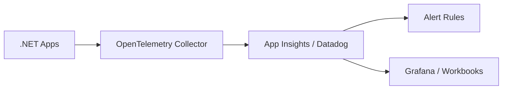

# Observability — Intermediate: Production Operations

> **Week 32** | Distributed tracing, incident response, runbooks

## 1. Distributed Tracing Deep Dive

```
[API Gateway] ──trace-id: abc123──► [Order Service] ──► [SQL]
                                      │
                                      └──► [Payment Service] ──► [Stripe]
```

**W3C Trace Context:** `traceparent` header propagated across HTTP, Service Bus, gRPC.

**Architect review:** Every outbound call must propagate context. Broken traces = blind during incidents.

---

## 2. RED vs USE Methods

| Method | Metrics | For |
|--------|---------|-----|
| **RED** | Rate, Errors, Duration | Request-driven services |
| **USE** | Utilization, Saturation, Errors | Resources (CPU, disk, network) |

**Example SLO:** Order API RED — 99.9% requests < 300ms, error rate < 0.1%.

---

## 3. Incident Response Runbook

1. **Detect** — Alert fires (PagerDuty)
2. **Triage** — Check dashboard, recent deploys
3. **Mitigate** — Rollback, scale out, feature flag off
4. **Resolve** — Root cause fix
5. **Postmortem** — Blameless, action items

**Architect during incident:** Decision authority on rollback vs fix-forward. Communicate ETA to stakeholders.

---

## 4. Log Aggregation Architecture



**Sampling:** 100% in dev; tail-based sampling in prod (keep all errors, sample successes).

---

## 5. PowerShell Automation Patterns

```powershell
# Bulk enable diagnostic settings
Get-AzResource -ResourceType "Microsoft.Web/sites" |
  ForEach-Object {
    Set-AzDiagnosticSetting -ResourceId $_.ResourceId `
      -WorkspaceId $workspaceId -Enabled $true
  }
```

Use for: compliance audits, cost reports, incident bulk actions, environment teardown.
