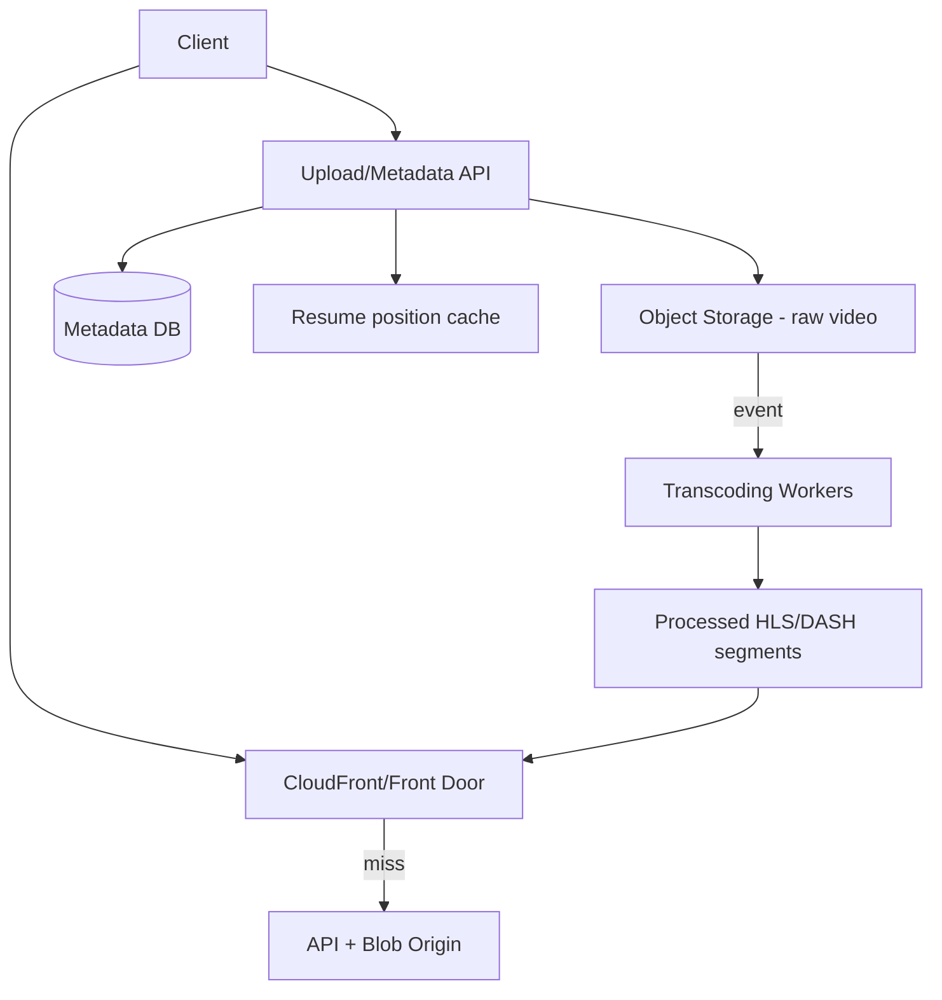

# Case Study: Design Netflix-Lite Video Streaming

| **Week** | 33 | **Difficulty** | Expert | **Time** | 45 min |

## Requirements
- 10M users, 1M DAU
- Upload and stream video (not live)
- Resume playback across devices
- Global users (US, EU, APAC)

## Clarifying Questions to Ask
- Video length average? Max file size?
- Concurrent streams per user?
- Transcoding requirements (multiple qualities)?
- DRM required?

## Reference Architecture

## Key Decisions
| Decision | Choice | Why |
|----------|--------|-----|
| Storage | S3/Blob + CDN | Cost, global delivery |
| Transcoding | Async queue (SQS/Service Bus) | CPU-heavy, bursty |
| Streaming | HLS/DASH adaptive bitrate | Device/bandwidth adaptive |
| Resume | Redis `userId:videoId → position` | Fast read/write |
| Upload | Pre-signed URL direct to blob | Bypass API for large files |

## Scale Estimates
- 1M DAU × 1 hour video/day × 1 Mbps ≈ significant CDN egress — budget $$$

## Deep Dive Topics
- Chunked upload for large files
- CDN cache invalidation on new version
- Geo-restriction for licensing

## Rubric
Pass: CDN + blob + async transcode + metadata DB + resume state
