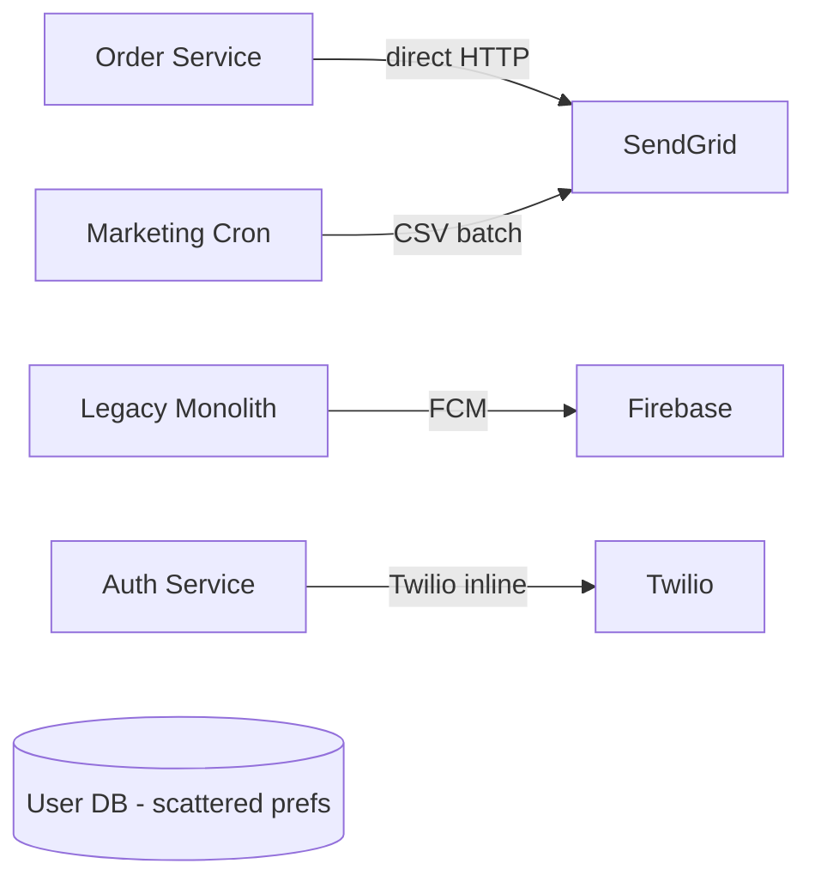
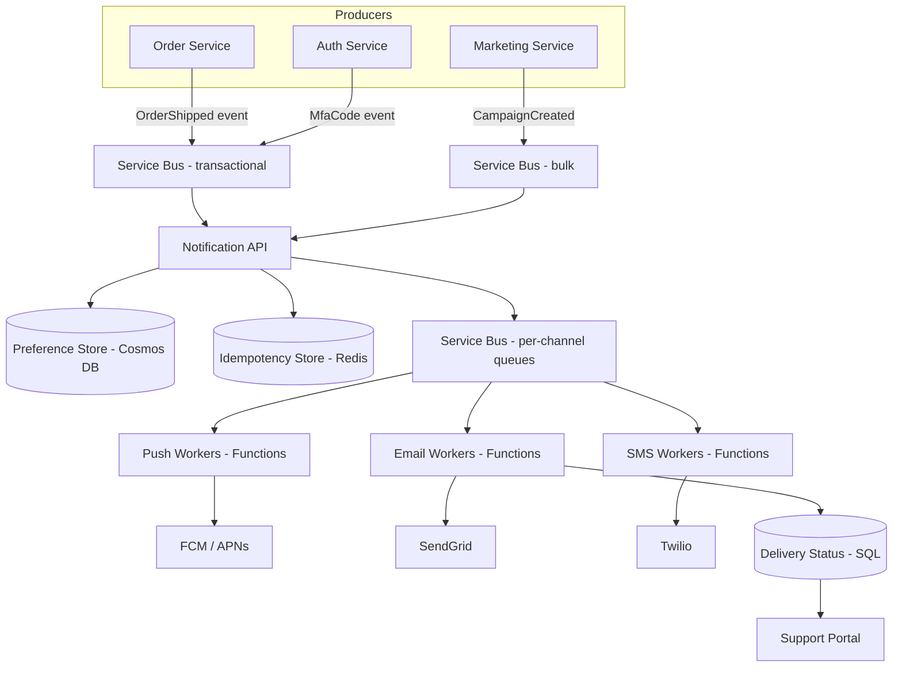

# Case Study: Real-Time Notification Platform — Push, Email & SMS at 5M Users

| Attribute | Value |
|-----------|-------|
| **Industry** | Consumer SaaS / E-commerce |
| **Scale** | 5M registered users, 50M notifications/day peak |
| **Week** | 33 |
| **Difficulty** | Advanced |

## Business Context

A growing marketplace app needs a unified notification system: order updates, promotional campaigns, and security alerts across mobile push (FCM/APNs), email (SendGrid), and SMS (Twilio). Today each team built ad-hoc integrations — the Order service calls SendGrid directly, Marketing uses a batch CSV upload, and push notifications share one hardcoded Firebase key in a monolith.

Product leadership wants a single platform with user preference management, delivery tracking, and the ability to send 500K notifications within 5 minutes for flash campaigns. You have 45 minutes in a system design interview to whiteboard the architecture.

## Current State

**Current implementation issues (from architecture review):**

- No central preference store — users receive duplicate emails and push for the same event
- Synchronous SendGrid calls in Order API hot path add 200–400ms latency
- No idempotency — retry logic causes duplicate "order shipped" emails
- Marketing batch job sends 2M emails in one hour; IP reputation damaged, 30% spam folder rate
- No delivery status tracking — support cannot answer "did user get the alert?"
- Firebase credentials in source control; no per-environment key rotation
- Peak campaign can spike 20× normal volume with no queue buffering

## Requirements

### Functional
- Send notification via push, email, or SMS based on user preferences and event type
- Support transactional (order shipped) and bulk (marketing campaign) traffic classes
- User opt-in/opt-out per channel and category (marketing vs transactional)
- Delivery status: sent, delivered, failed, bounced — queryable by support tools
- Template management with variable substitution (`{{orderId}}`, `{{userName}}`)

### Non-Functional
| NFR | Target |
|-----|--------|
| Transactional latency | < 30 seconds end-to-end (p99) |
| Bulk throughput | 500K notifications in 5 minutes |
| Availability | 99.9% |
| Durability | Zero message loss for transactional |
| Preference read latency | < 50ms (p99) |
| Cost | < $0.002 per notification blended |

## Constraints

- Must use third-party providers (SendGrid, Twilio, FCM) — no in-house SMTP or SMS gateway
- Azure-first: prefer Service Bus, Azure Functions, Cosmos DB or SQL
- CAN-SPAM and GDPR: marketing requires explicit consent audit trail
- Existing .NET microservices publish domain events to Service Bus today
- Team: design for 6 backend engineers to implement in 3 months

## Your Task

1. Clarify requirements and estimate scale (QPS, storage, fan-out)
2. Draw high-level architecture: ingestion → queue → workers → providers
3. Design user preference and template data models
4. Separate transactional vs bulk traffic paths
5. Address idempotency, retries, and dead-letter handling
6. Define observability and support-facing delivery queries

> **Attempt your solution before reading the reference below.**

---

## Reference Solution

### Top 3 Issues

1. **Synchronous provider calls in business services** — tight coupling, latency, and no backpressure during spikes
2. **No traffic class separation** — bulk marketing starves transactional order confirmations
3. **Missing idempotency and preference layer** — duplicates, compliance risk, and poor deliverability

### Revised Architecture

### Key Decisions

| Decision | Choice | Rationale |
|----------|--------|-----------|
| Ingestion | Event-driven via Service Bus topics | Decouple producers from delivery |
| Traffic classes | Separate queues: transactional vs bulk | Bulk cannot starve order alerts |
| Preferences | Cosmos DB partition by `userId` | Fast point reads; global distribution |
| Idempotency | Redis `SETNX` on `(userId, eventId, channel)` | Prevent duplicate sends on retry |
| Workers | Azure Functions with Service Bus trigger | Auto-scale per channel backlog |
| Templates | Blob Storage + metadata in SQL | Marketers edit HTML without deploys |
| Rate limiting | Token bucket per provider per traffic class | Protect SendGrid IP reputation |
| Status | Webhooks from SendGrid/Twilio → Status API | Support queries delivery history |
| Retry | Exponential backoff; DLQ after 5 attempts | Durability without infinite loops |

### Scale Estimates

| Metric | Calculation |
|--------|-------------|
| Average QPS | 50M / 86400 ≈ 580/sec |
| Peak QPS | ~6,000/sec (10× average) |
| Preference reads | 1 per notification ≈ 6K RPS peak — Redis cache fronting Cosmos |
| Storage (90 days status) | 50M × 90 × 500 bytes ≈ 2.25 TB — partition + archive to Blob |

### Expected Outcome

- Order API latency: -250ms (removed inline SendGrid)
- Duplicate notifications: ~3%/week → < 0.01% with idempotency keys
- Campaign send: 500K in 4.2 minutes in load test with bulk worker pool
- Support ticket volume (delivery disputes): -40% with status portal

## Discussion Questions

1. How would you handle a provider outage (SendGrid down) without losing messages?
2. When would you shard notification workers by tenant vs by channel?
3. How do you design unsubscribe flows that propagate within 60 seconds globally?

## Interview Story Angle

**STAR prompt:** "Design a notification system" or "Tell me about a platform you architected for multiple consumers."

Use this case study: start with requirements clarification and traffic classes, show queue-based decoupling, mention compliance (GDPR opt-in) unprompted — interviewers reward product-aware architects.
