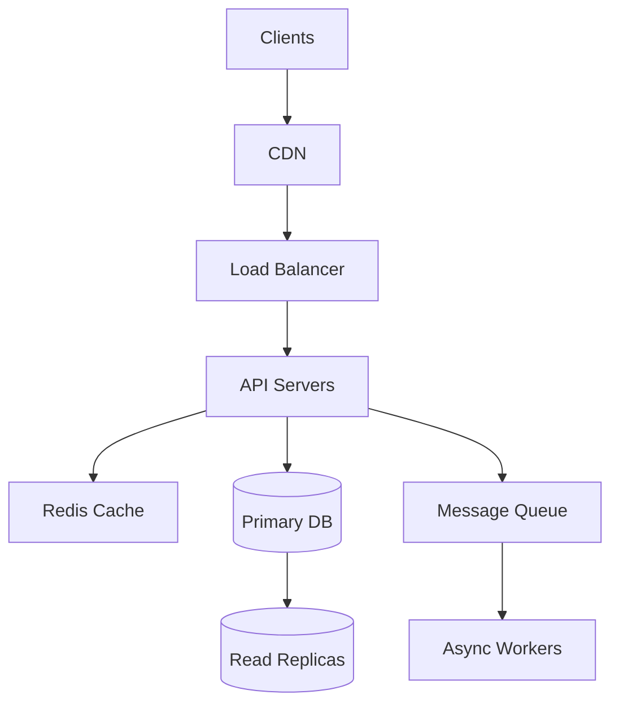

# High-Level System Design Methodology

> **Week 33** | **Module:** [system-design](../../../modules/system-design/README.md)

## The RESHADED Framework (45 minutes)

| Step | Time | Action |
|------|------|--------|
| **R**equirements | 5 min | Functional + non-functional; ask clarifying questions |
| **E**stimation | 5 min | Users, QPS, storage, bandwidth |
| **S**ystem design | 10 min | High-level boxes, APIs, data model |
| **H**ighlights | 15 min | Deep dive 2 components |
| **A**vailability | 5 min | Failure modes, redundancy |
| **D**eployment | 3 min | How built and operated |
| **E**volution | 2 min | 10x scale changes |
| **D**iscussion | — | Trade-offs, alternatives |

---

## Clarifying Questions (Always Ask)

```
Scale:
- How many daily/monthly active users?
- Read vs write ratio?
- Geographic distribution?

Performance:
- p99 latency target?
- Availability SLA (99.9% vs 99.99%)?

Data:
- How much data stored? Growth rate?
- Consistency requirements?

Constraints:
- Budget? Team size?
- Existing systems?
- Compliance (GDPR, PCI)?
```

---

## Back-of-Envelope Estimation

| Metric | Formula |
|--------|---------|
| QPS | DAU × actions/day ÷ 86400 |
| Peak QPS | Avg × 3-5 |
| Storage/year | records/day × size × 365 |
| Bandwidth | QPS × response size |
| Servers (rough) | peak QPS ÷ 500-2000 RPS per server |

**Example — Twitter-like:**
- 300M DAU, 2 tweets/day average
- Writes: 300M × 2 / 86400 ≈ 7K TPS
- Peak: ~35K TPS
- Storage: 7K × 300 bytes × 86400 × 365 ≈ 70TB/year (tweets only)

---

## API Design

```
POST   /api/v1/tweets          Create tweet
GET    /api/v1/tweets/{id}     Get tweet
GET    /api/v1/users/{id}/feed Get user feed
DELETE /api/v1/tweets/{id}     Delete tweet
```

**Versioning:** `/v1/` in path or header. **Idempotency:** `Idempotency-Key` on POST.

---

## Data Model (Start Simple)

```
User: id, name, email, created_at
Tweet: id, user_id, content, created_at
Follow: follower_id, followee_id
```

**Then evolve:** Denormalize for read paths. Separate read/write stores (CQRS) at scale.

---

## High-Level Diagram Template



**Next:** Week 34 Scalability patterns
