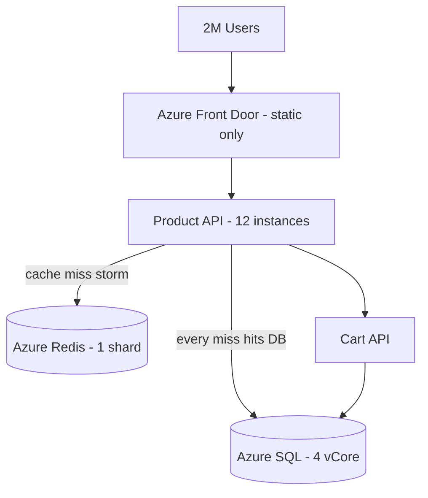
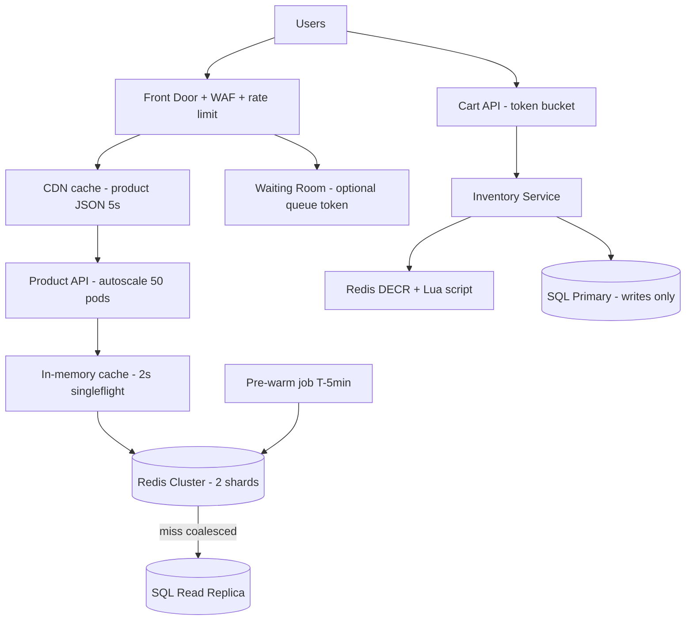

# Case Study: Flash Sale Meltdown — 50× Traffic, Cache Stampede & Database Collapse

| Attribute | Value |
|-----------|-------|
| **Industry** | E-commerce |
| **Scale** | 50× traffic spike, 80K RPS peak, 2M concurrent users |
| **Week** | 34 |
| **Difficulty** | Advanced |

## Business Context

A fashion retailer announced a limited-edition sneaker drop: 5,000 units, sale opens at noon. Marketing drove 2M users to the product page. At 12:00:01, the site collapsed — product API returned 503s, Redis hit connection limits, and Azure SQL CPU pegged at 100% for 22 minutes. Bots and humans alike hammered "Add to Cart." The sale sold out in reality but the company processed only 800 orders due to timeouts.

The CTO wants a scalability architecture review before the next drop in 10 weeks. You own the caching, CDN, and database protection strategy.

## Current State



**Current implementation issues (from post-mortem):**

- Product detail cached with TTL=60s but **no cache stampede protection** — 80K concurrent misses on expiry
- Cache key `product:{id}` stores full object; inventory count stale or bypassed inconsistently
- Redis: 256 connections per API instance × 12 = 3,072 — connection storm exhausted pool
- No CDN caching for product API responses — only images/CSS on Front Door
- Database: no read replicas; inventory check = `SELECT FOR UPDATE` on hot row
- No request coalescing (singleflight) — 80K identical DB queries in 2 seconds
- Rate limiting absent on Add to Cart — bots consumed 60% of capacity
- Warm-up job not run — cold cache at exactly noon

## Requirements

### Functional
- Serve product page (detail + available inventory signal) under flash sale load
- Add to Cart must reflect real inventory — oversell max 0.1% (business tolerance)
- Sale queue or fair access acceptable if communicated to users

### Non-Functional
| NFR | Target |
|-----|--------|
| Product page availability | 99.9% during drop |
| Product read latency (p99) | < 100ms |
| Add to Cart latency (p99) | < 300ms |
| Peak RPS (product read) | 80,000 |
| SQL CPU | < 70% sustained |
| Oversell rate | < 0.1% |

## Constraints

- Azure SQL (not Cosmos) — inventory already in relational schema with EF Core
- Azure Cache for Redis Premium available; budget for one additional shard
- Front Door Premium already licensed
- Cannot rewrite checkout in 10 weeks — focus on read path + cart admission
- Legal: cannot show fake inventory counts

## Your Task

1. Explain what caused the cache stampede and DB meltdown
2. Design multi-layer caching (CDN → app → Redis) for product reads
3. Propose inventory consistency strategy under extreme contention
4. Specify rate limiting, bot protection, and optional virtual waiting room
5. Define pre-sale warm-up and load test plan

> **Attempt your solution before reading the reference below.**

---

## Reference Solution

### Top 3 Issues

1. **Cache stampede on TTL expiry** — 80K simultaneous cache misses each hit SQL for identical product row
2. **No read path isolation** — product reads and inventory writes contended on same SQL primary
3. **Unbounded connection and request fan-out** — Redis and SQL connection pools exhausted before CPU

### Revised Architecture



### Key Decisions

| Decision | Choice | Rationale |
|----------|--------|-----------|
| CDN | Cache `GET /products/{id}` 5s at edge | Absorb 70%+ read RPS before origin |
| Stampede | Singleflight + probabilistic early refresh | One origin fetch per cache key per window |
| Redis | Cluster mode, 2 shards; connection multiplexing | Scale connections and memory |
| Inventory read | Redis counter synced from SQL pre-sale; periodic reconcile | Sub-ms reads; authoritative SQL on checkout |
| Inventory write | Lua `DECR` with floor at 0 + async SQL persist | Atomic, fast, prevents negative stock |
| Read replica | Azure SQL read scale-out for non-inventory queries | Offload product metadata reads |
| Rate limit | Front Door 100 req/min/IP on cart; bot rules | Protect origin from abuse |
| Waiting room | Virtual queue token for first 60s of sale | Optional fairness layer |
| Warm-up | Load product + seed Redis 5 min before noon | Zero cold-start at T+0 |

### Cache Stampede Pattern

```csharp
// Singleflight: only one request populates cache per key
var product = await _cache.GetOrCreateAsync($"product:{id}", async entry =>
{
    entry.AbsoluteExpirationRelativeToNow = TimeSpan.FromSeconds(30);
    return await _productRepo.GetByIdAsync(id); // one DB hit per expiry window
});
```

### Expected Outcome

- Product read p99: timeout → 45ms at 80K RPS in rehearsal
- SQL CPU: 100% → ~55% with CDN + replica + coalescing
- Successful checkouts during 10-min window: 800 → 4,800+ (near sellout)
- Redis connections: stable with multiplexer pattern (< 500 total)

## Discussion Questions

1. How stale can inventory displayed on the product page be before UX/legal issues arise?
2. Compare Redis DECR vs SQL `ROWLOCK` for inventory at 10K writes/sec
3. When does a virtual waiting room hurt conversion more than it helps reliability?

## Interview Story Angle

**STAR prompt:** "Tell me about a system that couldn't handle a traffic spike."

Use this case study: name cache stampede explicitly, draw the thundering herd, then layer defenses (CDN → singleflight → Redis → read replica) — quantify recovery (800 → 4,800 orders) to show business fluency.
