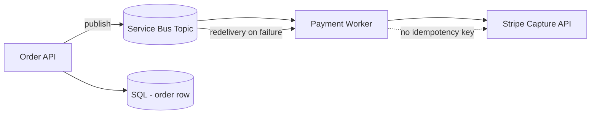
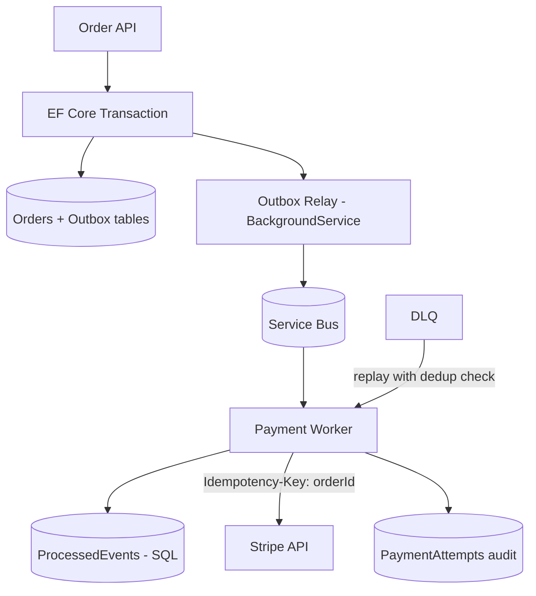

# Case Study: Double-Charge Incident — Duplicate Service Bus Messages & Missing Idempotency

| Attribute | Value |
|-----------|-------|
| **Industry** | E-commerce / FinTech |
| **Scale** | 15,000 payments/hour peak, $2.4M daily GMV |
| **Week** | 35 |
| **Difficulty** | Advanced |

## Business Context

Customers reported duplicate charges for the same order over a weekend — 847 confirmed cases, $126K in refunds and chargeback fees. Investigation traced the bug to the payment pipeline: the Order service publishes `OrderPlaced` to Azure Service Bus, and the Payment worker calls Stripe to capture funds. Messages were delivered **at-least-once** after broker failover, but the Payment worker had no idempotency guard and no transactional outbox on the publisher side.

Compliance has flagged the incident. You must redesign the event-driven payment flow to guarantee exactly-once **business effect** (charge once per order) while accepting at-least-once message delivery.

## Current State



**Current implementation issues (from code review):**

- `OrderPlaced` event published **before** SQL transaction commits — crash = ghost charge attempt
- Payment worker: `await stripe.CaptureAsync(orderId)` with no idempotency key
- On Stripe timeout, worker throws → message abandoned → redelivered → second capture succeeds
- No `ProcessedMessages` table or natural-key deduplication
- Order API and Payment worker share no correlation beyond `orderId` string in message body
- Service Bus sessions not used — ordering not guaranteed across partitions
- Dead-letter queue monitored manually; 12 messages replayed without dedup check → 12 duplicate charges in staging

## Requirements

### Functional
- Charge customer exactly once per confirmed order
- Publish `OrderPlaced` reliably iff order persisted
- Handle Stripe timeouts gracefully without duplicate capture
- Support manual replay from DLQ without double-charging

### Non-Functional
| NFR | Target |
|-----|--------|
| Payment processing latency | < 5 seconds (p99) |
| Durability | Zero lost orders; zero duplicate charges |
| Availability | 99.95% |
| Auditability | Full trail: order → event → payment attempt → Stripe ID |
| RPO | 0 for payment state |
| RTO | 30 minutes |

## Constraints

- Must keep Azure Service Bus (no Kafka migration this quarter)
- Stripe supports idempotency keys on API calls — must use them
- .NET 8 + EF Core; SQL Server already in use
- PCI: card data never in messages — only `orderId`, `amount`, `paymentMethodToken`
- Team familiar with MediatR domain events but not event sourcing

## Your Task

1. Explain how at-least-once delivery caused duplicate charges
2. Design transactional outbox pattern for Order API
3. Design idempotent Payment worker with Stripe idempotency keys
4. Specify message schema, correlation IDs, and deduplication store
5. Define safe DLQ replay procedure

> **Attempt your solution before reading the reference below.**

---

## Reference Solution

### Top 3 Issues

1. **No transactional outbox** — events published outside DB transaction; crashes and redelivery cause duplicate processing
2. **No consumer idempotency** — Payment worker treats every message as new; Stripe timeout + retry = double capture
3. **Unsafe DLQ replay** — manual reprocessing without dedup amplified the bug in staging and production

### Revised Architecture



### Key Decisions

| Decision | Choice | Rationale |
|----------|--------|-----------|
| Publisher | Transactional outbox in same SQL transaction as order | Event exists iff order committed |
| Outbox relay | `BackgroundService` polls + Service Bus send | Simple; proven in .NET |
| Consumer dedup | `ProcessedEvents` table with PK on `messageId` | Reject duplicate deliveries |
| Stripe calls | `Idempotency-Key: order-{orderId}` header | Provider-side duplicate protection |
| State machine | `PaymentStatus`: Pending → Captured → Failed | Explicit lifecycle |
| Timeout handling | Record `AttemptId`; on timeout query Stripe before retry | Avoid blind redelivery |
| Message schema | `eventId` (UUID), `orderId`, `correlationId`, `occurredAt` | Traceability |
| DLQ replay | Admin tool checks `ProcessedEvents` before requeue | Safe manual recovery |
| Sessions | Service Bus session on `orderId` | Ordered processing per order |

### Outbox + Idempotent Consumer Sketch

```csharp
// Order API — same transaction
_context.Orders.Add(order);
_context.OutboxMessages.Add(new OutboxMessage("OrderPlaced", order.Id, payload));
await _context.SaveChangesAsync();

// Payment Worker
if (await _dedup.ExistsAsync(message.MessageId)) return; // complete without reprocessing
var result = await _stripe.CaptureAsync(charge, new RequestOptions {
    IdempotencyKey = $"order-{orderId}"
});
await _dedup.MarkProcessedAsync(message.MessageId, result.Id);
```

### Expected Outcome

- Duplicate charges: 847/weekend → 0 over 90-day monitoring window
- Ghost events (publish without commit): eliminated by outbox
- DLQ replay: 100% safe in staging drill with dedup gate
- Latency impact: +15ms average (outbox poll interval 1s configurable)

## Discussion Questions

1. When would you choose event sourcing over outbox + idempotent consumers?
2. How do you test idempotency in integration tests with Service Bus?
3. What is the difference between exactly-once delivery and exactly-once processing?

## Interview Story Angle

**STAR prompt:** "Tell me about a bug caused by distributed systems semantics."

Use this case study: explain at-least-once vs exactly-once business effect clearly, present outbox + idempotency as the standard fix, mention Stripe idempotency keys — shows messaging maturity beyond "just use a queue."
