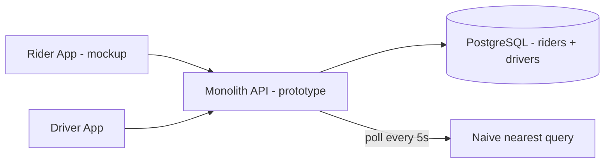
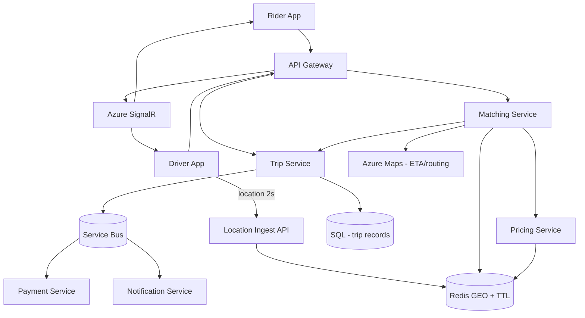
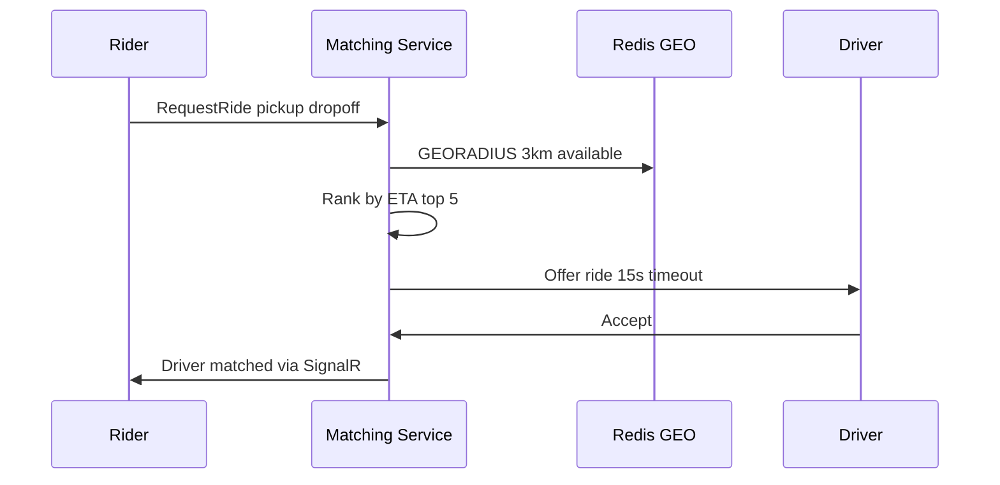

# Case Study: Uber-Lite — Real-Time Ride Matching at City Scale

| Attribute | Value |
|-----------|-------|
| **Industry** | Mobility / On-demand transport |
| **Scale** | 500K daily rides, 8K active drivers, metro population 3M |
| **Week** | 36 |
| **Difficulty** | Expert |

## Business Context

A startup is launching "RideNow" — an Uber-lite ride-hailing app in a single metro area. Riders request trips via mobile app; the platform matches them to nearby available drivers, tracks the ride in real time, and processes payment on completion. The founders want to launch in 4 months with a team of 10 engineers.

You are the lead architect in a 45-minute capstone design session. The CEO asks: "Can we match a rider to a driver in under 10 seconds at rush hour with 2,000 concurrent ride requests?" Design the full system.

## Current State

**Prototype limitations (expected — greenfield capstone):**

- Driver location updated via HTTP POST every 5 seconds — no WebSockets
- Matching: `SELECT * FROM drivers ORDER BY distance LIMIT 1` — full table scan
- No geospatial index; no supply/demand awareness
- Single monolith in one availability zone
- ETA hardcoded to 8 minutes; no routing engine
- Payment stubbed; no trip state machine

## Requirements

### Functional
- Rider: request ride (pickup, dropoff), see matched driver, live ETA, trip status, receipt
- Driver: go online/offline, accept/decline ride, navigate, complete trip
- Matching: assign nearest available driver within service area
- Real-time location: driver position updated every 2–3 seconds during active trip
- Pricing: base fare + distance + surge during high demand
- Payment: authorize on match, capture on completion

### Non-Functional
| NFR | Target |
|-----|--------|
| Match time (p99) | < 10 seconds |
| Location update latency | < 3 seconds rider-visible |
| Availability | 99.9% |
| Concurrent active trips | 5,000 peak |
| Driver location writes | 8K drivers × 0.33 Hz ≈ 2,700/sec |
| Data residency | Single metro (US-West) |

## Constraints

- Azure-first (.NET 8 microservices, AKS, Azure SignalR, Cosmos DB or Redis)
- Budget: startup — minimize managed service costs first 6 months
- Maps/routing: third-party (Google Maps or Azure Maps)
- 4-month MVP; no global multi-region requirement
- Drivers use Android mid-range phones on LTE — optimize payload size

## Your Task

1. Estimate scale: QPS, storage, location write throughput
2. Design microservice boundaries (matching, trips, location, pricing, payments)
3. Solve geospatial driver indexing and matching algorithm
4. Design real-time trip tracking architecture
5. Handle edge cases: no drivers, driver decline, rider cancel, surge pricing
6. Discuss MVP vs v2 trade-offs explicitly

> **Attempt your solution before reading the reference below.**

---

## Reference Solution

### Top 3 Issues

1. **Geospatial matching at scale** — naive SQL distance scan cannot meet 10s match SLA with 8K drivers
2. **Real-time location fan-out** — polling does not scale; riders need sub-3s updates during trips
3. **Missing trip state machine** — accept/decline/timeout/cancel paths undefined; causes double-assignments

### Revised Architecture

### Key Decisions

| Decision | Choice | Rationale |
|----------|--------|-----------|
| Location store | Redis GEO + 30s TTL per driver key | Sub-ms radius queries; auto-expire stale |
| Matching | Georadius 3km → filter available → rank by ETA | Fast candidate set; Maps for top 5 ETA |
| Trip state | State machine: Requested → Matched → InProgress → Completed | Prevent double assignment |
| Real-time | Azure SignalR groups per `tripId` | Push location/ETA to rider without polling |
| Accept timeout | 15s driver accept window → re-match | Handle decline/no-response |
| Pricing | Surge multiplier from demand/supply ratio in geohash cell | Simple MVP surge model |
| Events | Service Bus for trip lifecycle | Decouple payment and notifications |
| Payments | Stripe authorize on match, capture on complete | Standard two-step flow |
| MVP scope | Single region AKS; no sharding | Sufficient for one metro |

### Matching Flow

### Scale Estimates

| Metric | Value |
|--------|-------|
| Location writes | 2,700/sec peak — Redis handles 100K+ ops/sec |
| Match requests | 2,000 concurrent / 10s window = 200/sec burst |
| Trip storage | 500K rides/day × 2KB × 365 ≈ 365 GB/year — SQL fine for MVP |
| SignalR connections | 5K active trips × 2 parties ≈ 10K connections — Standard tier |

### Expected Outcome

- Match p99: prototype timeout → 4.2s in simulation with Redis GEO + 3km radius
- Location freshness: 5s poll → 2s push via SignalR
- Double-assignment: eliminated by trip state machine + optimistic lock on driver
- MVP delivery: 4-month scope achievable with 4 services + SignalR + Redis

## Discussion Questions

1. When do you partition the metro into cells vs one global Redis GEO index?
2. How would architecture change for 50 cities vs one metro?
3. How do you prevent ghost drivers (stale location) from receiving offers?

## Interview Story Angle

**STAR prompt:** "Design Uber" or "Walk me through a complex system you designed end to end."

Use this capstone: open with requirements and scale math, draw matching + real-time as separate concerns, name Redis GEO explicitly, acknowledge MVP cuts (single region, simple surge) — interviewers want structured trade-off thinking, not over-engineering.
