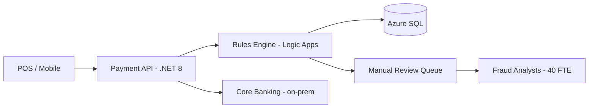
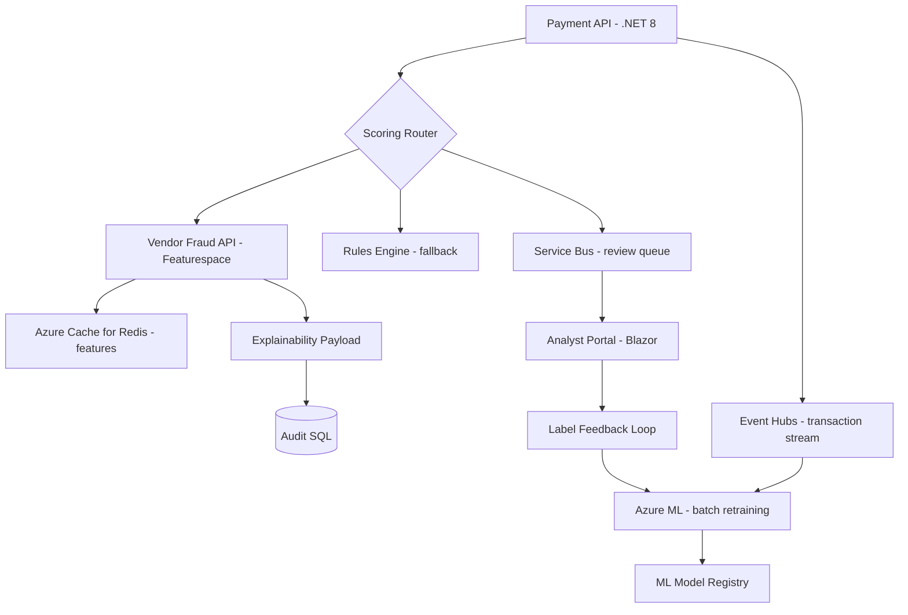

# Case Study: Fraud Detection — Build vs Buy

| Attribute | Value |
|-----------|-------|
| **Industry** | Retail banking |
| **Scale** | 50,000 transactions/minute peak |
| **Week** | 37 |
| **Difficulty** | Advanced |

## Business Context

A mid-size bank processes card and ACH transactions through a .NET 8 payment orchestration API on Azure. The current rules engine (Azure Logic Apps + SQL stored procedures) catches ~60% of confirmed fraud, costing $12M annually in chargebacks and manual review labor.

The ML team proposes a custom Graph Neural Network trained on 3 years of transaction graphs. A vendor (Featurespace) offers a SaaS fraud API at $0.002/transaction. The board wants a recommendation in 2 weeks with a 6-month rollout plan and regulatory explainability for OCC audit.

## Current State

**Current implementation issues (from architecture review):**
- Rules are brittle — 400+ SQL conditions, 2-week lead time per rule change
- No real-time feature store; each rule re-queries transaction history
- 40% of flagged transactions are false positives (analyst fatigue)
- No model governance or A/B testing framework
- Latency p99 is 180ms but rules path spikes to 800ms under peak

## Requirements

### Functional
- Score every transaction in real time (approve, decline, or route to review)
- Support card-present, card-not-present, and ACH flows
- Provide explainability payload for regulatory audit (top 5 contributing factors)
- Allow fraud analysts to override and feed back labels for model improvement

### Non-Functional
| NFR | Target |
|-----|--------|
| Latency (p99) | < 100ms scoring (excluding review queue) |
| Availability | 99.99% |
| Fraud catch rate | > 85% (from 60%) |
| False positive rate | < 15% (from 40%) |
| Explainability | OCC-compliant reason codes per transaction |
| RPO | 0 (no transaction loss on scoring failure) |

## Constraints

- Team: 8 .NET developers, 2 data scientists (no GNN production experience)
- Budget: $2M capex cap; $400K/year opex for fraud tooling
- Vendor API requires outbound HTTPS (security review in progress)
- Custom model needs 6+ months training pipeline on Azure ML
- Must not block payment path — fallback to rules if scorer unavailable
- PCI DSS: card data never sent to vendor (tokens only)

## Your Task

1. Identify the top 3 issues with the current rules-only approach
2. Compare build (custom GNN), buy (vendor API), and hybrid (rules + GPT assist) options
3. Recommend an architecture with 6-month rollout phases
4. Address explainability and regulatory requirements
5. Draft ADR summary with 3-year TCO estimate

> **Attempt your solution before reading the reference below.**

---

## Reference Solution

### Top 3 Issues

1. **Rules don't generalize** — new fraud patterns require weeks to encode; 60% catch rate is a ceiling
2. **No feature engineering pipeline** — repeated SQL lookups add latency and inconsistency
3. **Analyst feedback loop is broken** — overrides don't retrain anything; false positives persist

### Revised Architecture

### Key Decisions

| Decision | Choice | Rationale |
|----------|--------|-----------|
| Primary scorer | Vendor API (buy) | 90-day time-to-production vs 9+ months for custom GNN |
| Fallback | Existing rules engine | Zero RPO; payments never blocked by scorer outage |
| Feature store | Redis with 24h TTL | Sub-10ms feature lookup; vendor enriches with tokenized data |
| Custom ML | Phase 2 (month 7+) | Train challenger model on labeled data from vendor period |
| Explainability | Vendor SHAP payload → audit table | Meets OCC requirement; no custom explainability build |
| GPT assist | Analyst copilot only (not real-time scorer) | Too slow and non-deterministic for payment path |

### 3-Year TCO Comparison

| Option | Year 1 | Year 2 | Year 3 | Total |
|--------|--------|--------|--------|-------|
| Vendor API | $1.05M | $1.10M | $1.15M | $3.30M |
| Custom GNN | $1.8M | $600K | $500K | $2.90M |
| Rules only | $400K | $420K | $440K | $1.26M (+ $12M fraud loss) |

*Vendor TCO: 50K txn/min × 0.002 × 525,600 min/year ≈ $52M — negotiate enterprise tier to ~$1M/year.*

### Expected Outcome

- Fraud catch rate: 60% → 88% within 6 months
- False positives: 40% → 12% (analyst headcount redeployable)
- Latency p99: 180ms → 95ms (vendor API + Redis features)
- Phase 2: challenger custom model in shadow mode by month 9

## Discussion Questions

1. At what transaction volume does building custom ML break even against vendor pricing?
2. How would you design the shadow-mode evaluation for a challenger model?
3. What happens when the vendor API latency exceeds your 100ms SLO?

## Interview Story Angle

**STAR prompt:** "Tell me about a build-vs-buy decision you made under time pressure."

Use this case study: emphasize TCO beyond license fees (fraud loss, FTE), regulatory explainability as a hard constraint, and phased hybrid as the pragmatic path.
