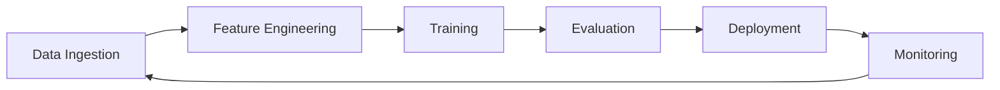

# AI/ML Architecture Fundamentals

> **Week 37** | **Module:** [ai-architecture-rag-llmops](../../../modules/ai-architecture-rag-llmops/README.md)

## Learning Objectives
- Understand ML lifecycle and where architects add value
- Compare build vs buy vs managed AI services
- Design feature stores and model serving patterns

---

## 1. ML Lifecycle (Architect View)



| Phase | Architect Concern |
|-------|-------------------|
| Data | Lineage, PII, retention, quality SLAs |
| Training | Compute cost, reproducibility, experiment tracking |
| Serving | Latency, throughput, fallback, versioning |
| Monitoring | Drift, performance decay, cost per inference |

---

## 2. Build vs Buy vs Managed

| Approach | When | Example |
|----------|------|---------|
| **Managed API** | General language tasks, fast time-to-market | Azure OpenAI, Bedrock |
| **Custom model** | Domain-specific, data moat | Fine-tuned classifier on internal docs |
| **Traditional ML** | Structured prediction, explainability required | Fraud detection (XGBoost) |
| **Rules + ML hybrid** | Regulated, need audit trail | Credit scoring |

**Architect default in 2026:** Start managed (GPT-4 class) + RAG for enterprise knowledge. Fine-tune only when evaluation proves need.

---

## 3. Model Serving Patterns

| Pattern | Latency | Use Case |
|---------|---------|----------|
| **Synchronous API** | Real-time | Chat, classification |
| **Batch inference** | Hours | Nightly scoring, reports |
| **Streaming** | Near real-time | Fraud detection pipeline |
| **Edge** | Lowest local | Factory floor, offline |

**.NET integration:**
```csharp
// Azure OpenAI SDK
var response = await client.GetChatCompletionsAsync(new ChatCompletionsOptions
{
    DeploymentName = "gpt-4o",
    Messages = { new ChatRequestUserMessage(userPrompt) }
});
```

---

## 4. Feature Stores

Centralized repository for ML features — training/serving consistency.

| Platform | Cloud |
|----------|-------|
| Feast (OSS) | Self-hosted |
| Azure ML Feature Store | Azure |
| SageMaker Feature Store | AWS |

**Architect:** Without feature store, training-serving skew causes silent model degradation.

---

## 5. MLOps vs LLMOps

| MLOps | LLMOps |
|-------|--------|
| Model versioning (MLflow) | Prompt versioning |
| Data drift detection | Output quality eval |
| A/B model tests | RAG chunk quality |
| GPU training pipelines | Token cost management |

**Next:** Week 38 RAG architecture
