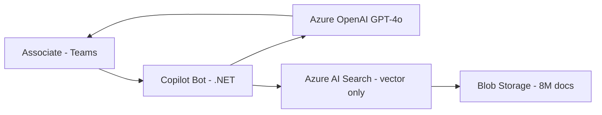
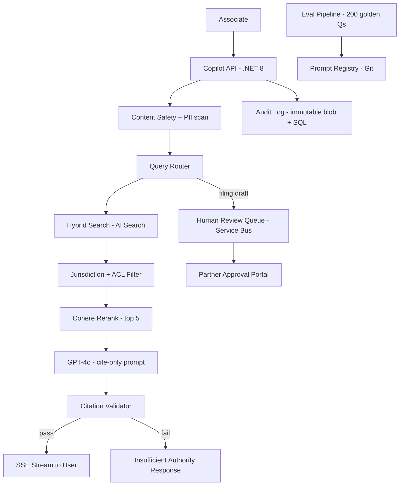

# Case Study: RAG Hallucination in Enterprise Legal Copilot

| Attribute | Value |
|-----------|-------|
| **Industry** | Legal services (Am Law 100 firm) |
| **Scale** | 3,200 attorneys, 8M documents, 50K queries/month |
| **Week** | 38 |
| **Difficulty** | Expert |

## Business Context

A global law firm deployed an internal copilot built on Azure OpenAI + Azure AI Search to help associates draft briefs and research case law. A partner cited a non-existent precedent in federal court — the model hallucinated a case name that matched a similar real case from the wrong jurisdiction. Malpractice exposure is estimated at $5M+; the firm paused all copilot use pending redesign.

You are the AI architect engaged to rebuild the RAG pipeline with compliance controls that satisfy the malpractice insurer and state bar ethics rules.

## Current State



**Current implementation issues (from incident postmortem):**
- No citation requirement in system prompt — model free to invent case names
- Vector search returned semantically similar docs from wrong jurisdiction (NY vs CA)
- No confidence threshold — model always answered even with weak retrieval
- No human review gate for client-facing or court-facing outputs
- No audit log of queries, retrieved chunks, or generated responses
- ACL filtering applied after retrieval, not at query time (data leakage risk)

## Requirements

### Functional
- Answer legal research questions with mandatory inline citations (case name, citation, source link)
- Filter every query by jurisdiction and practice area metadata
- Return "insufficient authority" when retrieval confidence is below threshold
- Route draft filings and court submissions through human-in-the-loop approval
- Full audit trail: query, retrieved chunks, prompt, response, user, timestamp

### Non-Functional
| NFR | Target |
|-----|--------|
| Availability | 99.9% |
| Latency (p95) | < 8 seconds (streaming) |
| Hallucination rate | < 0.1% on golden eval set (200 questions) |
| Citation accuracy | 100% — every citation must resolve to source doc |
| Audit retention | 7 years |
| Availability during rebuild | Phased rollout; no big-bang cutover |

## Constraints

- Team: 4 .NET developers, 1 ML engineer, 2 legal knowledge managers
- Budget: existing $25K/month Azure spend; no increase without partner approval
- Must stay in single Azure tenant (client matter confidentiality)
- Azure OpenAI only — no third-party LLM APIs
- Associates expect sub-10s responses; cannot add 30s human review for research queries
- Malpractice insurer requires documented controls before re-enabling

## Your Task

1. Identify the top 3 root causes of the hallucination incident
2. Redesign the RAG architecture with jurisdiction filtering and citation enforcement
3. Define the confidence threshold and "I don't know" behavior
4. Design human-in-the-loop workflow for high-risk outputs
5. Specify audit logging and eval pipeline before re-launch

> **Attempt your solution before reading the reference below.**

---

## Reference Solution

### Top 3 Issues

1. **No grounded generation contract** — prompt allowed synthesis without requiring verifiable citations
2. **Retrieval without metadata filters** — vector similarity alone cannot enforce jurisdiction
3. **No post-generation validation** — no check that cited cases exist in the index

### Revised Architecture



### Key Decisions

| Decision | Choice | Rationale |
|----------|--------|-----------|
| Retrieval | Hybrid (BM25 + vector) + metadata filter | Jurisdiction as mandatory OData filter, not post-hoc |
| Citation enforcement | Structured output + validator | Model returns JSON `{claims[], citations[]}`; validator checks each citation exists in index |
| Confidence gate | Rerank score < 0.7 → refuse | Prevents generation on weak retrieval |
| High-risk outputs | HITL for filings/motions only | Research queries stream immediately if citations validate |
| Audit | Append-only blob + SQL index | 7-year retention; immutable for malpractice defense |
| Eval gate | 200 golden questions, 0 hallucinations to launch | Block deploy if citation accuracy < 100% |

### Citation Validator (concept)

```csharp
public record GroundedResponse(IReadOnlyList<Claim> Claims);
public record Claim(string Text, string CitationId);

// Validator: every CitationId must exist in retrieved chunk set
public bool Validate(GroundedResponse response, IReadOnlySet<string> retrievedIds)
    => response.Claims.All(c => retrievedIds.Contains(c.CitationId));
```

### Expected Outcome

- Hallucination rate: unmeasured → 0% on golden set at launch (validator blocks invalid)
- Jurisdiction errors: eliminated via mandatory OData filter `jurisdiction eq 'US-CA'`
- Re-launch: phased — research only (month 1), filings with HITL (month 3)
- Insurer sign-off: control matrix mapped to audit artifacts

## Discussion Questions

1. Can you ever guarantee zero hallucinations, or only bound the risk?
2. How do you handle conflicting precedents retrieved for the same query?
3. Should associates see retrieval scores to calibrate trust?

## Interview Story Angle

**STAR prompt:** "Tell me about a time you recovered from an AI system failure with serious business impact."

Use this case study: emphasize that RAG is not "plug in search + LLM," citation validation as a separate service, and insurer-driven compliance as the real gate.
