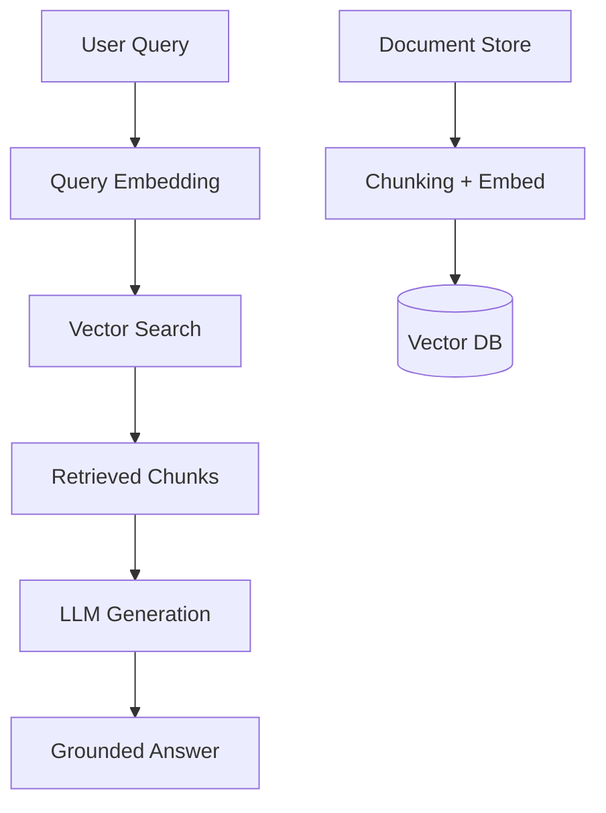

# RAG, Vector Search & LLM Integration

> **Week 38** | **Module:** [ai-architecture-rag-llmops](../../../modules/ai-architecture-rag-llmops/README.md)

## Learning Objectives
- Design production RAG pipelines
- Choose vector databases and embedding models
- Integrate Azure OpenAI and AWS Bedrock in .NET

---

## 1. RAG Architecture



**Why RAG:** Grounds LLM in private data without fine-tuning. Reduces hallucination for enterprise Q&A.

---

## 2. Chunking Strategies

| Strategy | Chunk Size | Best For |
|----------|------------|----------|
| Fixed size | 512–1024 tokens | General docs |
| Semantic | Variable | Long narratives |
| Parent-child | Small search, large context | Technical manuals |
| Markdown-aware | By heading | Wiki, Confluence |

**Architect decision:** Chunk size affects recall and cost. Evaluate on representative query set.

---

## 3. Vector Databases

| Database | Strengths |
|----------|-----------|
| **Azure AI Search** | Hybrid search, enterprise security |
| **Cosmos DB vector** | Existing Cosmos investment |
| **Pinecone** | Managed, simple |
| **pgvector** | PostgreSQL extension |
| **Amazon OpenSearch** | AWS ecosystem |

**Hybrid search:** Vector + BM25 keyword — critical for SKU codes, IDs, exact terms.

---

## 4. .NET RAG with Azure

```csharp
// 1. Embed query
var embedding = await openAIClient.GetEmbeddingsAsync(
    new EmbeddingsOptions("text-embedding-3-small", query));

// 2. Vector search
var results = await searchClient.SearchAsync<DocumentChunk>(query,
    new SearchOptions { VectorSearch = vectorQuery });

// 3. Generate with context
var prompt = $"Context:\n{context}\n\nQuestion: {query}";
var answer = await chatClient.GetChatCompletionsAsync(...);
```

---

## 5. AWS Bedrock Pattern

- **Knowledge Bases** — Managed RAG (S3 → embed → OpenSearch Serverless)
- **Agents** — Tool use, action groups
- **Model choice** — Claude, Titan, Llama

**Multi-cloud architect:** Abstract retrieval behind `IKnowledgeRetriever` interface; swap Azure AI Search vs Bedrock KB.

---

## 6. RAG Failure Modes

| Failure | Mitigation |
|---------|------------|
| Wrong chunks retrieved | Hybrid search, reranking (Cohere) |
| Stale data | Incremental indexing pipeline |
| PII in context | Redaction at ingest |
| Prompt injection | Input sanitization, system prompt guards |
| High latency | Cache frequent queries, smaller model for retrieval |

**Next:** Week 39 LLMOps
