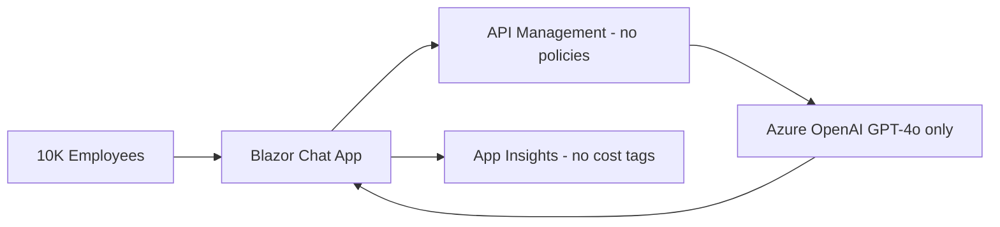
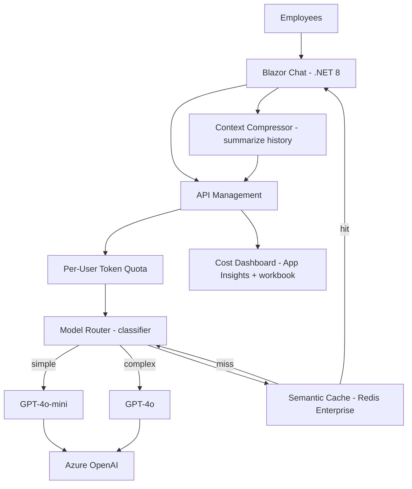

# Case Study: LLM API Cost Blowout

| Attribute | Value |
|-----------|-------|
| **Industry** | Technology (enterprise SaaS) |
| **Scale** | 10,000 employees, 2.4M requests in month 1 |
| **Week** | 39 |
| **Difficulty** | Intermediate |

## Business Context

A 10,000-person software company launched an internal HR + IT helpdesk copilot on Azure OpenAI. Finance approved $15K/month. Month 1 bill: $180K — 12× over budget. Usage went viral after a company-wide email; executives pasted 50-page documents into chat; no rate limits or model routing existed.

The CTO has asked you to architect cost controls that preserve adoption without shutting down the chatbot.

## Current State

**Current implementation issues (from cost analysis):**
- Average 8,000 tokens/request (users paste full email threads and PDFs)
- GPT-4o used for all queries including "what's the WiFi password"
- 40% of questions are near-duplicates (no semantic cache)
- No per-user or per-department quotas
- No prompt compression — full conversation history sent every turn
- No cost allocation tags by department (finance cannot charge back)

## Requirements

### Functional
- Continue serving HR policy, IT troubleshooting, and onboarding questions
- Support document Q&A for uploaded files (with size limits)
- Maintain streaming responses for chat UX
- Provide usage dashboard for department heads

### Non-Functional
| NFR | Target |
|-----|--------|
| Availability | 99.9% |
| Latency (p95) | < 5 seconds |
| Monthly cost | ≤ $15K at steady state (10K users) |
| Cost per user | ≤ $1.50/month average |
| Cache hit rate | > 35% for FAQ-class queries |
| Quota enforcement | Graceful degradation, not hard lockout |

## Constraints

- Team: 3 .NET developers, 1 platform engineer
- Cannot remove GPT-4o entirely — complex HR/legal questions need it
- Must deploy cost controls within 2 weeks (finance escalation)
- Azure OpenAI PTU not approved ($30K/month minimum commitment)
- Adoption metrics matter to CEO — hard blocking users is politically risky
- All changes via APIM policies and app config (no full rewrite)

## Your Task

1. Identify the top 3 drivers of the $180K bill
2. Design model routing, caching, and quota architecture
3. Propose prompt engineering changes to reduce token volume
4. Define monitoring dashboard for cost anomaly detection
5. Deliver a 4-week cost optimization roadmap

> **Attempt your solution before reading the reference below.**

---

## Reference Solution

### Top 3 Issues

1. **No model routing** — GPT-4o at $5/1M input tokens for trivial queries
2. **Unbounded context** — 8K tokens/request from pasted documents and full history
3. **Zero caching** — 40% redundant spend on identical semantic questions

### Revised Architecture

### Key Decisions

| Decision | Choice | Rationale |
|----------|--------|-----------|
| Model routing | GPT-4o-mini for classifier score < 0.3 complexity | ~20× cheaper; handles 65% of queries |
| Semantic cache | Redis Enterprise vector cache, 24h TTL | 40% hit rate saves ~$48K/month at prior volume |
| Per-user quota | 50K tokens/day soft, 100K hard | Prevents abuse; soft limit shows upgrade nudge |
| Context management | Summarize history after 4 turns; 4K token cap | Cuts average request from 8K → 2.5K tokens |
| Upload limits | 10 pages max; Document Intelligence pre-summary | Stops 50-page paste attacks |
| Cost observability | App Insights custom metrics by department tag | Finance chargeback and anomaly alerts |

### Cost Projection

| Control | Month 1 (actual) | Steady state |
|---------|------------------|--------------|
| Raw spend | $180K | — |
| Model routing (-65% on simple) | — | -$70K equivalent |
| Semantic cache (-40% of remainder) | — | -$44K equivalent |
| Context compression (-50% tokens) | — | -$33K equivalent |
| **Projected** | — | **~$13K/month** |

### Expected Outcome

- Month 2 bill: $180K → $45K (quick wins: routing + cache + quotas)
- Month 3 steady state: ~$13K/month within budget
- User satisfaction: maintained via streaming and soft quota warnings
- Dashboard: daily cost alert if 20% above 7-day rolling average

## Discussion Questions

1. When would PTU (Provisioned Throughput Units) be cheaper than pay-as-you-go?
2. How do you prevent users from gaming the complexity classifier?
3. Should departments with higher usage pay more, or is it a shared corporate benefit?

## Interview Story Angle

**STAR prompt:** "Tell me about a time you had to reduce cloud costs without degrading the user experience."

Use this case study: emphasize data-driven triage (token analysis first), layered controls (routing + cache + quotas), and political sensitivity around not blocking executives.
