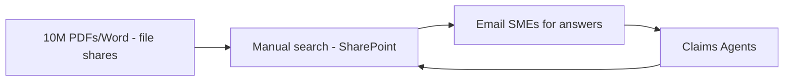
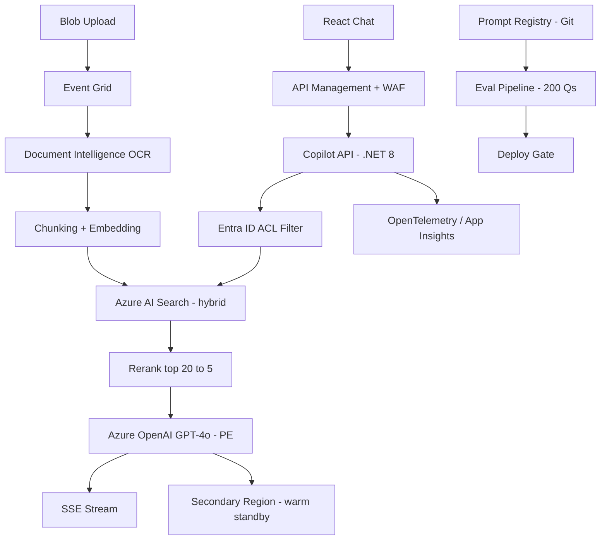

# Case Study: AI Architecture Capstone — Board Presentation

| Attribute | Value |
|-----------|-------|
| **Industry** | Insurance (global P&C) |
| **Scale** | 50K employees, 10M policy documents |
| **Week** | 40 |
| **Difficulty** | Expert |

## Business Context

You are presenting your capstone design for an enterprise document intelligence copilot to the insurance firm's architecture review board (ARB). The system must answer policy questions, draft claim summaries, and cite sources — all within Azure, SOC 2/GDPR compliant, at $15K/month inference budget.

This is a 45-minute presentation with 5 minutes Q&A. Peers will challenge security, multi-region failover, and eval discipline. Your grade depends on clarity, defensibility, and handling hostile questions.

## Current State

**Current pain points (from stakeholder interviews):**
- Claims agents spend 40% of time searching policy documents
- Inconsistent answers across regions — no single source of truth
- No AI tooling; pilot chatbots blocked by security over data residency
- Document ACLs exist in SharePoint but are not enforced in any search index
- No eval framework for AI quality before production

## Requirements

### Functional
- Ingest PDF, Word, and scanned documents with OCR
- Hybrid retrieval (vector + keyword) with document-level ACL from Entra ID
- Chat interface with streaming, inline citations, and source links
- Incremental index updates on blob upload (not nightly full re-index)
- Prompt registry, golden eval set, and cost dashboard per department

### Non-Functional
| NFR | Target |
|-----|--------|
| Availability | 99.9% |
| Latency (p95) | < 5 seconds (chat) |
| Data residency | Azure tenant only — no third-party LLM APIs |
| Compliance | SOC 2 Type II, GDPR |
| Inference budget | ≤ $15K/month at launch |
| Eval gate | 200 golden questions, 95% citation accuracy |

## Constraints

- Team: you (architect) + 6 engineers for build phase
- Azure OpenAI with private endpoint only
- Board includes CISO who will ask about prompt injection and cross-tenant leakage
- Finance will challenge $15K/month vs manual labor savings
- 45-minute slot — cannot deep-dive every component
- Must deliver: C4 diagrams, 2 ADRs, threat model, cost spreadsheet

## Your Task

1. Structure a 45-minute board presentation (timing per section)
2. Walk through end-to-end architecture: ingestion → retrieval → generation → LLMOps
3. Prepare answers for the 4 peer review questions below
4. Justify vector DB and model selection via ADR summaries
5. Define eval strategy and go/no-go criteria before each prompt change

> **Attempt your solution before reading the reference below.**

---

## Reference Solution

### Top 3 Presentation Risks

1. **Security depth insufficient** — board will reject without threat model and ACL-enforced retrieval
2. **No failover story** — single-region Azure OpenAI is a known board blocker
3. **Cost justification weak** — $15K/month needs ROI math vs 50K employees × search time

### Revised Architecture

### Key Decisions

| Decision | Choice | Rationale |
|----------|--------|-----------|
| Vector DB | Azure AI Search (not Cosmos vector) | Hybrid search, ACL filters, single ops surface |
| Model | GPT-4o primary, 4o-mini for routing | Quality for policy nuance; mini for intent classification |
| Ingestion | Event-driven on blob upload | Incremental; avoids nightly 10M doc re-index |
| ACL | OData filter at query time | Prevents cross-group retrieval — CISO requirement |
| Failover | Secondary region AOAI + replicated index | RTO 15 min; board accepts warm standby |
| LLMOps | Git prompt registry + eval gate | No prompt deploy without 95% golden pass rate |

### Presentation Structure (45 min)

| Section | Time | Content |
|---------|------|---------|
| Executive summary | 5 min | Problem, solution, ROI ($2.4M labor savings/year) |
| Architecture walkthrough | 15 min | C4 container, happy-path sequence, ACL flow |
| Security & compliance | 10 min | Threat model, private endpoints, audit logging |
| LLMOps & eval | 5 min | Golden set, deploy gate, red-team results |
| Cost & roadmap | 5 min | $12K/month projected, 3-phase rollout |
| Q&A | 5 min | Prepped answers below |

### Peer Review Answers

1. **Azure OpenAI region down?** Failover to secondary region; APIM routes via health probe; RTO 15 min.
2. **Cross-tenant leakage?** ACL OData filter on every query; integration tests per Entra group; pen test scheduled.
3. **Eval before prompt change?** CI runs 200 golden Qs; deploy blocked if citation accuracy < 95%.
4. **Justify $15K/month?** 50K employees × 15 min/week saved × $45/hr loaded = $2.4M/year vs $180K inference.

### Expected Outcome

- Board approval with condition: pen test before production
- Grade rubric: security 25%, RAG quality 25%, LLMOps 20%, cost 15%, presentation 15%
- Recording for self-review: target < 2 filler words/minute, all diagrams legible at projector resolution

## Discussion Questions

1. How much architecture detail is too much for a 45-minute board slot?
2. Would you lead with security or business ROI?
3. How do you handle a board member who insists on on-prem LLM only?

## Interview Story Angle

**STAR prompt:** "Tell me about presenting a complex technical architecture to senior leadership."

Use this case study: emphasize audience tailoring (CISO vs CFO), prepped Q&A for predictable objections, and ROI framing alongside technical depth.
