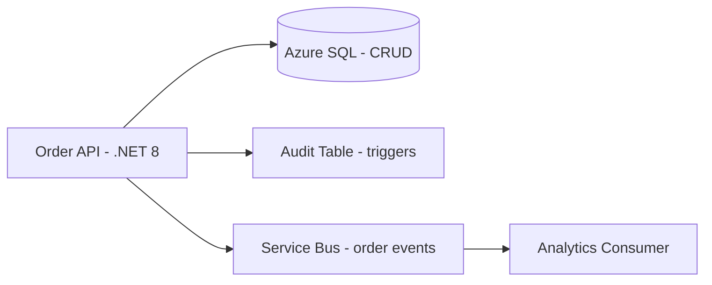
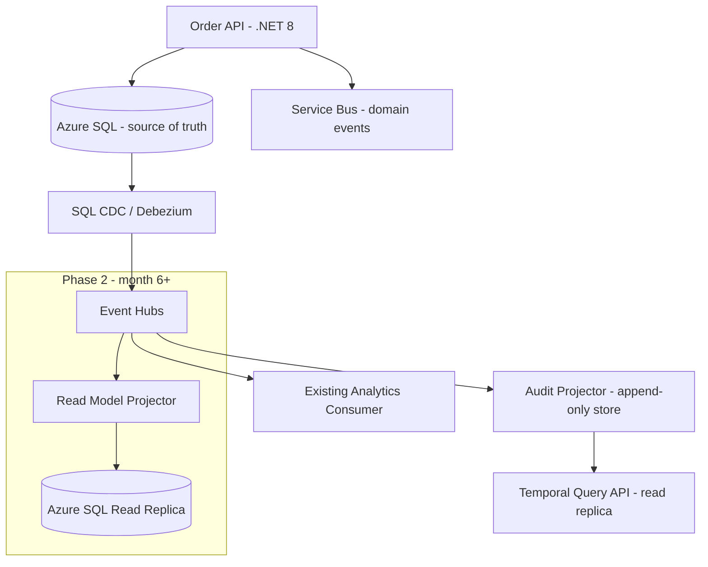

# Case Study: Architecture Review Board — Event Sourcing ADR

| Attribute | Value |
|-----------|-------|
| **Industry** | E-commerce / order management |
| **Scale** | 12K orders/minute peak, 8-person dev team |
| **Week** | 41 |
| **Difficulty** | Advanced |

## Business Context

The order management team submitted ADR-047 proposing full event sourcing for the entire order domain — replacing the current CRUD + audit table approach. Motivation: complete audit trail, temporal queries ("what was order state at 3pm?"), and eventual CQRS read models. Release deadline: 3 months.

You chair the monthly architecture review board. The team has no event sourcing production experience. Operations runs a single Azure SQL instance with no Kafka/Event Hubs expertise.

## Current State

**Current implementation (from ADR and code review):**
- `Order` entity with EF Core change tracking and soft deletes
- SQL triggers write to `OrderAudit` table on every change
- Service Bus publishes `OrderCreated`, `OrderConfirmed` for downstream consumers
- Read queries hit primary SQL — no separate read models
- Team velocity: 20 story points/sprint; 3-month roadmap already committed to stakeholders

## Requirements

### Functional
- Complete audit trail for compliance (SOX) — who changed what, when
- Support order status queries for customer service portal
- Publish domain events for fulfillment and analytics (existing consumers)
- Optional: temporal queries for dispute resolution

### Non-Functional
| NFR | Target |
|-----|--------|
| Availability | 99.95% |
| Latency (p99) | < 100ms for order read |
| RTO | 30 minutes |
| RPO | 5 minutes |
| Team ramp-up | ≤ 4 weeks training if new pattern adopted |
| Release | 3 months (committed to Q3 launch) |

## Constraints

- Team: 8 .NET developers, 0 event sourcing experience, 1 DevOps engineer
- No budget for additional platform team support
- ADR proposes EventStoreDB on AKS — not an approved Azure PaaS
- Compliance accepts current audit table for SOX (verified last year)
- Stakeholders expect CQRS read models "eventually" but not in Q3 scope
- Alternative ADR-048 (CDC + enriched audit) submitted by staff engineer

## Your Task

1. Review ADR-047 against team readiness, timeline, and operational complexity
2. Decide: approve, defer, or reject with written conditions
3. Compare full ES vs CDC + audit table vs hybrid (events without ES)
4. Identify operational risks: replay, schema evolution, snapshot strategy
5. Deliver written review outcome for the team

> **Attempt your solution before reading the reference below.**

---

## Reference Solution

### Top 3 Issues with ADR-047

1. **Team readiness mismatch** — full ES requires aggregate design, versioning, projection rebuilds; 3 months is insufficient for first production ES system
2. **Operational complexity underestimated** — EventStoreDB on AKS adds cluster ops; no runbook for event replay or corrupted stream recovery
3. **SOX requirement already met** — audit table + triggers satisfy compliance; ES is optimization, not unblocker

### Revised Architecture (Conditional Approval Path)

### Key Decisions

| Decision | Choice | Rationale |
|----------|--------|-----------|
| ADR-047 verdict | **Reject** full ES for Q3 | Timeline + team readiness; SOX already satisfied |
| Audit approach | CDC → Event Hubs → audit projector | Immutable append log without rewriting domain model |
| Domain events | Keep Service Bus publish from API | Existing consumers unchanged; no ES required |
| Temporal queries | Phase 2 via CDC-sourced audit store | Meets dispute resolution without aggregate replay |
| Training | 2-week ES workshop; revisit ADR in Q1 next year | Build capability before committing to ES |
| EventStoreDB on AKS | Rejected | Use Event Hubs (approved PaaS) as event log |

### Review Outcome (Written)

**Decision: Reject ADR-047 for Q3 release. Approve ADR-048 (CDC + audit projector) with conditions.**

Conditions:
1. Audit projector must be idempotent with partition-key ordering
2. Schema evolution via versioned event contracts in Git
3. Runbook for projector lag > 5 minutes and replay from checkpoint
4. Re-submit ES ADR after team completes ES training and shadow projection in dev

### Expected Outcome

- Q3 delivery: on track with CDC approach (4-week incremental add)
- SOX audit: enhanced with immutable Event Hubs retention (7 years archive)
- Team: avoids 3-month rewrite risk; builds event pipeline skills for future ES
- Board: documented decision trail for audit

## Discussion Questions

1. When *is* full event sourcing justified for an order domain?
2. How do you distinguish "we want ES" from "we need ES"?
3. What's the minimum viable event log before introducing aggregates?

## Interview Story Angle

**STAR prompt:** "Tell me about a time you pushed back on a team's technical proposal."

Use this case study: emphasize evidence-based review (SOX already met), alternative path (CDC), and conditions for future approval rather than blanket rejection.
