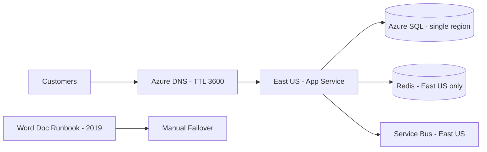
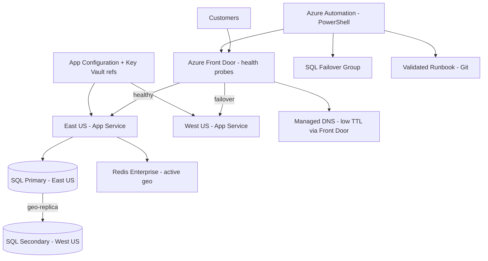

# Case Study: DR Drill Failure — Regional Failover

| Attribute | Value |
|-----------|-------|
| **Industry** | SaaS (B2B workflow platform) |
| **Scale** | 2,400 tenants, 180K daily active users |
| **Week** | 42 |
| **Difficulty** | Advanced |

## Business Context

Your company runs a multi-tenant .NET 8 SaaS platform on Azure (primary: East US, secondary: West US). Annual DR drill mandate from enterprise customers requires proving RTO of 1 hour. Last month's drill failed catastrophically: failover took 6 hours, DNS propagated slowly, runbooks were outdated, and connection strings hardcoded to primary region.

The CEO escalated to you after two Fortune 500 customers threatened contract renewal. You must design a DR improvement program with quarterly drills and automated failover.

## Current State



**Current implementation issues (from drill postmortem):**
- Connection strings in `appsettings.json` hardcoded to `eastus` SQL and Redis
- DNS TTL 3600 seconds — clients cached primary IP for 1 hour after switch
- Runbook referenced decommissioned App Service plan and old Key Vault names
- Azure SQL had geo-replica but failover was never tested (manual group failover failed)
- No health-check-driven traffic routing; ops relied on manual DNS CNAME update
- Service Bus and Redis had no cross-region replication

## Requirements

### Functional
- Automated failover of App Service, Azure SQL, and critical dependencies
- Traffic routing to secondary region within RTO window
- Runbook executable by on-call engineer without tribal knowledge
- Quarterly DR drill with pass/fail criteria and customer-facing report

### Non-Functional
| NFR | Target |
|-----|--------|
| RTO | 1 hour (contractual) |
| RPO | 15 minutes |
| Availability (steady state) | 99.95% |
| DNS propagation | < 5 minutes to 95% of clients |
| Drill success rate | 100% pass by Q4 (after remediation) |
| Runbook freshness | Auto-validated monthly against live infra |

## Constraints

- Team: 4 platform engineers, 1 on-call rotation
- Budget: +$8K/month for geo-replicated SQL, Front Door, secondary Redis
- Cannot use active-active in year one (application not idempotent across regions)
- Some tenants require data residency in East US — West US is failover only
- PowerShell automation preferred (team skill set)
- Must not cause production outage during remediation work

## Your Task

1. Root-cause the 6-hour failover (top 3 contributing factors)
2. Design updated DR architecture with automated failover
3. Define quarterly drill calendar and pass/fail criteria
4. Outline PowerShell failover script structure
5. Specify connection string and configuration management fixes

> **Attempt your solution before reading the reference below.**

---

## Reference Solution

### Top 3 Issues

1. **Hardcoded regional endpoints** — app could not start in West US without config redeploy
2. **DNS TTL + manual CNAME** — 1-hour client cache + human error extended outage
3. **Untested geo-failover dependencies** — SQL failover group misconfigured; Redis/SB single-region

### Revised Architecture



### Key Decisions

| Decision | Choice | Rationale |
|----------|--------|-----------|
| Traffic routing | Azure Front Door + health probes | Automatic failover; no manual DNS edits |
| Config | App Configuration with Key Vault references | Region-agnostic labels; swap on failover |
| SQL | Auto-failover group with grace period 1 hour | RPO 15 min; tested monthly |
| Redis | Active geo-replication (Enterprise tier) | Session state survives regional failover |
| Service Bus | Premium with geo-disaster recovery alias | Connection string swap via App Config |
| Runbook | Git-versioned + monthly validation script | Detects drift from live resource names |

### PowerShell Failover Outline

```powershell
# 1. Verify primary unhealthy (Front Door probe)
# 2. Initiate SQL failover group switch
# 3. Update App Configuration label: Region=WestUS
# 4. Scale out West US App Service to match East capacity
# 5. Verify health endpoints; Front Door auto-routes
# 6. Post to Statuspage + PagerDuty resolution
```

### Quarterly Drill Calendar

| Quarter | Scope | Pass criteria |
|---------|-------|---------------|
| Q1 | Tabletop + config validation | Runbook matches live infra |
| Q2 | SQL failover only (off-peak) | RPO ≤ 15 min, app reconnects |
| Q3 | Full regional failover (planned) | RTO ≤ 1 hour, zero data loss |
| Q4 | Unannounced drill for on-call | Same as Q3 without prep |

### Expected Outcome

- RTO: 6 hours → 45 minutes (Front Door + automated SQL + config swap)
- RPO: unmeasured → 15 minutes (geo-replica lag monitored)
- Customer report: drill pass certificate for enterprise renewals
- Cost: +$8K/month offset by retained $2.4M ARR from at-risk accounts

## Discussion Questions

1. When does active-active become worth the application complexity?
2. How do you drill DR without risking production data corruption?
3. Should failover be automatic or require human approval?

## Interview Story Angle

**STAR prompt:** "Tell me about a disaster recovery failure and how you fixed it."

Use this case study: emphasize drill realism (untested != protected), configuration management as the hidden killer, and customer-contract RTO as the forcing function.
