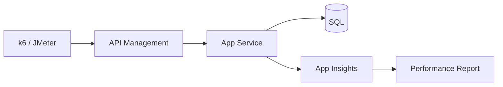

# FinOps, DR & Performance Engineering

> **Week 42**

## Learning Objectives
- Apply FinOps framework to cloud architecture
- Design DR strategies with RTO/RPO targets
- Define performance budgets and load testing

---

## 1. FinOps Principles

| Phase | Activity |
|-------|----------|
| **Inform** | Tagging, cost allocation, showback |
| **Optimize** | Right-sizing, reserved capacity, spot |
| **Operate** | Budgets, anomalies, unit economics |

**Architect metrics:**
- Cost per transaction
- Cost per tenant
- Idle resource %

```powershell
# Top 10 resources by cost last 30 days
Get-AzConsumptionUsageDetail -StartDate (Get-Date).AddDays(-30) |
  Group-Object ResourceId |
  Sort-Object { ($_.Group | Measure-Object PretaxCost -Sum).Sum } -Descending |
  Select-Object -First 10
```

---

## 2. DR Tiers

| Tier | RTO | RPO | Pattern | Cost |
|------|-----|-----|---------|------|
| 1 | < 1h | < 15min | Active-active multi-region | $$$ |
| 2 | < 4h | < 1h | Warm standby | $$ |
| 3 | < 24h | < 24h | Cold backup, restore | $ |
| 4 | Best effort | 24h+ | Backup only | $ |

**Azure patterns:**
- **Active-active:** Front Door + multi-region App Service + Cosmos multi-write
- **Warm standby:** Secondary region scaled to 20%, failover script ready
- **Backup/restore:** SQL geo-restore, blob GRS

---

## 3. DR Testing

**Architect mandate:** Untested DR is not DR.

| Test Type | Frequency |
|-----------|-----------|
| Tabletop | Quarterly |
| Failover drill | Semi-annual |
| Full chaos (region down) | Annual |

Document: actual RTO achieved vs target.

---

## 4. Performance Budgets

| Metric | Budget | Measured |
|--------|--------|----------|
| LCP (web) | < 2.5s | Lighthouse |
| API p99 | < 300ms | APM |
| DB query p95 | < 50ms | SQL insights |
| Bundle size | < 200KB | Webpack analyzer |

**CI gate:** k6 load test — p99 < 300ms at 500 RPS or build fails.

---

## 5. Load Testing Architecture



**Architect:** Load test production-like data volume, not empty DB.

**Next:** Week 43 Frontend Architecture
