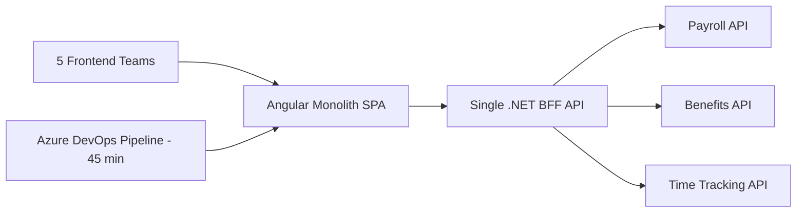
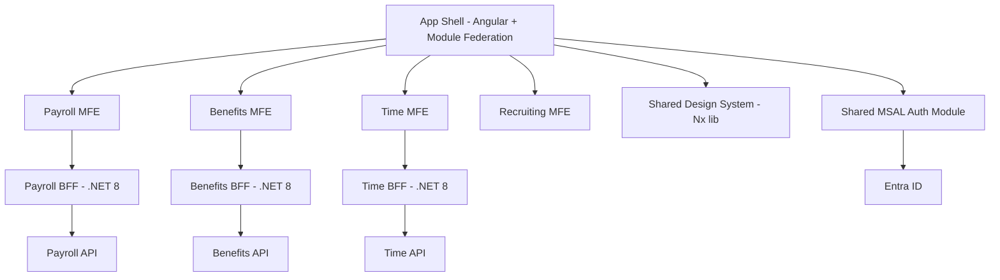

# Case Study: Micro-Frontend vs BFF — Platform Decision

| Attribute | Value |
|-----------|-------|
| **Industry** | Enterprise HR technology |
| **Scale** | 5 frontend teams, 1.2M lines Angular, 800K DAU |
| **Week** | 43 |
| **Difficulty** | Advanced |

## Business Context

A enterprise HR platform runs a single Angular 17 monolith SPA backed by one .NET 8 BFF (Backend for Frontend). Five frontend teams share the repo. CI builds take 45 minutes; merge conflicts block weekly releases. The CTO asks whether to adopt micro-frontends (MFEs) with independent deploys, or improve the monolith.

You are the principal architect. Deliver a recommendation with an 18-month plan covering module boundaries, BFF strategy, auth, and shared design system.

## Current State

**Current implementation issues (from platform review):**
- No enforced module boundaries — teams import each other's components freely
- Single webpack build; any change rebuilds entire app
- BFF has 240 endpoints and is a bottleneck for all teams
- Shared Angular Material theme but inconsistent component usage
- Auth: single MSAL instance; token refresh race conditions on lazy routes
- Weekly release train; hotfixes require full regression suite (4 hours)

## Requirements

### Functional
- Independent deploy cadence per domain (Payroll, Benefits, Time, Recruiting, Admin)
- Shared authentication and design system across all surfaces
- Deep linking and consistent navigation between domains
- BFF aggregation for each client domain without duplicating backend logic

### Non-Functional
| NFR | Target |
|-----|--------|
| CI build time | < 10 minutes per team |
| Deploy frequency | Daily per domain (from weekly monolith) |
| Availability | 99.9% |
| Latency (p95) | < 300ms BFF aggregation |
| Bundle size (initial) | < 250KB per MFE shell |
| Developer onboarding | < 2 days per new frontend hire |

## Constraints

- Team: 5 frontend teams (6-8 devs each), 3 backend teams
- Cannot rewrite to React (18-month deadline, no React expertise)
- Must use Module Federation or Nx — no greenfield framework
- Entra ID SSO is non-negotiable; tokens must work across MFE boundaries
- Budget: 2 platform engineers for 12 months to build shared shell
- Enterprise customers require single URL (no separate subdomains per MFE)

## Your Task

1. Identify the top 3 problems with the current monolith approach
2. Compare: stay monolith + Nx boundaries, Module Federation MFEs, full React rewrite
3. Recommend BFF-per-domain vs shared BFF with route modules
4. Design auth token sharing strategy across MFEs
5. Deliver 18-month phased migration plan

> **Attempt your solution before reading the reference below.**

---

## Reference Solution

### Top 3 Issues

1. **Build coupling** — 45-minute CI blocks all teams; no independent deploy path
2. **BFF god-object** — 240 endpoints create merge conflicts and release coordination
3. **Missing module boundaries** — cross-team imports create hidden coupling and regression risk

### Revised Architecture

### Key Decisions

| Decision | Choice | Rationale |
|----------|--------|-----------|
| Frontend strategy | Nx monorepo + Module Federation | Independent deploys without React rewrite |
| React rewrite | Rejected | 18-month timeline, skill gap, no business case |
| BFF | One BFF per domain (not per MFE) | Aligns with backend team boundaries; avoids 5× duplication |
| Design system | Nx shared lib (`@hr-platform/ui`) | Single source for Material theme and components |
| Auth | Shell owns MSAL; tokens via shared `AuthService` singleton | Prevents refresh race; MFEs consume injected token |
| Routing | Shell router with lazy-loaded remote entries | Single URL; deep links via shell |
| CI | Nx affected builds + per-MFE pipelines | 45 min → 8 min average per team |

### 18-Month Phased Plan

| Phase | Months | Deliverable |
|-------|--------|-------------|
| 1 — Foundation | 1-4 | Nx workspace, design system lib, shell app, enforce module boundaries |
| 2 — First MFE | 5-8 | Payroll extracted to Module Federation remote + Payroll BFF split |
| 3 — Expand | 9-14 | Benefits, Time, Recruiting remotes; deprecate monolith routes |
| 4 — Stabilize | 15-18 | Remove legacy monolith build; daily deploys per domain |

### Expected Outcome

- CI: 45 min → 8 min (affected builds)
- Deploy frequency: weekly → daily per domain
- Merge conflicts: ~40/week → < 5/week (enforced Nx module boundaries)
- BFF: 240 endpoints split into 4 domain BFFs (~60 each)

## Discussion Questions

1. When do micro-frontends create more problems than they solve?
2. Should BFFs share a single APIM instance or separate gateways?
3. How do you version shared design system breaking changes across MFEs?

## Interview Story Angle

**STAR prompt:** "Tell me about a frontend platform architecture decision you led."

Use this case study: emphasize rejecting React rewrite on evidence, Module Federation as incremental path, and BFF split aligned to domain teams not arbitrary MFE count.
