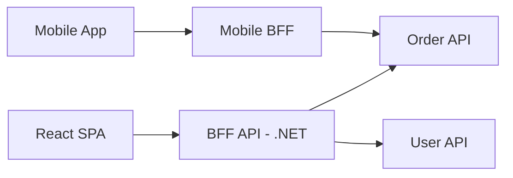

# Frontend Architecture — React & Angular

> **Week 43** | **Modules:** [react](../../../modules/react/README.md), [angular](../../../modules/angular/README.md)

## Learning Objectives
- Understand SPA architecture from architect lens
- Compare React vs Angular for enterprise
- Design micro-frontends and BFF patterns

---

## 1. Why Architects Need Frontend Depth

You won't write components daily — but you must:
- Design API contracts (BFF aggregation)
- Set performance budgets (Core Web Vitals)
- Choose SPA vs SSR vs hybrid
- Plan micro-frontend boundaries
- Security: CSP, token storage, XSS

---

## 2. React vs Angular (Enterprise)

| Factor | React | Angular |
|--------|-------|---------|
| Structure | Flexible (choose libs) | Opinionated (batteries included) |
| Team skill | JS ecosystem | TypeScript-first, enterprise |
| State | Redux, Zustand, RTK Query | NgRx, Signals |
| Hiring | Larger pool | Strong in enterprise .NET shops |
| Micro-frontends | Module Federation | Native Elements, single-spa |

**Architect:** Angular pairs naturally with .NET enterprise teams. React for product velocity and ecosystem.

---

## 3. BFF (Backend for Frontend)

**Why:** Aggregate 5 microservice calls into 1 tailored response. Hide internal topology. Different shapes per client.

---

## 4. State Management Architecture

| Complexity | React | Angular |
|------------|-------|---------|
| Local UI | useState | Component state |
| Server cache | TanStack Query | HttpClient + signals |
| Global app | Redux Toolkit | NgRx / Signals store |
| URL state | React Router | Angular Router |

**Architect anti-pattern:** Duplicating server state in global store — use server-state library.

---

## 5. Micro-Frontends

| Pattern | Description |
|---------|-------------|
| **Build-time** | npm packages shared components |
| **Runtime (Module Federation)** | Independent deployable shells |
| **iframe** | Legacy isolation (avoid if possible) |

**When:** 5+ frontend teams, independent release cadence. **Cost:** Shared design system, cross-MFE auth, performance overhead.

---

## 6. Security Checklist

- [ ] Tokens in memory or httpOnly cookies (not localStorage for refresh)
- [ ] CSP headers via API gateway
- [ ] CORS restricted to known origins
- [ ] API keys never in frontend bundle
- [ ] OIDC / MSAL for Entra ID

**Next:** Week 44 Case Study Marathon
