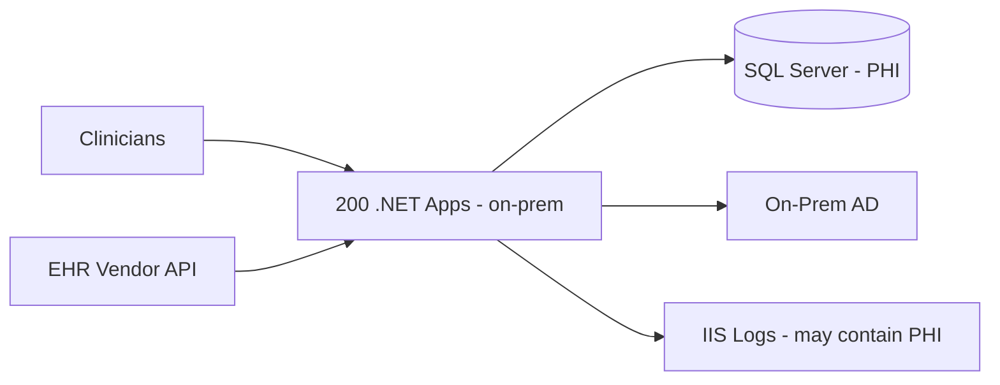
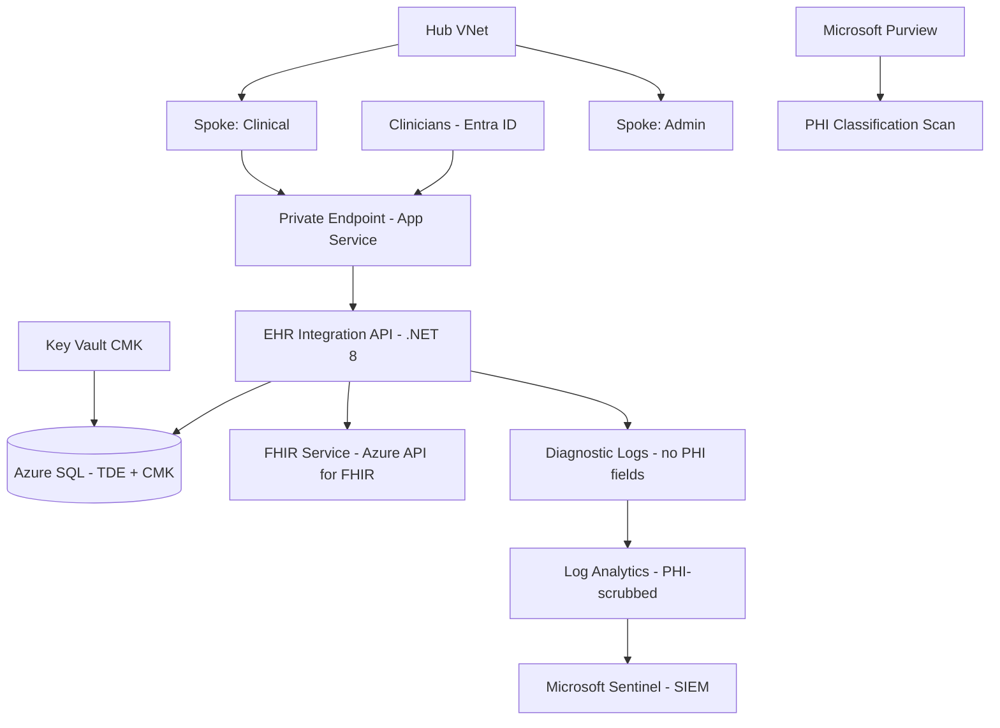

# Case Study: Healthcare HIPAA Cloud Migration

| Attribute | Value |
|-----------|-------|
| **Industry** | Healthcare (regional hospital system) |
| **Scale** | 200 .NET apps, 14 hospitals, 2.1M patient records |
| **Week** | 44 |
| **Difficulty** | Expert |

## Business Context

A regional hospital system must migrate 200 .NET applications from on-premises SQL Server to Azure within 18 months. Applications handle Protected Health Information (PHI) — patient demographics, lab results, and EHR integration APIs. The board signed a Microsoft BAA; HIPAA compliance is non-negotiable.

You are the lead architect for wave planning, network isolation, and HIPAA control mapping. A prior pilot failed when developers logged PHI in Application Insights traces.

## Current State

**Current implementation issues (from HIPAA gap assessment):**
- PHI appears in application logs, exception messages, and App Insights (pilot finding)
- No encryption at rest for 12 legacy apps using local file storage
- Audit trail is per-application — no centralized PHI access logging
- Network: flat on-prem VLAN; no segmentation between clinical and admin apps
- 40 apps touch PHI directly; 160 are indirect (scheduling, billing without clinical data)
- RPO/RTO for EHR integration API undocumented

## Requirements

### Functional
- Migrate PHI-bearing workloads to Azure with BAA-covered services only
- Centralized audit trail for all PHI access (who, what, when, which patient)
- EHR integration API with bidirectional HL7 FHIR messaging
- Entra ID integration for clinician SSO (existing on-prem AD sync)

### Non-Functional
| NFR | Target |
|-----|--------|
| Availability (EHR API) | 99.95% |
| RPO (EHR integration) | 15 minutes |
| RTO (EHR integration) | 4 hours |
| PHI in logs | Zero — automated scan in CI |
| Encryption | At rest (CMK) and in transit (TLS 1.2+) |
| Audit retention | 6 years (HIPAA) |
| Migration completion | 18 months |

## Constraints

- Team: 25 developers, 4 infrastructure engineers, 1 compliance officer
- Budget: $1.2M migration budget; $85K/month steady-state Azure
- BAA signed with Microsoft; third-party SaaS requires separate BAAs
- Some legacy apps are .NET Framework 4.5 — cannot containerize without rewrite
- State AG audit scheduled month 12 — controls must be demonstrable
- Cannot migrate EHR integration API until wave 3 (month 10+)

## Your Task

1. Identify the top 3 HIPAA risks in the current state
2. Propose hub-spoke network with Private Link vs alternatives
3. Create migration wave plan (which apps in which order)
4. Map HIPAA controls to Azure services (control mapping table)
5. Deliver C4 Context + Container diagram scope

> **Attempt your solution before reading the reference below.**

---

## Reference Solution

### Top 3 Issues

1. **PHI in logs** — violates minimum necessary; automatic HIPAA breach if logs exfiltrated
2. **No centralized PHI access audit** — cannot demonstrate compliance to state AG
3. **Flat network** — clinical and admin workloads share blast radius

### Revised Architecture

### Key Decisions

| Decision | Choice | Rationale |
|----------|--------|-----------|
| Network | Hub-spoke + Private Link | Segment clinical PHI; no public SQL endpoints |
| PHI logging | Serilog destructuring policies + CI grep gate | Block deploy if log templates contain PHI field names |
| Audit | Azure SQL Auditing + App Insights custom events (IDs only) | Log `PatientId` hash, never name/SSN |
| Encryption | CMK in Key Vault per environment | HIPAA addressable specification for key management |
| EHR API hosting | App Service VNet-integrated in clinical spoke | Isolated from admin workloads |
| Migration waves | Indirect apps first, PHI direct last | Build controls before highest-risk workloads |

### HIPAA Control Mapping

| HIPAA Control | Azure Implementation |
|---------------|---------------------|
| Access control (§164.312(a)) | Entra ID RBAC + managed identities |
| Audit controls (§164.312(b)) | SQL Auditing, Sentinel, immutable blob |
| Integrity (§164.312(c)) | TDE, checksums, EF Core optimistic concurrency |
| Transmission security (§164.312(e)) | TLS 1.2+, Private Link, no public endpoints |
| Encryption at rest (§164.312(a)(2)(iv)) | TDE with CMK, Storage SSE with CMK |

### Migration Wave Plan

| Wave | Months | Apps | Rationale |
|------|--------|------|-----------|
| 1 | 1-4 | 60 indirect (scheduling, HR) | Low PHI risk; build landing zone |
| 2 | 5-9 | 80 indirect + tooling | Purview scanning; log policies enforced |
| 3 | 10-14 | 40 direct PHI | Clinical spoke ready; pen test complete |
| 4 | 15-18 | 20 critical (EHR API) | Highest scrutiny; AG audit evidence |

### Expected Outcome

- PHI in logs: eliminated via CI gate + Purview classification
- AG audit: control matrix with evidence artifacts per wave
- EHR API: RPO 15 min (geo-replica), RTO 4 hours (documented runbook)
- Cost: $85K/month within budget after reserved instances

## Discussion Questions

1. Which Azure services are NOT covered by the Microsoft BAA?
2. How do you handle .NET Framework 4.5 apps that cannot be containerized?
3. When is a dedicated tenant per hospital warranted vs shared tenant?

## Interview Story Angle

**STAR prompt:** "Tell me about migrating regulated healthcare data to the cloud."

Use this case study: emphasize PHI-in-logs as the silent killer, wave planning by risk tier, and demonstrable controls for auditors not checkbox compliance.
