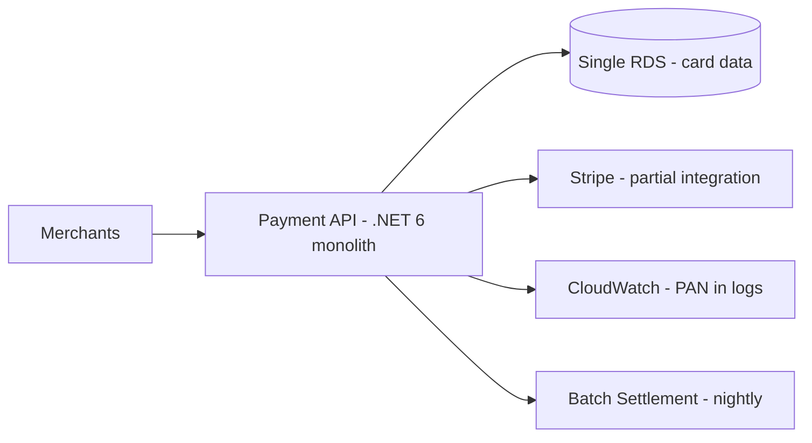
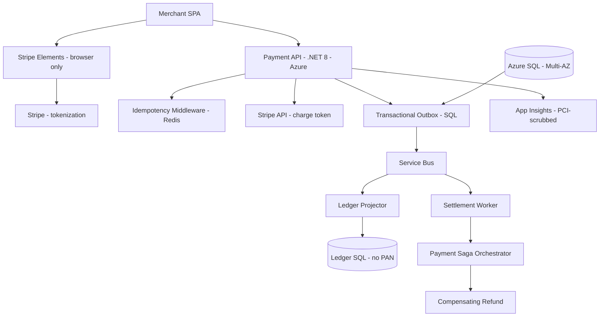

# Case Study: Fintech Payment Platform — PCI Modernization

| Attribute | Value |
|-----------|-------|
| **Industry** | Fintech (payments) |
| **Scale** | $2B/year payment volume, 8M transactions/month |
| **Week** | 44 |
| **Difficulty** | Expert |

## Business Context

A payments startup processes $2B annually through a monolithic .NET 6 API hosted on AWS. A PCI DSS Level 1 audit found critical findings: card data in application logs, single-database architecture, and no idempotency on the payment API. The board approved migration to Azure and modernization to achieve 99.99% availability.

You are the architect for PCI scope reduction, multi-region design, and event-sourced ledger for reconciliation.

## Current State



**Current implementation issues (from PCI audit):**
- Primary Account Numbers (PAN) logged in request/response debug traces
- Card data stored in application database — full PCI SAQ-D scope
- Single RDS instance — no Multi-AZ, RPO unmeasured
- Payment POST is not idempotent — duplicate charges on client retry
- Settlement is batch-only; no real-time ledger for merchant disputes
- Stripe Elements adopted for frontend but backend still accepts raw card JSON

## Requirements

### Functional
- Process card and ACH payments with tokenization (no PAN in application tier)
- Idempotent payment API — safe client retries
- Real-time transaction ledger for merchant reconciliation
- Settlement saga with compensating transactions on failure

### Non-Functional
| NFR | Target |
|-----|--------|
| Availability | 99.99% (52 min downtime/year) |
| Latency (p99) | < 200ms authorization |
| PCI scope | SAQ-A or minimized SAQ-D (tokenization) |
| RPO | 0 for ledger entries |
| RTO | 1 hour |
| Idempotency | 24-hour idempotency key window |

## Constraints

- Team: 10 .NET developers, 2 DevOps; no event sourcing experience
- 12-month modernization roadmap with quarterly PCI re-assessment
- Stripe is approved processor — must use Stripe tokens, not custom vault
- Migration from AWS to Azure in phases — cannot big-bang cutover
- Investors require 99.99% SLA in contracts by month 9
- Budget: $45K/month Azure at steady state

## Your Task

1. Identify the top 3 PCI and reliability findings to remediate first
2. Design PCI scope reduction architecture (Stripe Elements + tokenization)
3. Choose saga vs transactional outbox for settlement — ADR rationale
4. Design idempotent payment API contract
5. Deliver threat model for payment flow and 12-month roadmap

> **Attempt your solution before reading the reference below.**

---

## Reference Solution

### Top 3 Issues

1. **PAN in logs** — critical PCI violation; immediate breach notification risk
2. **No idempotency** — duplicate charges destroy merchant trust and drive support cost
3. **Single database** — availability ceiling below 99.99%; no failover path

### Revised Architecture



### Key Decisions

| Decision | Choice | Rationale |
|----------|--------|-----------|
| PCI scope | Stripe Elements + token-only API | PAN never touches merchant servers; SAQ-A target |
| Logging | Strip card fields via middleware + Serilog filters | Remediate critical audit finding day 1 |
| Idempotency | `Idempotency-Key` header + Redis 24h TTL | Return cached response on duplicate POST |
| Ledger | Event-sourced append log via outbox | Audit trail for disputes; not full ES on order domain |
| Settlement | Saga with outbox (not 2PC) | Reliable publish; compensating refund on partial failure |
| Database | Azure SQL Business Critical (Multi-AZ) | 99.99% SLA; geo-replica for DR |

### Idempotency Contract

```csharp
[HttpPost("payments")]
public async Task<IActionResult> CreatePayment(
    [FromHeader(Name = "Idempotency-Key")] string idempotencyKey,
    CreatePaymentRequest request) // request.PaymentMethodId = Stripe token only
{
    var cached = await _idempotencyStore.GetAsync(idempotencyKey);
    if (cached is not null) return Ok(cached);
    // ... charge Stripe token, persist, cache response
}
```

### Threat Model Highlights

| Threat | Mitigation |
|--------|------------|
| PAN interception | Stripe Elements; TLS 1.3; no card fields in API |
| Replay attack | Idempotency key + short-lived Stripe tokens |
| Ledger tampering | Append-only table; hash chain per merchant |
| Insider log access | App Insights PII scrubbing; RBAC on log workspace |

### Expected Outcome

- PCI: critical findings closed month 2; SAQ-A scope by month 6
- Availability: 99.9% → 99.99% with SQL Business Critical + health probes
- Duplicate charges: eliminated via idempotency middleware
- Ledger: real-time merchant dispute resolution (from nightly batch)

## Discussion Questions

1. Saga vs outbox — when would you choose choreographed saga instead?
2. Can you achieve exactly-once payment semantics end-to-end?
3. How do you PCI-scope Azure API Management and App Insights?

## Interview Story Angle

**STAR prompt:** "Tell me about remediating critical security findings under audit pressure."

Use this case study: emphasize scope reduction over checkbox compliance, idempotency as reliability + trust, and outbox as pragmatic event ledger without full ES.
